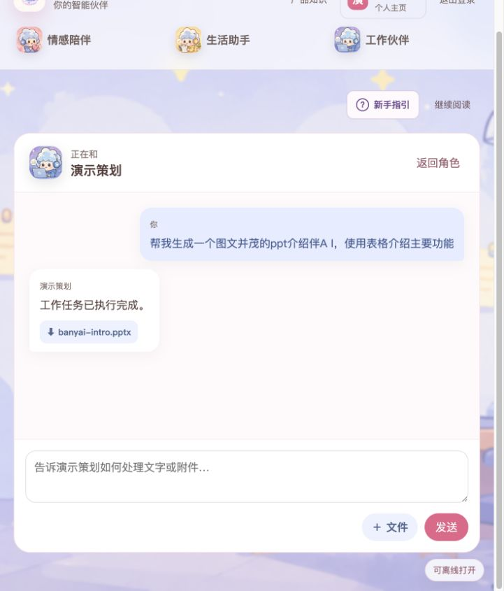

<p align="center">
  
</p>

# 伴AI · AI Companion

<p align="center"><strong>Someone to talk to. A hand with life. A partner for getting things done.</strong></p>
<p align="center">Companionship · Life management · Office productivity</p>

<p align="center">
  <a href="README.zh-CN.md">简体中文</a> · <a href="README.md">English</a><br>
  <a href="#quick-start">Quick start</a> · <a href="#product-in-action">See it in action</a> · <a href="#technical-highlights">Technical highlights</a> · <a href="#documentation">Docs</a> · <a href="https://github.com/bamboo-ye/ai-companion/issues">Feedback</a>
</p>

<p align="center">
  <a href="go.mod"></a>
  <a href="web/package.json"></a>
  <a href="workers/python/pyproject.toml"></a>
  <a href="#quick-start"></a>
</p>

AI Companion is a self-hostable personal AI workspace. Continue a meaningful conversation, organize everyday tasks in natural language, and turn your own material into office deliverables. Characters, memory, knowledge and tools work together—from a request to a result you can check.


## One workspace, three ways to help

| What you need | Where to start | What you get |
| --- | --- | --- |
| Talk things through and pick up where you left off | **Companion** | Custom characters, multi-turn conversations, inspectable and correctable memory |
| Organize daily plans and spending | **Life assistant** | Today's plan, reminders, ledger records and summaries, Excel export |
| Turn ideas and source material into deliverables | **Work partner** | Knowledge Wiki, PPTX generation, PDF translation, DOCX copy editing, CSV/XLSX analysis |

All three experiences share context, knowledge and governed tools. A separate admin console manages models, Agents, permissions, quotas and execution records.

## Why AI Companion

- **Conversations with continuity.** Recent messages, sourced summaries and correctable memories retain useful preferences and constraints across sessions.
- **Knowledge with evidence.** Search, read and edit a Wiki built from uploaded sources. Follow citations to the original material; source permission changes affect access.
- **Results beyond the chat.** Ledger entries appear in the ledger, reminders in the reminder list, and office tasks return files you can use.
- **A plan for long-running work.** Complete source intake, bounded parallel batches and deterministic merging handle material beyond one model window, with targeted recovery.
- **Control over execution.** Host the app and data services yourself, configure models, allowlist tools and set quotas. The server enforces authorization and required approvals.

## Quick start

Install **Git, Docker Desktop / Docker Compose v2, and Make**. The full Docker setup supplies Go, Python and Node.js; host installations are only needed for local development.

### 1. Get the project and configuration

```bash
git clone https://github.com/bamboo-ye/ai-companion.git
cd ai-companion
test -f .env || cp .env.example .env
```

> **Choose your first-run mode:** the default `MODEL_PROVIDER=development` needs no model key and helps check registration, pages and task plumbing, but returns fixed mock responses. For the natural-language conversations, tool selection and content generation shown below, first configure a server-side provider, key and concrete model IDs using the [model guide (Chinese)](docs/OPENROUTER_MODELS.md). Requests go to your configured provider; self-hosting does not imply offline inference.

### 2. Start the app

```bash
make docker-up
make docker-ps
```

Open **<http://localhost:3000>**, register, sign in and add a character to start a conversation. Compose applies business migrations and initializes Agent checkpoints. The first build downloads images and dependencies.

### 3. Try your first task

These are example requests to try after connecting a real model, not actions already performed:

| Module | Try saying | Check the result |
| --- | --- | --- |
| Companion | “I'm nervous about tomorrow's project presentation. Help me work through what worries me most.” | Add more context and see whether the next reply follows the conversation |
| Life assistant | “I spent CNY 18 on lunch today. Record it as a dining expense.” | Review and confirm the candidate, then open the ledger |
| Life assistant | “Remind me tomorrow at 3 p.m. to prepare the project demo.” | Verify the date, time and timezone, then open reminders |
| Work partner | “Create an illustrated PPT introducing AI Companion, with a table of its main features.” | Check the completion message and file entry in the conversation |

<details>
<summary>Troubleshooting, admin access and local development</summary>

- Follow logs with `make docker-logs`; stop services while retaining data volumes with `make docker-down`.
- API health: <http://localhost:8080/healthz>; readiness: <http://localhost:8080/readyz>.
- All three chat modules use the Agent by default, so the Agent Worker must be ready.
- Admin console: <http://localhost:3000/admin>. It requires a [separate invitation and Passkey (Chinese)](docs/ADMIN_PASSKEY_LOGIN.md), not an ordinary user account.
- Replace all `change-*` development secrets before exposing services. Configure the deployment's domain and secrets; never commit real keys.
- See the [first-run guide (Chinese)](docs/GETTING_STARTED.md) for setup and troubleshooting, or the [engineering guide](docs/ENGINEERING.md#quick-start) for host development and additional commands.

</details>

## Product in action

The following real UI and conversation captures come from a local environment with sanitized demo accounts and sample data. They show request, execution and result verification—not actions performed on the current reader's account.

### Companion: from listening to practical guidance

The user expresses anxiety about a presentation, then explains the worry about having too much material and running overtime. The character follows that context with suggestions for trimming content, timeboxing sections and rehearsing. Long-term preferences can be inspected and maintained separately. The homepage remains at the top of this README; the conversation is below.

<details>
<summary>See the multi-turn conversation: presentation anxiety and preparation</summary>


</details>

### Life assistant: records you can find after the conversation

Describe an expense, review and confirm it, then check the ledger. Create a reminder and verify it in the list. The demo shows a **CNY 18.00** ledger record and a reminder titled **“准备 AI Companion 项目演示材料”** with its trigger time and notification channel.

<details>
<summary>See the life workspace and expense flow: conversation → ledger</summary>

Plans, reminders and spending share one workspace:


Describe the expense in chat and confirm the proposed write:


Open the ledger to verify the record and monthly summary:


</details>

<details>
<summary>See the reminder flow: creation conversation → reminder record</summary>

First, request the reminder and receive the creation result:


Then verify its title, time and channel in the reminder list:


</details>

### Work partner: one request, an office deliverable

The exact prompt sent in this demo was:

> 帮我生成一个图文并茂的ppt介绍伴A I，使用表格介绍主要功能

It asks for an illustrated presentation introducing AI Companion, with a table of its main features. The Work partner selects the PPTX generation Skill and returns a `banyai-intro.pptx` file entry in the same conversation. Relevant built-in product knowledge can ground the introduction in documented features and technical details.

<p align="center">
  
</p>

<details>
<summary>See the workbench: versioned Skills, intent routing and MCP controls</summary>

The workbench offers attachment extraction, DOCX copy editing, PDF translation, PPTX generation and CSV/XLSX analysis. Background execution connects task status, confirmation steps and artifact permissions.


</details>

## Technical highlights

Context engineering, Agentic RAG and parallel Agents are backed by concrete mechanisms, source code and tests.

| Focus | Implementation | Practical value |
| --- | --- | --- |
| **Complete large-file processing** | Ordered extraction rounds, stable Source IR entity IDs, token/character bounds, coverage gates, deterministic merging and targeted retries | Maintains a complete source-processing path beyond one model window |
| **Three-layer Agent parallelism** | Go Run dispatch, persistent Python processes and LangGraph `Send` branches; budgets assigned before execution, results joined in order | Works across tasks and reduces serial waiting within long tasks |
| **Shared context and memory** | Versioned Go/Python snapshots, sourced summaries, memory correction chains, per-role budgets and full-request window checks | Keeps chat and tool execution consistent and correctable |
| **Evidence-backed Wiki** | Source/topic/entity/decision pages, on-demand search and reads, citations, edit versions and permission invalidation | Makes retrieved knowledge readable, maintainable and traceable |
| **Recoverable tool execution** | PostgreSQL Runs/checkpoints, human approval, idempotency, leases and revision fencing; Go controls business writes | Tracks state and side effects through retries, cancellation and interruptions |
| **Documentation as product knowledge** | Allowlisted docs, SHA-256 versions, `go:embed`, local BM25 and guide citations | Grounds product questions and generation tasks without extra uploads |
| **Identity and cost governance** | Admin Passkeys, recent verification, per-resource quota inheritance, revision checks and transactional audits | Makes privileged changes, limits and model costs accountable |

### Large files, parallel execution, checked coverage

The default attachment limit is **20 MiB**. After full source intake, Composer batches are bounded by **2,000 estimated tokens / 12,000 source characters**. Go dispatches **4 Runs** by default; Composer fan-out defaults to **3** with a hard cap of **4** per Run. Results are merged in source order, checked for source/entity coverage, then rendered. Recovery targets the affected batches.

Completeness means full intake and verifiable source/entity coverage, not flawless parsing of every file format. Controlled tests use fixed-latency fake providers to verify parallel behavior; real latency depends on the document and model service. No production speedup ratio is claimed from those tests.

[Large-file design (Chinese)](docs/blog/ppt-generation-vibe-coding/03-large-files-and-intermediate-representation.md) · [Parallelism experiments (Chinese)](docs/blog/ppt-generation-vibe-coding/09-parallelism-design-and-results.md) · [Implementation details](docs/ENGINEERING.md#implementation-highlights)

### Engineering challenges and solutions

| Challenge | Mechanism | Verification |
| --- | --- | --- |
| Missing/duplicate records or unstable batch ordering | Source IR, coverage gates, ordered joins and targeted retries | [Composition tests](workers/python/tests/test_agent_runtime.py) |
| Overspent parallel budgets or uncounted failed branches | Disjoint preallocated budgets, settlement of admitted branches, successful-result caching | [Parallel design and tests (Chinese)](docs/blog/ppt-generation-vibe-coding/09-parallelism-design-and-results.md) |
| Lost constraints or fact attribution in compressed history | Complete message groups, sourced summaries, correction chains and final window checks | [Shared context tests](internal/conversation/context_snapshot_test.go) |
| Stale knowledge after source access is revoked | Revalidate every dependency and version; invalidate permission-aware caches | [Wiki tests](internal/document/wiki_test.go) |
| Crashes, duplicate dispatch or late responses after cancellation | Durable state, idempotency, lease takeover and revision fencing | [Agent Worker tests](internal/agent/worker_test.go) |

For human-edit conflicts, concurrent admin changes and knowledge consistency, see the [full engineering challenge matrix](docs/ENGINEERING.md#engineering-challenges-and-solutions).

## Architecture and stack

A **modular Go monolith, independent asynchronous workers and a Python Agent runtime** separate application authority from model reasoning. Models propose actions and generate content; Go authorizes business writes. PostgreSQL stores authoritative state; Kafka is an optional dispatch accelerator.

| Layer | Technologies |
| --- | --- |
| Web | Next.js 16 · React 19 · TypeScript |
| API and business logic | Go 1.26 · OpenAPI · PostgreSQL 18 |
| Agents and processing | Python · LangGraph · PostgreSQL Checkpointer · Versioned Skills |
| Retrieval and files | Qdrant · Redis · MinIO · Source IR · Wiki · Local BM25 |
| Deployment and observability | Docker Compose · Caddy · OpenTelemetry · Prometheus · Loki / Alloy · Optional Langfuse |

[Architecture and processing diagrams (Chinese)](docs/TECHNICAL_GUIDE.zh-CN.md#系统架构) · [Repository map](docs/ENGINEERING.md#repository-map) · [Concurrency settings (Chinese)](docs/TECHNICAL_GUIDE.zh-CN.md#关键并行与分片参数)

## Documentation

Most topic guides are currently in Chinese; the engineering and operations guide is in English.

| Looking for | Start here |
| --- | --- |
| Installation, registration, first tasks and troubleshooting | [First-run guide](docs/GETTING_STARTED.md) |
| Model providers, server-side keys, roles and budgets | [Model configuration](docs/OPENROUTER_MODELS.md) |
| Large files, parallelism, architecture and trade-offs | [English engineering guide](docs/ENGINEERING.md) · [中文技术指南](docs/TECHNICAL_GUIDE.zh-CN.md) |
| Memory, Wiki, retrieval and context organization | [Context management](docs/CONTEXT_MANAGEMENT.md) |
| Updating built-in product descriptions and help | [Product knowledge maintenance](docs/PRODUCT_KNOWLEDGE.md) |
| Admin login and user quotas | [Passkey administration](docs/ADMIN_PASSKEY_LOGIN.md) · [Quota management](docs/ADMIN_QUOTAS.md) |
| Operations, quality gates and verification records | [Runbooks](docs/runbooks/) · [Engineering and release commands](docs/ENGINEERING.md) · [Project verification](docs/PROJECT_COMPLETION.md) |
| APIs, domain design and architecture decisions | [OpenAPI](api/openapi/openapi.yaml) · [Detailed design](docs/DETAILED_DESIGN.md) · [ADRs](docs/adr/) |

## Get involved

Share use cases and feedback in [Issues](https://github.com/bamboo-ye/ai-companion/issues), or improve code, tests, documentation and demos through [Pull Requests](https://github.com/bamboo-ye/ai-companion/pulls). Include sanitized reproduction steps, versions and logs; never post model keys, credentials or private documents.

See the [engineering guide](docs/ENGINEERING.md#documentation-maintenance) for development and validation. After editing the Chinese README, technical guide or other product-knowledge sources, refresh the embedded catalog:

```bash
node scripts/build-product-knowledge.mjs
node scripts/build-product-knowledge.mjs --check
go test ./internal/productknowledge
```

If AI Companion is useful to you, a Star helps others discover the project.
