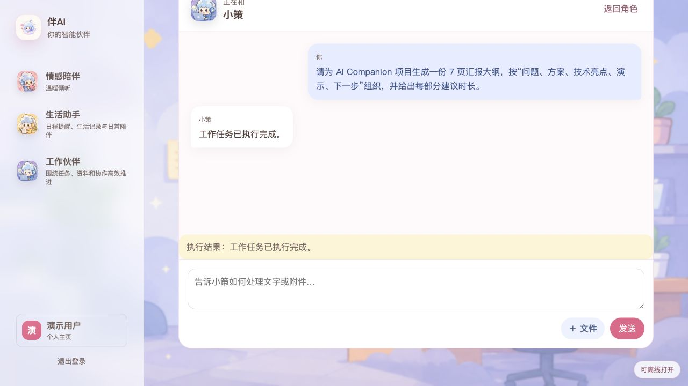
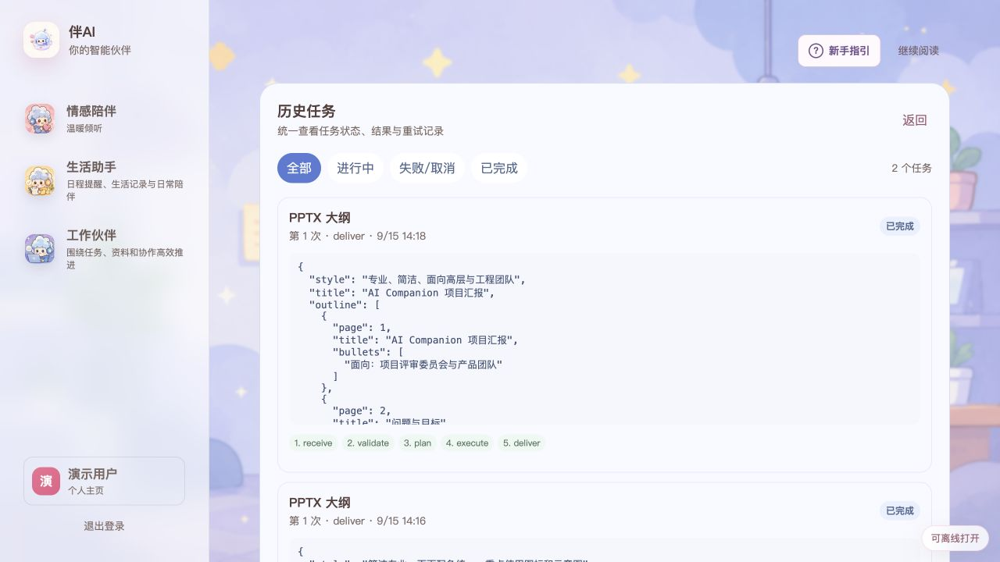

# 伴AI

[简体中文](README.zh-CN.md) | English

伴AI is a conversational personal AI workspace spanning emotional companionship, life assistance, work skills, collaboration, billing/safety controls, and operator-run internal-release workflows.

Current completion scope and verification are recorded in [`docs/PROJECT_COMPLETION.md`](docs/PROJECT_COMPLETION.md).

## Product preview

> Screenshots are captured from the local development environment with synthetic demo data.

### Companion conversations and long-term memory

Create persona-based companions, continue conversations, and manage durable memories that carry useful context across sessions.


#### Conversation demo: emotional continuity and actionable guidance

The user first shares presentation anxiety and then narrows it down to time pressure. The companion carries the earlier context into the next turn and responds with concrete suggestions for trimming content, allocating time, preparing an escape route, and rehearsing with spare capacity.


### Life planning, reminders, and ledger

The life workspace brings today's plans, reminders, and daily ledger entries together, with confirmation gates before sensitive data is written.


#### Conversation demo: natural-language life tools

The user describes an expense amount, purpose, and category directly in chat. The Agent converts that request into a governed ledger action, writes only after confirmation, and reports the successful business result in the conversation, completing the flow from intent recognition to an authorized write.


#### Result verification: ledger and reminder records

Completed tool actions are reflected in their dedicated product views instead of existing only as chat messages. The ledger summarizes monthly income, expenses, and balance while showing the newly written CNY 18.00 entry. The reminder demo first creates “Prepare AI Companion demo materials” in chat, then verifies the matching title, trigger time, and notification channel in the reminder view.

**Ledger record**


**Reminder conversation**


**Persisted reminder verification**


### Governed Skills and parallel Agent execution

The workbench exposes versioned document, PDF, presentation, and spreadsheet Skills together with intent routing and MCP allowlists. Large inputs run through lossless chunking, bounded Agent fan-out/fan-in, deterministic merging, and targeted retries; generated files and write actions remain previewable and auditable.


#### Conversation demo: from intent to a structured work task

A plain-language request for a seven-slide project outline is routed to the PPTX outline Skill. Chat reports execution status, while task history retains the structured output, the `receive → validate → plan → execute → deliver` stage trail, quality gates, and source-coverage metadata for auditing and retry.



#### Result verification: seven-slide structured PPTX outline

Task history exposes the concrete artifact behind the completion message: a structured outline titled *AI Companion Project Review*, a completed status, and the full `receive → validate → plan → execute → deliver` execution trail.



| Slide | Title | Generated focus |
| --- | --- | --- |
| 1 | AI Companion Project Review | Presentation title and target audience |
| 2 | Problem and goals | User pain points, business goals, and success metrics |
| 3 | Solution overview | Core capabilities, value proposition, architecture, and data flow |
| 4 | Technical highlights | Realtime chat, RAG, multimodality, performance, scale, and privacy |
| 5 | Demo plan | Demo scenarios, flow, environment, and fallback plan |
| 6 | Next steps and milestones | Actions, owners, timeline, and acceptance criteria |
| 7 | Recap | Problem, solution, technology, demo, and next-step summary |

## Repository map

```text
cmd/api, cmd/worker       Go API and asynchronous worker processes
internal/                 Go platform and future domain modules
workers/python/           Isolated document/data/media algorithm worker
web/                      Next.js web client
mobile/android/           Kotlin + Jetpack Compose Android client
mobile/ios/               SwiftUI app source and testable Swift core
deploy/                   Docker Compose and service images
api/openapi/              HTTP contract
events/schemas/           Event contract
migrations/               Forward and rollback SQL migrations
docs/adr/                  Architecture decisions
```

## Prerequisites

- Go 1.26+
- Python 3.12+
- Node.js 24+ and pnpm 11+
- Docker Desktop with Compose v2
- Android: JDK 17, Android Studio with API 37, Gradle 9.4.1
- iOS: Xcode 26+ and XcodeGen

## Quick start

```bash
cp .env.example .env
# Replace every change-* secret before exposing services beyond localhost.
make docker-up
make docker-ps
```

Then open `http://localhost:3000`. The API is available at
`http://localhost:8080`; follow application logs with `make docker-logs` and
stop the stack with `make docker-down`.

The Docker application profile applies PostgreSQL migrations before starting
the API and Worker. To run the Go processes on the host instead:

```bash
make infra-up
make postgres-migrate
make run-api
# In another terminal:
make run-worker
```

Asynchronous delivery is database-first. PostgreSQL stores authoritative job
state, Agent Runs, leases, retries, Outbox records and recovery metadata; the
Worker polls and claims runnable rows with bounded concurrency. Kafka remains an
optional Outbox/consumer-group accelerator for later horizontal scaling. Enable
it with `make docker-up-kafka-scale`, or set `KAFKA_ENABLED=true`, provide
`KAFKA_BROKERS`, and activate the Compose `kafka-scale` profile. See
[`docs/adr/0005-database-first-async-dispatch.md`](docs/adr/0005-database-first-async-dispatch.md).

The LangGraph migration now includes the PostgreSQL checkpointer, durable Agent
Run store, and an authenticated Go Tool Gateway. Run `make
agent-checkpoint-setup` once per database and `make agent-checkpoint-smoke` to
verify persistent interrupt/resume behavior. `AGENT_GATEWAY_TOKEN` and
`AGENT_CONFIRMATION_SECRET` are server-side secrets and must never use a
`NEXT_PUBLIC_*` prefix.

The dedicated Agent Worker claims persisted Agent Runs directly by default,
uses OpenRouter tool calling for model-assisted intent selection, and keeps Go
as the authority for tool definitions, confirmation, and business writes. In
Kafka scale mode, `agent.run.requested.v1` and
`agent.run.resume.requested.v1` provide low-latency dispatch hints while the
database reconciler remains the recovery path. Start it alongside the app with
`make agent-worker-up`.

Langfuse is the optional, fail-open LLM/Agent observability backend. When
`LANGFUSE_ENABLED=true`, the Agent Worker exports deterministic Agent traces,
per-attempt model generations, node observations, token/cost data, immutable
Agent/model version correlation, and quality scores. Content capture is off by
default; the local PostgreSQL run record remains authoritative. Configuration,
privacy rules, self-hosting boundaries, and acceptance steps are in
[`docs/runbooks/langfuse-agent-observability.md`](docs/runbooks/langfuse-agent-observability.md).

Loki is the optional system-log query backend. Grafana Alloy captures the
application's redacted JSON stdout, keeps only low-cardinality Loki labels, and
stores Run/Trace/Agent Trace identifiers as structured metadata. The `/admin`
log center queries Loki through the API and visibly falls back to the durable
PostgreSQL audit log if ingestion is unavailable or delayed. Configuration,
retention, privacy rules, and smoke queries are in
[`docs/runbooks/loki-structured-logging.md`](docs/runbooks/loki-structured-logging.md).

Chat cutover is module-scoped and disabled by default in development. Staging
can set `AGENT_CHAT_MODULES=life` for a narrow canary; production must set
`AGENT_CHAT_MODULES=companion,life,work`, so every user-facing model workflow
uses the governed Graph. A cut-over message creates an Agent Run instead of a
legacy generation job, and write-tool approval resumes the same persisted run.
Every run receives a fixed total deadline from `AGENT_RUN_TIMEOUT` (default
`15m`). The chat stop button calls the idempotent Agent cancellation endpoint;
the worker polls durable control state at `AGENT_CONTROL_POLL_INTERVAL` (default
`500ms`) and revision fencing prevents a cancelled or timed-out run from
committing a late assistant reply.

Run the isolated life-module canary after the stack is healthy:

```bash
CANARY_TIMEOUT_SECONDS=240 sh scripts/run_agent_life_canary.sh
```

The script creates a disposable account and a real CNY 50 ledger entry. It
verifies Agent dispatch exclusivity, approval token redaction, resume completion,
one assistant message, and one ledger write. The Kafka-specific transport checks
are exercised only in the `kafka-scale` profile. See
[`docs/runbooks/evidence/2026-07-24-agent-life-canary.md`](docs/runbooks/evidence/2026-07-24-agent-life-canary.md).

In another terminal:

```bash
curl http://localhost:8080/healthz
curl http://localhost:8080/readyz
curl http://localhost:8080/v1/meta
```

Run the locally available quality gate:

```bash
make check
```

Run the backend/internal-release gate used for the completed M0-M8 scope:

```bash
make release-check
```

Run the M2 retrieval quality gate:

```bash
make eval-m2
```

Run the M4 legacy/advisory deterministic-routing regression gate (the production chat execution path uses model tool calling):

```bash
make eval-m4
```

Run the versioned Agent result and execution-chain gates:

```bash
make eval-agent
AGENT_PERFORMANCE_LOG=/path/to/agent-worker.jsonl make eval-agent-performance
AGENT_RETRY_LOG=/path/to/agent-worker.jsonl make eval-agent-retry
make postgres-test-agent-retry
AGENT_RETRY_TEST_COUNT=5 make postgres-test-agent-retry
make validate-observability
make observability-drill
make agent-observability-canary
make eval-observability-release
METRICS_URL=http://127.0.0.1:8080/metrics make observability-release-gate
make agent-direct-canary
```

The performance command evaluates a real canary log against hard queue, model latency,
local runtime overhead, direct-answer, error, cold-start, and process-recycle
thresholds. JSON and JUnit reports are written to `artifacts/agent-eval/`. The log must begin at Agent
Worker startup so the performance gate can verify the versioned Python warmup handshake.
The retry gate expects a complete controlled-failure window and rejects orphaned,
duplicated, over-budget, deadline-crossing or unrecovered retry sequences;
the PostgreSQL gate verifies durable retry scheduling, recovery/exhaustion metrics,
revision fencing, concurrent duplicate delivery, and exactly-once assistant output.
The observability gate protects retry and Agent event-dispatch alert thresholds,
minimum sample guards, scrape targets, and Grafana metric references. The API
`/metrics` exposes retry outcomes and the settled recovery ratio; the Agent Worker
serves health/readiness and low-cardinality dispatch/tool-wake metrics on port 9467.
`make agent-observability-canary` sends finite mixed Kafka traffic using nonexistent
run/task IDs, verifies exact no-match/not-claimed outcomes and the one-second wake bound,
and rejects any Python execution or model call attributable to those IDs. Its versioned
baseline and private JSON/JUnit reports live under `evals/agent/` and
`artifacts/agent-eval/`; unrelated business traffic is excluded from its counters, so it
exercises the online path without model calls or business writes. The live drill starts an isolated Prometheus
and Alertmanager network, feeds synthetic metrics through the production rules, and
requires zero-sample suppression, all three firing webhooks, all three resolved
webhooks, and automatic cleanup. It never calls a model or writes application data.
The release comparison gate consumes sanitized before/after snapshots and checks both
absolute SLO limits and bounded regressions. Capture from a live API or an existing
release evidence bundle, then compare:

```bash
METRICS_URL=http://127.0.0.1:8080/metrics \
OBSERVABILITY_SNAPSHOT=artifacts/observability-eval/before.json \
make capture-observability

METRICS_INPUT=.release-evidence/<before>/metrics.prom \
OBSERVABILITY_SNAPSHOT=artifacts/observability-eval/after.json \
make capture-observability

OBSERVABILITY_BEFORE=artifacts/observability-eval/before.json \
OBSERVABILITY_AFTER=artifacts/observability-eval/after.json \
make eval-observability-release
```

Snapshots contain only allowlisted reliability values, derived totals, a timestamp,
and the source SHA-256. They exclude URLs, HTTP labels, headers, prompts, and tokens.
The one-command release gate uses the read-only API health Canary by default and runs
before snapshot → Canary → stabilization → after snapshot → comparison. Exit 0 means
`promote`, exit 1 means `rollback`, and exit 2 means the gate could not safely start.
It records the decision but does not mutate deployment state. To opt into the disposable
Agent direct-path Canary, which creates test records and may call the configured model:

```bash
API_BASE_URL=http://127.0.0.1:8080 \
METRICS_URL=http://127.0.0.1:8080/metrics \
OBSERVABILITY_CANARY_SPEC=evals/observability/canaries/agent-direct.v1.json \
make observability-release-gate
```

The direct Canary runs five short-answer cases and requires every run to stay on the
no-plan/no-tool path with exactly one model call, a single assistant delivery, expected
topic terms, bounded length and latency, and a passing response-quality check. The final
persisted response is inspected again for repeated sentences. Exact duplicate sentences
are repaired deterministically without another model call; residual repetition, an
unsuccessful repair, a model rewrite, content drift, planning, or a second model call
forces `rollback`. The versioned baseline and suite are under `evals/agent/`; the private
JSON/JUnit evidence is copied into the Gate bundle, recomputed during signing, and included
in the append-only trend ledger.

To make the zero-model Agent path a blocking part of the same before/after release Gate:

```bash
METRICS_URL=http://127.0.0.1:8080/metrics \
OBSERVABILITY_CANARY_SPEC=evals/observability/canaries/agent-observability.v1.json \
make observability-release-gate
```

This Canary is safe to run beside normal traffic. Set `OBSERVABILITY_ENVIRONMENT_ID` to a
stable, non-secret deployment identity. The Gate enforces a shared environment-level lease,
so an overlapping invocation fails closed before dispatch instead of corrupting the sample.
Any timeout, missing/incorrect outcome, terminal error, latency
violation, Python execution, or model call writes a failing report and returns nonzero.
Every completed Gate is appended to a private, environment-bound, append-only hash-chain
ledger. `make observability-release-trend` verifies the complete chain and emits recent
promote/rollback, latency and concurrency rejection trends. It also reports zero-model
observability totals plus direct-rate, single-call, quality, content, repair and duplicate
trends when direct Canary runs are present.

After collecting at least three signed-quality Gate samples, evaluate the next direct-answer
traffic stage without changing traffic:

```bash
OBSERVABILITY_ENVIRONMENT_ID=staging-cn \
OBSERVABILITY_GATE_HISTORY_LEDGER=artifacts/observability-eval/history.sqlite3 \
OBSERVABILITY_DIRECT_ROLLOUT_CURRENT_TRAFFIC=5 \
make evaluate-agent-direct-rollout
```

The default stages are `0 → 5 → 10 → 25 → 50 → 100`. A stable 10-minute, three-sample
window can recommend moving one stage; insufficient/stale evidence holds; a recent latency,
planning, tool or second-model-call regression rolls back one stage; quality/content,
duplicate-output or duplicate-delivery regressions recommend disabling the direct path at
0%. The controller only writes a private recommendation. A separately trusted operator may
sign and verify it with `OBSERVABILITY_DIRECT_ROLLOUT_ATTESTATION_KEY` and
`OBSERVABILITY_DIRECT_ROLLOUT_ATTESTATION_KEY_ID`. Verification recomputes the policy against
the full history chain, so any newly appended Gate automatically invalidates the old decision.

The next boundary is a local SQLite traffic sandbox, not a production traffic adapter. Initialize
it once at the exact deployed stage, then certify its adapter protocol in a separate namespace:

```bash
OBSERVABILITY_ENVIRONMENT_ID=staging-cn \
OBSERVABILITY_DIRECT_ROLLOUT_INITIAL_TRAFFIC=5 \
make initialize-agent-direct-rollout-sandbox

# Inject the dedicated adapter-certification key and key ID from a secret manager.
OBSERVABILITY_DIRECT_TRAFFIC_CERTIFICATION_NONCE=staging-cert-001 \
make certify-agent-direct-traffic-adapter

OBSERVABILITY_DIRECT_ROLLOUT_DECISION_DIR="$DECISION_DIR" \
make plan-agent-direct-rollout-traffic

OBSERVABILITY_DIRECT_ROLLOUT_DECISION_DIR="$DECISION_DIR" \
OBSERVABILITY_DIRECT_TRAFFIC_CERTIFICATION="$CERTIFICATE" \
make apply-agent-direct-rollout-sandbox
```

Certification proves duplicate apply, lookup, compare-and-swap conflict handling and isolation from
operational traffic before issuing a short-lived, private certificate. Both preview and apply
reverify the rollout signature and history under the shared environment lock. Apply additionally
requires a certificate bound to the adapter name, implementation version, provider instance and
environment; it fences the Gate chain head inside the SQLite transaction, checks the exact traffic
stage plus a monotonic revision, and writes one append-only hash-chained operation. Replaying the
same decision returns the original receipt; a `hold`, expired signature/certificate, new Gate, wrong
provider/environment, stale stage/revision or tampered ledger fails closed. This command cannot
alter real traffic; a platform implementation of the certified protocol is still required.

Before enabling a platform writer, run the next boundary as a read-only HTTPS shadow. The platform
must expose exactly `GET /v1/direct-traffic/state` with the versioned state contract; the observer
has no mutation methods, rejects redirects and non-443 origins, and reads its bearer token only from
`OBSERVABILITY_DIRECT_TRAFFIC_SHADOW_PROVIDER_TOKEN`:

```bash
OBSERVABILITY_ENVIRONMENT_ID=staging-cn \
OBSERVABILITY_DIRECT_TRAFFIC_SHADOW_PROVIDER_NAME=platform-reader \
OBSERVABILITY_DIRECT_TRAFFIC_SHADOW_PROVIDER_BASE_URL=https://traffic.provider.example/api \
OBSERVABILITY_DIRECT_TRAFFIC_SHADOW_PROVIDER_ALLOWED_HOST=traffic.provider.example \
make check-agent-direct-traffic-shadow

make status-agent-direct-traffic-shadow
```

The comparison requires an exact provider/environment identity, traffic percentage, monotonic
revision and operation-chain head. A stale snapshot, lookup error, redirect, malformed/duplicate
JSON key or local change during the read fails closed. Every attempt is appended to a private,
environment-bound hash-chain ledger without storing the token or URL. This stage still contains no
`PUT`, `POST`, `PATCH` or `DELETE` platform path and cannot alter real traffic. Initialize the local
desired-state ledger with the same stable target Provider identity; a ledger created under the
default local-sandbox identity is deliberately rejected for a different platform Provider.

After accumulating observations, evaluate fast and stable zero-drift windows into a new empty Gate
directory, then let a separate signer attest the exact live chain head:

```bash
OBSERVABILITY_DIRECT_TRAFFIC_SHADOW_GATE_DIR="$GATE_DIR" \
make evaluate-agent-direct-traffic-shadow-gate

# Inject the dedicated Gate key and key ID from the secret manager.
OBSERVABILITY_DIRECT_TRAFFIC_SHADOW_GATE_DIR="$GATE_DIR" \
make attest-agent-direct-traffic-shadow-gate

OBSERVABILITY_DIRECT_TRAFFIC_SHADOW_GATE_DIR="$GATE_DIR" \
make verify-agent-direct-traffic-shadow-gate
```

The default policy requires three immediately healthy samples plus 30 healthy samples spanning at
least 15 minutes, with no drift, lookup error, future/out-of-order observation or excessive retry.
The signer replays the Gate against the history before signing. Verification replays again and
requires the event count and chain head to remain unchanged, so any new observation invalidates the
old attestation immediately.

The first network writer is restricted to an explicit `preproduction-*` namespace. Configure the
shadow reader with the same namespace-scoped path, obtain a certificate for the HTTPS execution
adapter, then consume all three short-lived proofs in one compare-and-swap operation:

```bash
export OBSERVABILITY_DIRECT_TRAFFIC_SHADOW_PROVIDER_NAME=https-direct-traffic-preproduction
export OBSERVABILITY_DIRECT_TRAFFIC_PREPRODUCTION_NAMESPACE=preproduction-agent-direct-blue
export OBSERVABILITY_DIRECT_TRAFFIC_SHADOW_PROVIDER_STATE_PATH=/v1/namespaces/$OBSERVABILITY_DIRECT_TRAFFIC_PREPRODUCTION_NAMESPACE/direct-traffic/shadow-state
export OBSERVABILITY_DIRECT_TRAFFIC_PREPRODUCTION_BASE_URL=https://traffic.provider.example/api
export OBSERVABILITY_DIRECT_TRAFFIC_PREPRODUCTION_ALLOWED_HOST=traffic.provider.example

OBSERVABILITY_DIRECT_TRAFFIC_PREPRODUCTION_CERTIFICATION_NONCE=preprod-cert-001 \
make certify-agent-direct-traffic-preproduction-adapter

# Inject rollout, certification, shadow Gate and preproduction bearer secrets via the secret manager.
make apply-agent-direct-traffic-preproduction
```

The Provider contract is `GET .../state`, `GET .../changes/by-idempotency-key/{key}` and exactly one
`PUT .../changes/{key}`. The request carries the signed rollout authorization, adapter certificate
and zero-drift shadow attestation so the Provider can independently verify every signature and
expiry. A timeout after PUT triggers lookup only—the PUT is never retried. Success is accepted only
after a forced state read matches the result and the local append-only ledger converges to the same
chain head. Unknown outcomes stop with a distinct indeterminate exit; operators reconcile by the
idempotency key. Production/staging/global namespaces, redirects, stale CAS state, new Gate or shadow
events, expired proofs, malformed responses and chain drift all fail closed. This client has no
production namespace mode.

Before connecting credentials, run the signed local protocol drill. It exercises expansion with a
timeout after commit, duplicate replay, quality-regression rollback, an offline unknown result and
same-key recovery without any external network call:

```bash
# Inject the dedicated drill signing key and key ID from the secret manager.
make drill-agent-direct-traffic-preproduction
```

Then run the real HTTPS read-only probe against the exact preproduction namespace:

```bash
# Also inject the Provider bearer token; this command performs GET only.
make probe-agent-direct-traffic-preproduction

OBSERVABILITY_DIRECT_TRAFFIC_PREPRODUCTION_DRILL_BUNDLE="$BUNDLE" \
make verify-agent-direct-traffic-preproduction-drill
```

Set `OBSERVABILITY_DIRECT_TRAFFIC_PREPRODUCTION_DRILL_REQUIRE_MODE` to
`local-contract-simulation` or `live-read-only-probe` when verifying each bundle. Local evidence is
explicitly marked `contains_live_provider_evidence=false`; the HTTPS probe is
marked `true` but does not prove mutation behavior. Both signed bundles are required before an
operator-authorized expansion/rollback exercise. The normative endpoint and failure semantics are
documented in [`docs/contracts/direct-traffic-preproduction-provider-v1.md`](docs/contracts/direct-traffic-preproduction-provider-v1.md).

Canary specifications contain an argument array, never a shell command string. Secrets
must be supplied through the runtime environment and must not be placed in the spec.
Before a deployment controller consumes a successful Gate, a dedicated signer must inject
`OBSERVABILITY_ATTESTATION_KEY` and `OBSERVABILITY_ATTESTATION_KEY_ID` from a secret manager,
then sign the exact output directory. The key must contain at least 32 bytes and must never
be passed on the command line or written into an artifact. Set `GATE_DIR` to the
`output_dir` returned by the successful Gate:

```bash
# OBSERVABILITY_ATTESTATION_KEY and OBSERVABILITY_ATTESTATION_KEY_ID are already injected.
OBSERVABILITY_GATE_DIR="$GATE_DIR" \
make attest-observability-release-gate

# Run immediately before traffic or image promotion, with the same values injected.
OBSERVABILITY_GATE_DIR="$GATE_DIR" \
make verify-observability-release-gate
```

Verification defaults to requiring a fresh `promote` decision no older than 15 minutes.
It fails closed on missing/extra files, content changes, stale or future timestamps, wrong
keys, decision/evidence inconsistencies, symlinks, hard links, or non-private permissions.
Signing a `rollback` bundle preserves audit evidence, but the default deployment verification
still rejects it. The attestation and Gate only authorize a downstream controller decision;
they do not themselves deploy or roll back anything.

The deployment-consumption layer is also safe by default. `check` is a read-only dry run;
only the explicitly named `issue` target writes a short-lived authorization. Set a unique
deployment ID for the intended platform release while the same attestation credentials are
injected:

```bash
OBSERVABILITY_GATE_DIR="$GATE_DIR" \
OBSERVABILITY_DEPLOYMENT_ID="$DEPLOYMENT_ID" \
make check-observability-deployment

OBSERVABILITY_GATE_DIR="$GATE_DIR" \
OBSERVABILITY_DEPLOYMENT_ID="$DEPLOYMENT_ID" \
make issue-observability-deployment-authorization

OBSERVABILITY_GATE_DIR="$GATE_DIR" \
OBSERVABILITY_DEPLOYMENT_ID="$DEPLOYMENT_ID" \
make verify-observability-deployment-authorization
```

The authorization defaults to five minutes and can never outlive its Gate. Reissuing the
same deployment ID for the same Gate returns the original authorization; rebinding that ID
to a different Gate fails. Its stable `idempotency_key` must be passed to the actual cloud or
deployment adapter and persisted atomically with that platform's deployment request. This
repository layer does not claim exactly-once external side effects and never invokes a deploy,
traffic switch, or rollback command.

The platform-neutral controller currently exposes only the built-in `dry-run` adapter. Planning
is read-only; preparing or simulating uses a private SQLite ledger with transactional request
binding, attempt counters, append-only events, dispatch leases, and lease-token fencing:

```bash
OBSERVABILITY_GATE_DIR="$GATE_DIR" \
OBSERVABILITY_DEPLOYMENT_ID="$DEPLOYMENT_ID" \
make plan-observability-deployment

OBSERVABILITY_GATE_DIR="$GATE_DIR" \
OBSERVABILITY_DEPLOYMENT_ID="$DEPLOYMENT_ID" \
make prepare-observability-deployment

OBSERVABILITY_GATE_DIR="$GATE_DIR" \
OBSERVABILITY_DEPLOYMENT_ID="$DEPLOYMENT_ID" \
make simulate-observability-deployment

OBSERVABILITY_DEPLOYMENT_ID="$DEPLOYMENT_ID" \
make observability-deployment-status
```

`simulate` ends in `simulated` and never returns an external operation ID. The controller retries
a stale dispatch only when an adapter can query by idempotency key or guarantees idempotent submit;
otherwise it records `indeterminate` and blocks automatic replay. No real provider adapter is
registered in this stage.

Ledger v4 adds a one-time manual-resolution audit table on top of the v3 durable reconciliation
scheduler and v2 reconciliation counter. An external adapter result of `accepted` is never
submitted again by the dispatch path:
reconciliation acquires its own fenced lease and performs lookup by the original idempotency key.
The first lookup is delayed, and each pending or retryable result advances a persisted exponential
backoff capped by policy. The default policy starts at 15 seconds, caps at 120 seconds, permits ten
lookups, and has a 30-minute total deadline. Exhausting either limit becomes `indeterminate` without
another provider call. A matching completion becomes `completed`; lookup miss, operation-ID drift,
or an invalid result also becomes `indeterminate`. Upgrade is explicit:

```bash
make migrate-observability-deployment-ledger

make observability-deployment-health
```

The health command is read-only and reports accepted, due, deadline-overdue, missing-schedule, and
indeterminate counts plus the oldest accepted age. The batch reconciliation API selects only due
rows and routes them through registered adapters. The only executable reconciliation adapter in
this repository is the local SQLite sandbox described below; no real provider adapter is registered.

An `indeterminate` operation can only be manually settled through a private provider-evidence
digest, a short-lived requester HMAC, and an independent approver HMAC. Requester and approver
identities, key IDs, and raw key values must differ. The request binds the operation's update time,
error code, adapter, and external operation ID, so any intervening ledger change invalidates it.
Applying the exact dual-signed bundle is atomic and idempotent; a different resolution can never
replace the consumed audit row. The approval signer does not receive the requester secret, while
the final apply job holds both verification secrets. No command edits an operation directly. See
the release runbook for the explicit evidence, request, approve, check, and apply commands.

The executable `sqlite-sandbox` adapter persists isolated provider operations locally. Certification
deliberately submits the same synthetic request twice and then performs lookup, requiring one stable
external operation ID. The signed, short-lived certificate binds the adapter name, implementation
version, persistent sandbox instance ID, request, report, capabilities, signer key ID, and expiry. Inject a
secret-manager key of at least 32 bytes and a key ID, then certify the sandbox:

```bash
export OBSERVABILITY_ADAPTER_CERTIFICATION_KEY
export OBSERVABILITY_ADAPTER_CERTIFICATION_KEY_ID
export OBSERVABILITY_ADAPTER_CERTIFICATION_NONCE="$CERTIFICATION_RUN_ID"
make certify-observability-sandbox-adapter
```

Pass the returned private certificate path to a one-shot scheduler invocation:

```bash
OBSERVABILITY_ADAPTER_CERTIFICATION="$CERTIFICATION_PATH" \
make run-observability-sandbox-scheduler-once
```

The scheduler verifies the certificate before reading controller work or performing provider lookup,
then relies on the v4 due-time and lease fences. Missing, expired, tampered, wrong-key, wrong-version,
or wrong-sandbox certificates fail before a lookup. Concurrent schedulers may observe the same due
row, but only the lease owner performs lookup and records completion. Repeated certification and
provider submit are idempotent across process restart. Retry a failed certification job with the
same nonce; use a new nonce for an intentional recertification. The reusable bounded loop API wraps the
one-shot operation for a service; an external cron or workload scheduler can invoke the Make target.
Both paths are local-only and emit strict JSON contracts. No write-capable production adapter is
registered; the optional read-only network observer is described below.

For continuous local validation, the explicit `deployment-sandbox` Compose profile runs a non-root
scheduler with an initialization job and a private named volume. The setup job transactionally creates
the empty v4 controller ledger, provider ledger and certificate; the service resolves exactly one
certificate by nonce before starting. Export the three required values and start it:

```bash
export OBSERVABILITY_ADAPTER_CERTIFICATION_KEY
export OBSERVABILITY_ADAPTER_CERTIFICATION_KEY_ID
export OBSERVABILITY_ADAPTER_CERTIFICATION_NONCE="$CERTIFICATION_RUN_ID"
make deployment-sandbox-up
```

Health, readiness and Prometheus metrics are exposed only on loopback by default at ports 9465
(`/healthz`, `/readyz`, `/metrics`). Run counters and the last strict scheduler report are atomically
persisted per certificate and restored after restart. Three consecutive failures stop the service;
an expired or modified certificate fails before Provider lookup. Stop only this service while keeping
its named volume with `make deployment-sandbox-down`; `make deployment-sandbox-logs` follows its logs.
Four alert contracts cover process absence, consecutive failures, certification expiry and due/deadline
backlog. Configure its Prometheus scrape job as `deployment-scheduler-sandbox`; an environment that
does not configure that optional target will not fire a false unavailable alert. This profile remains
a local SQLite sandbox, not a production deployment path.

### Read-only Provider shadow reconciliation

The opt-in `deployment-shadow` profile compares controller records with a pre-production Provider
without acquiring reconciliation leases or changing deployment status. The adapter contains no
submit method and issues only `GET` requests to the exact contract endpoint
`/v1/deployments/by-idempotency-key/{sha256}`. Configuration requires an HTTPS base URL, an exact host
allowlist, a non-secret provider instance identifier and a bearer token supplied only through
`OBSERVABILITY_SHADOW_PROVIDER_TOKEN`. Redirects, credentials in URLs, query strings, oversized
responses, unexpected fields, key mismatches and future timestamps fail closed.

The response must use `observability-provider-read-v1`. Each bounded batch classifies records as
match, Provider ahead/behind, missing, external-ID mismatch, status mismatch, ledger indeterminate or
lookup error. Only safe GET failures (408, 429 and selected 5xx/transport errors) receive at most three
attempts; authentication and contract failures are never retried. Reports intentionally omit bearer
tokens, URLs, idempotency keys, external operation IDs and raw response bodies.

Set the Provider-specific values in the environment, then run an exact one-shot gate or start the
observer:

```bash
export OBSERVABILITY_SHADOW_PROVIDER_NAME
export OBSERVABILITY_SHADOW_PROVIDER_BASE_URL
export OBSERVABILITY_SHADOW_PROVIDER_ALLOWED_HOST
export OBSERVABILITY_SHADOW_PROVIDER_INSTANCE
export OBSERVABILITY_SHADOW_PROVIDER_TOKEN
make deployment-shadow-check
make deployment-shadow-up
```

The one-shot check returns exit code 3 when any drift or exhausted lookup remains. The service exposes
loopback `/healthz`, `/readyz` and `/metrics` on port 9466. Its controller volume is mounted read-only;
only a separate shadow state volume is writable. Persistent counters and the last strict report survive
restart, while readiness is re-earned by a fresh batch. Configure the optional Prometheus scrape job as
`deployment-shadow-preprod`; absent profiles do not create false unavailable alerts. Stop the observer
with `make deployment-shadow-down`. Shadow evidence never authorizes an automatic Provider write or a
manual ledger resolution.

Every service iteration is also appended to a private SQLite history ledger. Successes and failures
share one contiguous sequence and SHA-256 hash chain; successful entries bind the complete strict
shadow report. Replaying the identical timestamp/report is idempotent, while a conflicting event,
provider change, modified report or broken chain is rejected.

After collecting a real observation window, set the provider digest shown in the private shadow state
and choose a new empty gate directory:

```bash
export OBSERVABILITY_SHADOW_PROVIDER_INSTANCE_SHA256
export OBSERVABILITY_SHADOW_GATE_DIR="artifacts/observability-deployment-shadow/gates/$RUN_ID"
make evaluate-deployment-shadow-gate
make attest-deployment-shadow-gate
make verify-deployment-shadow-gate
```

The default gate requires at least 30 runs spanning 15 minutes, at least 10 selected records, no gap
over 90 seconds, a last report no older than 90 seconds, and exactly zero failed runs, drift or lookup
errors. A passing evaluation exits 0; a correctly executed but insufficient or unhealthy window writes
a `hold` report and exits 3. Only `pass` can receive a short-lived, domain-separated HMAC attestation.
Verification rechecks the signature, expiry, exact provider identity, gate report digest and final
history-chain head. The signed shadow result remains a prerequisite only; it is not a deployment
authorization and cannot be consumed by the write controller.

`AGENT_PYTHON_POOL_WARM_SIZE=1` is the default and `0` disables only warmup. The
`performance.v2` gate requires 12 processed dispatch/Python run-id pairs plus four
terminal-Skill wake samples; it excludes harmless `not_claimed` duplicate deliveries from
latency percentiles and caps terminal-event-to-Agent-dispatch wake P95 at one second.

Start the web client after installing dependencies:

```bash
cd web
pnpm install
pnpm dev
```

## Platform notes

- `MODEL_PROVIDER=development` is deterministic and local. `MODEL_PROVIDER=openrouter` uses a versioned role profile: `deepseek/deepseek-v4-flash-0731` is preferred for text Graph roles, the previous GPT-5 Mini/Nano models remain explicit fallbacks, and GPT-5 Mini stays on the file/multimodal path. Concrete model slugs, price-sorted compatible providers with a configurable rolling P90 latency preference, shared fallback deadlines, per-run call/token/cost ceilings, and returned OpenRouter usage replace dynamic routing. See [`docs/OPENROUTER_MODELS.md`](docs/OPENROUTER_MODELS.md).
- `APP_DATABASE_DRIVER=postgres` is the supported application default. `mysql` is retained only for the bounded migration rollback window; once PostgreSQL accepts new writes, switching back without a reverse reconciliation would lose post-cutover data.
- Local Compose credentials are development-only and come from `.env`; production secrets must use a secret manager.
- The iOS app project is generated from `mobile/ios/project.yml` using XcodeGen. `swift test --package-path mobile/ios` tests its core without full Xcode.
- The Android project is pinned to AGP 9.2, Gradle 9.4.1, Kotlin 2.4, API 37, and the stable June 2026 Compose BOM.
- System reminder writes are never silent: users authorize and confirm them. The app remains the durable source if a platform permission is denied or revoked.

## Current completion boundary

M0-M4, M6, and the M8 Web/backend platform scope are complete. M5 financial research and M7 native Android/iOS client expansion are skipped by explicit product decision for this completion pass.

The completed scope includes persistent accounts, versioned personas, reliable streaming chat, memory/RAG, life-assistant ledger and reminders, Skill/office tools, database-first asynchronous execution with optional Kafka scaling, cross-Kafka Trace correlation, reliability/degradation controls, team workspaces, email delivery/replay operations, unified billing/Agent/model-cost quota guards with append-only corrections, minor-mode safety gating, operator MFA/RBAC/admin APIs, an independent `/admin` Operations Console, Loki-backed redacted structured logs with PostgreSQL fallback and Run/Trace/Langfuse correlation, incident workflows, runtime configuration convergence, visual Agent Studio with node debugging and Prompt versioning, cost/quality budgets and review exports, audit CSV export, release-readiness checks, automated release evidence collection/validation, and fail-open Langfuse export for LLM/Agent traces, generations, node observations and scores. Langfuse and Loki remain optional at runtime; Tempo remains a future scale integration.

See [`docs/PROJECT_COMPLETION.md`](docs/PROJECT_COMPLETION.md), [`docs/M6_STATUS.md`](docs/M6_STATUS.md), and [`docs/M8_STATUS.md`](docs/M8_STATUS.md) for acceptance evidence and remaining deployment-only prerequisites.
