# 伴AI（AI Companion）

[简体中文](README.zh-CN.md) | [English](README.md)

> 一个面向情感陪伴、生活管理与工作提效的个人 AI 工作台。项目以“可恢复、可治理、可观测”为核心，在同一套工程体系中实现大文件无损分片处理、Agent 多层并行执行、长期记忆、知识检索、工具调用、团队协作和内部发布控制。

当前仓库已完成约定的 Web/后端平台范围。详细完成状态与边界见 [项目完成情况](docs/PROJECT_COMPLETION.md)。

## 项目简介

伴AI 不只是一个聊天界面，而是一套可持续演进的 AI 应用平台。用户可以通过统一对话入口获得陪伴式交流、生活事务辅助和办公技能支持；系统则在后台完成上下文组织、长期记忆、文档检索、任务规划、工具审批、异步执行和结果追踪。

项目同时提供面向运营人员的管理能力，包括 Agent 配置与评测、模型和成本治理、日志与告警、事件处置、计费配额、安全策略以及内部发布证据管理。

## 系统实现效果

> 以下界面均来自本地运行环境，使用脱敏的演示账号与模拟数据，可直观看到当前系统已实现的产品形态。

### 情感陪伴：角色会话与长期记忆

用户可以按场景创建不同人设的陪伴角色，随时继续历史会话，并通过记忆管理查看与维护长期记忆。角色、会话与记忆彼此关联，让陪伴体验能够跨会话延续，而不是停留在一次性的问答中。


#### 对话实测：情绪承接与行动建议

演示用户先表达项目汇报前的紧张情绪，再补充“内容太多、担心超时”的具体原因。角色会沿用前一轮语境继续追问，并给出删减内容、分段计时、预留安全出口和压缩彩排时长等可执行建议，体现角色人设、上下文承接与多轮对话能力。


### 生活助手：计划、提醒与账本联动

生活模块将今日计划、提醒事项和日常账本集中到同一工作区。计划会自动汇总当天到期及已逾期但未完成的事项；记账等写入操作先生成候选内容，经用户确认后再落库，兼顾操作效率与数据安全。


#### 对话实测：自然语言驱动生活工具

用户直接在对话中描述消费金额、用途和分类，Agent 将自然语言转换为受控的记账工具调用。系统在用户确认后写入生活账本，并在会话中返回明确的执行结果，展示了意图识别、参数提取、人工确认和业务写入的完整闭环。


#### 结果验证：账本与提醒记录

对话执行完成后，业务结果会同步进入对应功能页，而不只停留在聊天消息中。账本页汇总当月笔数、收入、支出与结余，并展示本次写入的 ¥18.00 消费记录。提醒演示则先通过对话创建“准备 AI Companion 项目演示材料”，再进入提醒事项页验证同名记录、触发时间和通知渠道。

**账本记录**


**提醒事项对话**


**提醒事项落库验证**


### 工作伙伴：Skill 工作台与可治理执行

工作台集中展示附件正文提取、DOCX 副本编辑、PDF 多模态翻译、PPTX 多模态生成、CSV/XLSX 分析等版本化 Skill，并提供意图路由和 MCP 双白名单控制。大文件任务会在后台完成全量分片、并行 Agent fan-out/fan-in、确定性合并与局部重试；涉及文件生成或业务写入的动作保留预览和人工确认，执行进度、错误与产物均可追踪。

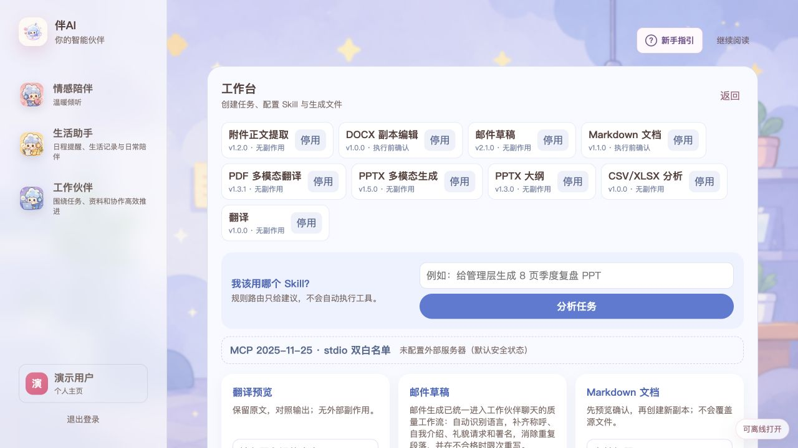

#### 对话实测：平台实际接收的 PPT 生成 Prompt

为确保演示截图与真实任务完全一致，下面展示平台实际收到的提示词。Prompt 要求工作伙伴先检索项目 RAG 知识文档，将技术亮点、功能实现和使用方法加入上下文，再使用三张真实系统截图生成 11 页中文 PPTX；视觉上明确要求图文并茂，并使用“三个模块的功能与用法对照”和“Agent 三层并行化对照”两张可编辑表格。“下一步计划”和“要点回顾”均作为正式页面保留。

[查看实际发送到平台的完整 Prompt](docs/demo/ai-companion-platform-prompt.txt)

**目标、资料与页面结构**

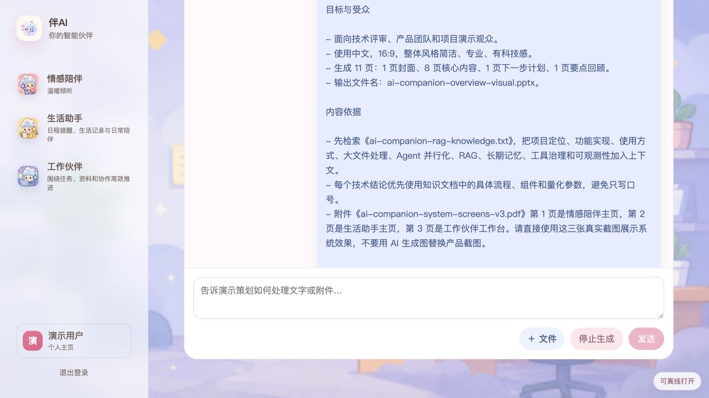

**图文并茂的视觉要求**

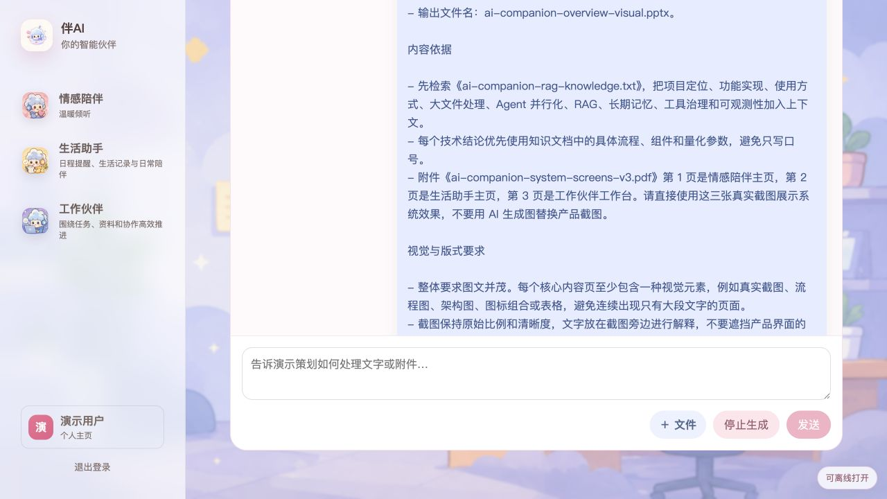

**可编辑表格与页面安排**

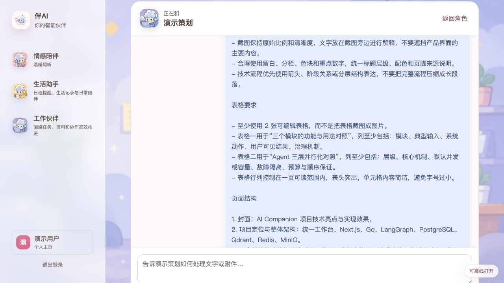

#### 实际生成成果：RAG 增强的 8 页 PPTX 演示文稿

工作伙伴先将项目定位、技术亮点、功能实现、使用方式和常见问答写入文档知识库，再围绕核心功能、大文件处理、Agent 并行化与治理机制执行检索。检索结果作为文字上下文交给 `PPTX 多模态生成` Skill，同时附带情感陪伴、生活助手和工作伙伴三张真实主页截图。下方展示的是仓库中已经通过校验的 8 页成品；本次重新发送的平台 Prompt 已升级为 11 页，恢复“下一步计划”和“要点回顾”，并新增图文并茂与可编辑表格要求。三张产品截图均直接来自系统实拍，未使用 AI 生成图片替换。

[查看用于 RAG 检索的项目知识文档](docs/demo/ai-companion-rag-knowledge.txt)

[下载完整 PPTX：ai-companion-overview.pptx](docs/demo/ai-companion-overview.pptx)

**第 1 页：封面**

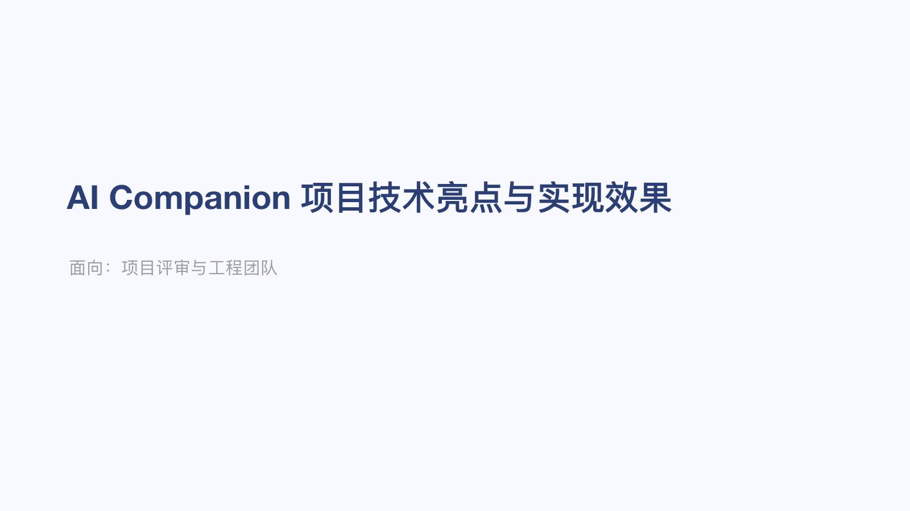

**第 2 页：项目定位与整体架构**


**第 3 页：情感陪伴实现效果**

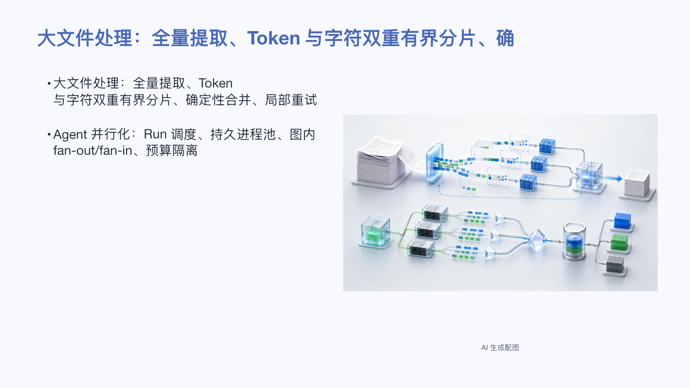

**第 4 页：生活助手实现效果**

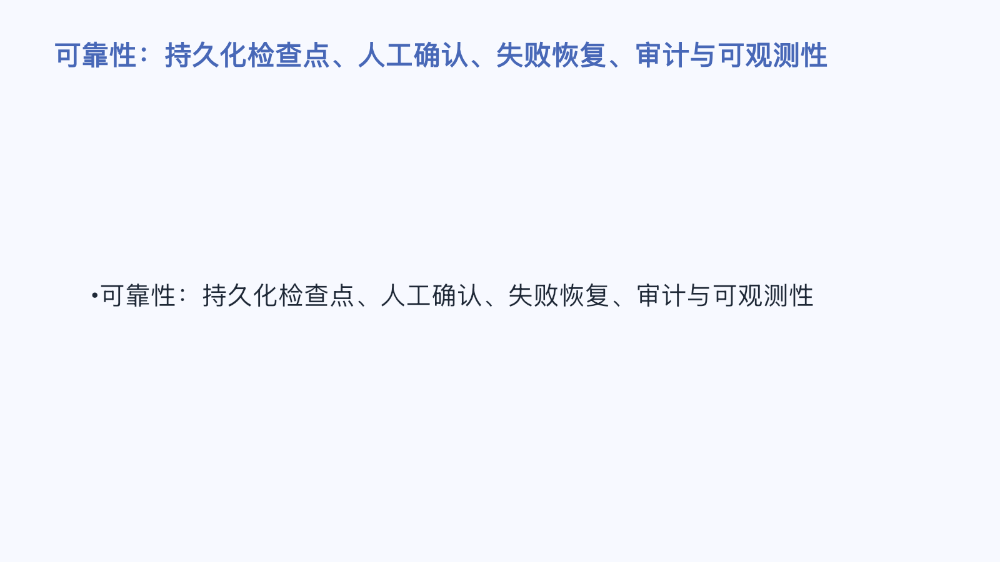

**第 5 页：工作伙伴与使用流程**

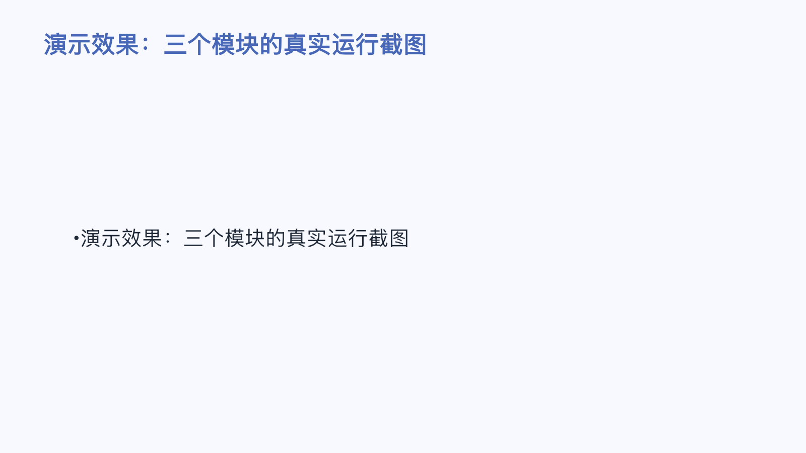

**第 6 页：大文件无损分片**

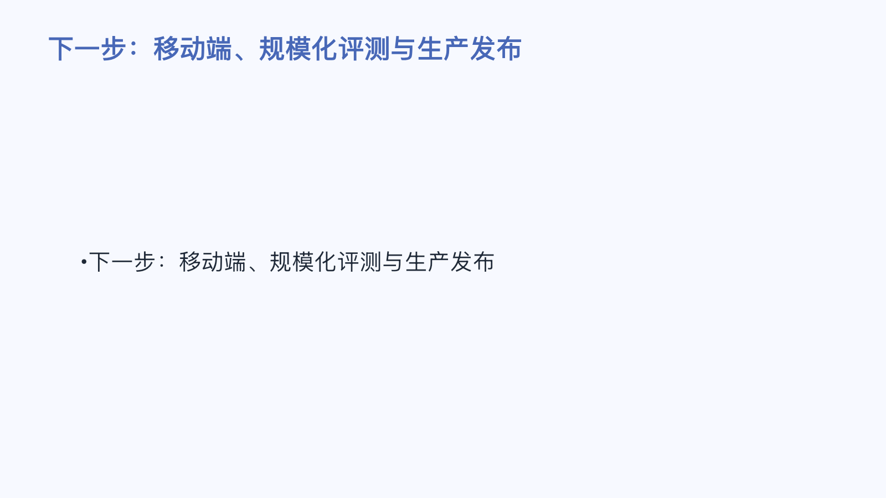

**第 7 页：Agent 三层并行化**

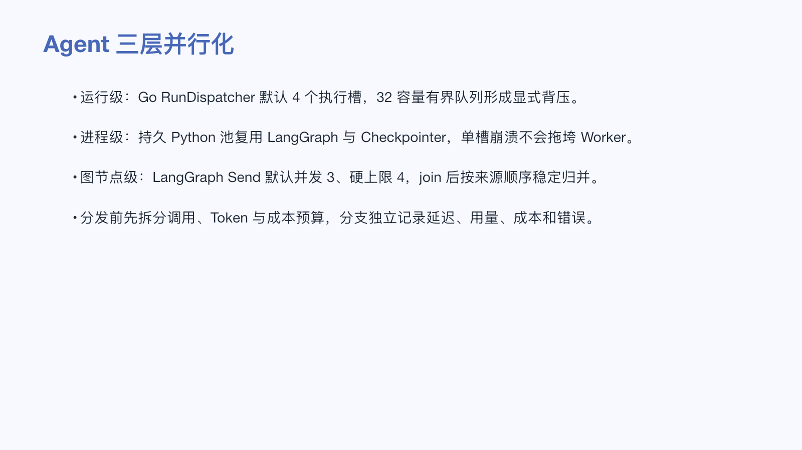

**第 8 页：RAG、记忆与治理**

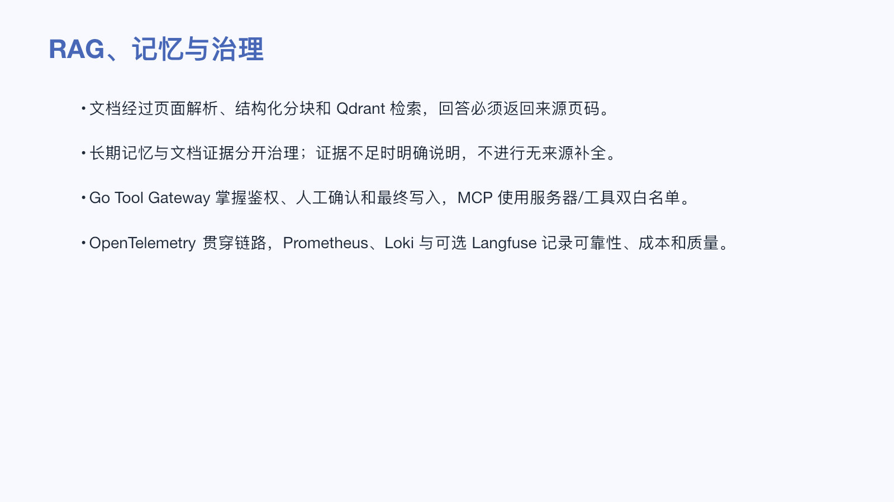

## 核心能力

- **可靠对话**：支持持久化会话、流式生成、重试、取消、故障恢复以及陪伴、生活、工作三类对话模块。
- **长期记忆与 RAG**：支持记忆提取、受限上下文组装、PDF/文本解析、结构化分块、Qdrant 检索、引用溯源、证据不足提示和数据删除。
- **生活助手**：覆盖记账候选确认、账目管理、Excel 导出、计划、提醒和应用内通知。
- **工作技能平台**：提供版本化 Skill 运行时、意图路由、大文件分片处理、文档/表格/演示文稿生成、长任务执行和生成文件访问控制。
- **可治理 Agent**：通过持久化图执行实现规划、工具调用、人工确认、中断恢复、超时与取消；业务写入始终由 Go 服务鉴权并落库。
- **团队协作**：支持工作空间、邀请以及文档、生成文件、账目导出的按需共享，同时隔离未共享的个人数据。
- **运营与控制台**：提供用户治理、操作员 MFA/RBAC、Agent Studio、模型与 Prompt 版本、评测、灰度、回滚、成本分析、告警和事件管理。

## 技术亮点

### 1. 面向大文件的无损分片与确定性合并

项目没有通过截断或代表性采样来规避上下文窗口，而是为大文档建立了可恢复的全量处理链路：

- **有序全量提取**：附件按原始 Chunk 顺序读取，单次最多返回 4 个、每个上限 4,000 Token 的轮次；每轮都携带 Chunk 范围、页码、清洗统计、`has_more` 和 `next_round` 游标。
- **覆盖率可证明**：继续提取由确定性节点驱动，覆盖率通过 Chunk 区间并集计算；重复执行同一轮不会虚增进度，直到完整覆盖源文件。
- **Token/字符双重有界分片**：提取结果继续拆成独立 Composer Source Batch，默认同时受 2,000 Token 和 12,000 源字符上限约束。切分优先选择页边界和行边界，并保留少量只读重叠上下文，避免跨边界记录丢失。
- **结构而非纯文本优先**：固定版式数据先转换为 `document-source-ir-v1`，保留表、列、行组、行、单元格、继承值和稳定来源 ID；只在逻辑组之间或可检查点化的子切片之间拆分。
- **确定性归并**：各分片结果按来源顺序或 Source Entity ID 合并，重叠记录去重，并通过双向精确率/召回率门禁检查缺失、额外、孤立和未引用实体。
- **局部失败局部重试**：每个分片拥有独立检查点。失败或完整性检查不通过时，只重跑失败分支或包含缺失 Source Key 的批次，已成功结果不会被丢弃。
- **内容寻址缓存**：解析结果、来源图片、生成图片和 Composer 分支结果写入有界私有原子缓存；精确重试可复用已完成分片，减少重复模型调用。

直接回退提取支持产品上传上限内的 20MB 文件。最终文件只有在来源覆盖、结构完整性、画布容量和可读性等硬门禁全部通过后才会交付。

### 2. Agent 的三层并行化设计

并行化不是简单地把模型请求一起发出，而是在运行级、进程级和图节点级分别控制吞吐、隔离与预算：

- **多 Run 并行调度**：Go `RunDispatcher` 默认提供 4 个执行槽和有界队列。相同 Run 的重复提示会被合并；若运行中出现新状态，只保留一次尾随 Replay，防止重复事件制造无界任务。
- **持久 Python 进程池**：进程池大小与 Agent 执行并发对齐，复用已编译 LangGraph、模型决策端口和 PostgreSQL Checkpointer 连接。默认预热 1 个进程；单进程超时、崩溃、EOF 或协议异常只回收对应槽位，不拖垮整个 Worker。
- **单 Run 内 fan-out/fan-in**：结构化和叙事型大文档通过 LangGraph `Send` 将独立 Source Batch 分发到并行 Composer 分支，默认并发为 3、硬上限为 4；`join_composition` 再按原始 Batch 顺序确定性归并。
- **先分预算，再开并行**：分发前将剩余模型调用次数、Prompt Token、Completion Token 和成本预算拆成互不重叠的份额。任何分支都无法借并发绕过单 Run 的总预算。
- **并行可观测、失败可结算**：每个分支独立记录模型、延迟、Token、成本、Batch ID 和错误；即使部分分支失败，已发生的用量也会完整结算，成功结果可保留用于一次有界重试。
- **先路由、按需规划**：Agent 先判断直接回答、单一可信工具或复杂任务；直接回答和单工具路径可跳过 Planner，只有多步、可重复或显式要求规划的任务才进入完整规划环，减少不必要的模型调用。
- **处理域级模型熔断**：若某模型返回的工具调用或参数违反 Composer 契约，同一文档范围内尚未开始的分片会立即跳过该模型；已进入并发窗口的请求允许正常结算，传输故障与契约故障则采用不同恢复策略。
- **专用任务并行**：PDF 翻译批次默认并发 2，并按源顺序合并；演示文稿图片请求同样有界并行，同时优先复用与引用页匹配的 PDF 原图，来源素材充足时直接跳过图片模型调用。

这套设计兼顾了吞吐与确定性：测试会同时断言峰值并发、输出顺序、预算结算以及并行墙钟时间低于模型调用耗时总和。

### 3. 数据库优先的可靠异步架构

PostgreSQL 是任务状态、Agent Run、租约、重试计划、幂等键和审计记录的事实来源。Worker 使用有界并发、行级租约和 `SKIP LOCKED` 认领任务，可在进程中断后继续恢复。

Kafka 不是启动项目的强依赖，而是按需启用的横向扩展加速器。启用后，系统仍通过事务性 Outbox、Inbox 去重、DLQ、补偿和数据库对账处理“至少一次”投递，避免把消息中间件误当作业务一致性的唯一保障。

### 4. 可中断、可恢复、可审批的 Agent 执行链

Agent Worker 使用 LangGraph 与 PostgreSQL Checkpointer 持久化执行状态。模型负责意图选择和参数生成，Go Tool Gateway 则掌握工具定义、鉴权、确认和业务写入权限。

写操作可在人工确认点暂停，并在审批后恢复同一条运行记录；取消和超时通过持久化控制状态、轮询以及 revision fencing 阻止迟到结果落库，从执行层面减少重复回复和越权副作用。

### 5. 模块化单体，兼顾交付效率与领域边界

后端采用 Go 模块化单体，按身份、会话、记忆、文档、技能、账目、计费、安全、Agent、控制面等领域拆分包，并将 API 与异步 Worker 分为独立进程。它保留了单体事务和本地开发的简洁性，也通过清晰的接口、事件契约和数据边界为后续服务拆分留出空间。

### 6. 有证据边界的记忆与知识检索

文档处理链路包含页面级解析、结构化分块、向量索引、检索和引用返回。系统不仅提供 RAG 结果，还显式处理“证据不足”，并支持原文与索引清理，降低无来源回答和数据残留风险。仓库内置 100 条检索质量用例作为 M2 阻断门禁。

### 7. 受控的 Skill 与 MCP 扩展机制

Skill 运行时具有版本、状态、租约、重试和生成文件权限控制。Python 算法任务运行在隔离 Worker 中，外部 MCP stdio 服务必须由运营方配置绝对路径并显式声明工具白名单；任何外部副作用都不能绕过 Go 服务的授权边界。

### 8. 从模型调用到发布决策的全链路可观测性

系统使用 OpenTelemetry Trace 贯穿 HTTP、事务性 Outbox、异步消费和 Agent 调度；Prometheus 暴露低基数可靠性指标；Grafana Alloy 与 Loki 承载脱敏结构化日志，并在 Loki 不可用时回退到 PostgreSQL 审计日志。

Langfuse 作为可选、故障开放的 LLM/Agent 可观测后端，记录运行、模型生成、节点耗时、Token/成本、版本关联和质量评分。内容采集默认关闭，不影响本地权威运行记录和发布门禁。

### 9. 面向真实故障场景的发布工程

项目将重试预算、熔断、幂等、租约接管、毒消息、重复投递、超时和对账纳入自动化测试。发布门禁可生成 JSON/JUnit 证据，对 Canary 前后指标、质量、重复回复、单次模型调用约束和延迟进行判断，并采用签名、短期授权和追加式哈希链保护关键证据。

## 系统架构

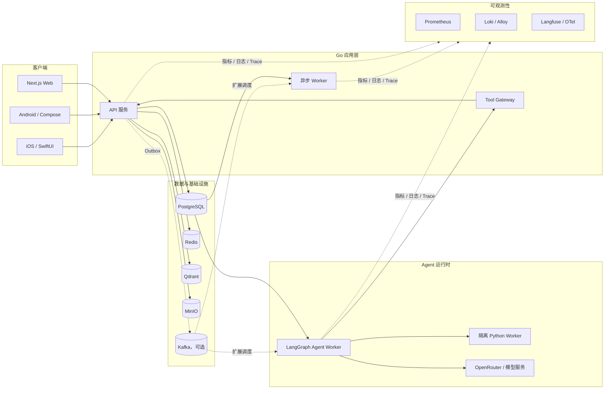

默认模式下，任务由 PostgreSQL 驱动；达到多 Worker 扩展或事件扇出需求后，可启用 Kafka profile 加速分发。两种模式共享相同的业务状态、租约、幂等和恢复语义。

### 大文件并行处理流水线

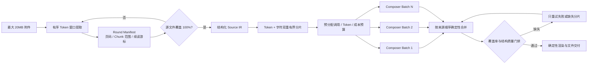

每个 Composer 分支都可独立检查点化、计费、观测和缓存。并行执行只改变处理时延，不改变最终合并顺序、来源覆盖要求或总预算上限。

## 技术栈

| 层级 | 主要技术 |
| --- | --- |
| Web | Next.js 16、React 19、TypeScript 5.9 |
| 后端 | Go 1.26、模块化领域包、HTTP API、OpenAPI |
| Agent | LangGraph、`Send` fan-out/fan-in、PostgreSQL Checkpointer、OpenRouter 兼容模型调用 |
| 算法 Worker | Python 3.12+、隔离文档/数据/媒体处理 |
| 数据 | PostgreSQL 18、Redis 8、Qdrant、MinIO；MySQL 作为迁移/回退路径 |
| 异步与事件 | 数据库租约、Transactional Outbox、可选 Kafka 4、Inbox/DLQ/补偿 |
| 可观测性 | OpenTelemetry、Prometheus、Grafana Alloy、Loki、可选 Langfuse |
| 客户端 | Next.js Web、Kotlin/Jetpack Compose、Swift/SwiftUI |
| 交付 | Docker Compose、Caddy、Makefile、JSON/JUnit 发布证据 |

### 关键并行与分片参数

| 环境变量 | 默认值 | 作用 |
| --- | ---: | --- |
| `AGENT_WORKER_CONCURRENCY` | `4` | Go 层同时执行的 Agent Run 数量，也是持久 Python 池的容量基准 |
| `AGENT_DISPATCH_QUEUE_SIZE` | `32` | Agent 调度器有界队列容量，用于显式背压 |
| `AGENT_PYTHON_POOL_WARM_SIZE` | `1` | Worker 就绪前预热的 Python Agent 进程数 |
| `AGENT_MODEL_FANOUT_CONCURRENCY` | `3` | 单个 LangGraph Run 内 Composer 分支并发数，有效范围为 1–4 |
| `AGENT_COMPOSER_SOURCE_BATCH_MAX_TOKENS` | `2000` | 单个大文档 Composer 来源分片的 Token 上限 |
| `AGENT_COMPOSER_SOURCE_BATCH_MAX_CHARS` | `12000` | 单个大文档 Composer 来源分片的字符上限 |
| `MODEL_COMPOSER_BATCH_MAX_TOKENS` | `6144` | 单个 Composer 分支的结构化输出上限 |
| `MODEL_TRANSLATION_CONCURRENCY` | `2` | PDF 翻译批次并发数，有效范围为 1–4 |
| `MODEL_PRESENTATION_IMAGE_CONCURRENCY` | `2` | 演示文稿图片生成并发数，有效范围为 1–4 |

所有并发参数都有硬上限或有界队列保护。模型分支在启动前先预留独立预算，因此增大并发不会放大单次运行允许的调用次数、Token 或成本。

## 快速开始

### 环境要求

- Go 1.26+
- Python 3.12+
- Node.js 24+ 与 pnpm 11+
- Docker Desktop 与 Docker Compose v2

仅开发 Web/后端时无需安装 Android 或 iOS 工具链。原生客户端分别需要 JDK 17 + Android Studio/API 37，以及 Xcode 26+ + XcodeGen。

### 使用 Docker 启动完整开发环境

```bash
cp .env.example .env
# 在对外暴露服务前，请替换所有 change-* 开发密钥
make docker-up
make docker-ps
```

启动后访问：

- Web：<http://localhost:3000>
- API：<http://localhost:8080>
- 健康检查：<http://localhost:8080/healthz>
- 就绪检查：<http://localhost:8080/readyz>

常用命令：

```bash
make docker-logs   # 查看 API、Worker、Agent Worker 和 Web 日志
make docker-down   # 停止完整应用栈
```

### 在宿主机运行 Go 服务

```bash
make infra-up
make postgres-migrate
make run-api
```

另开终端启动后台 Worker：

```bash
make run-worker
```

需要在宿主机运行 Agent 时，再开一个终端：

```bash
make run-agent-worker
```

如需启用 Kafka 横向扩展模式：

```bash
make docker-up-kafka-scale
```

## 配置模型服务

默认 `.env.example` 使用 `MODEL_PROVIDER=development`，无需真实模型密钥即可进行本地工程验证。接入 OpenRouter 时，请设置服务端的 `MODEL_PROVIDER`、`MODEL_BASE_URL`、`MODEL_API_KEY` 和具体模型名称。

生产环境注意事项：

- 不要使用动态的 `latest`、`auto` 或未固定版本的模型别名；
- `AGENT_GATEWAY_TOKEN`、`AGENT_CONFIRMATION_SECRET` 和模型密钥只能作为服务端秘密，不能使用 `NEXT_PUBLIC_*` 前缀；
- 真实密钥应由 Secret Manager 注入，不应提交到仓库或写入发布证据；
- 模型升级需同步更新配置版本，并经过项目评测集与 Canary 验证。

模型角色、回退顺序、预算和隐私策略详见 [OpenRouter 模型配置](docs/OPENROUTER_MODELS.md)。

## 质量与发布门禁

运行本地综合检查：

```bash
make check
```

运行 Web/后端内部发布门禁：

```bash
make release-check
```

该门禁覆盖 Go 全量测试、Python Worker 单元测试、OpenAPI YAML 解析、Docker Compose 配置校验、发布证据脚本与验证器测试，以及 Git diff 空白检查。

专项质量检查：

```bash
make eval-m2        # 100 条 RAG 检索质量用例
make eval-m4        # 意图路由回归门禁
make eval-agent     # Agent 结果与执行链契约
make eval-agent-runtime  # 并发、背压与异步恢复契约
make validate-observability
```

更多 Agent、可观测性 Canary、故障演练和发布证据命令请参阅 [英文运维 README](README.md) 与 [运行手册](docs/runbooks/)。

## 目录结构

```text
cmd/api/                 Go HTTP API 入口
cmd/worker/              通用异步 Worker
cmd/agent-worker/        Agent 调度与执行进程
internal/                后端领域模块与平台基础设施
workers/python/          隔离的文档、数据与媒体算法 Worker
web/                     Next.js Web 客户端
mobile/android/          Kotlin + Jetpack Compose 客户端
mobile/ios/              SwiftUI 客户端与可测试核心
api/openapi/             HTTP API 契约
events/schemas/          事件契约
migrations/              正向与回滚数据库迁移
deploy/                  Compose、镜像、Caddy 与可观测性配置
evals/                   RAG、Agent 与发布质量基线
docs/adr/                架构决策记录
docs/runbooks/           运维、演练与发布手册
```

## 设计原则

- **数据状态优先于消息投递**：业务表和持久化 Run 是事实来源，队列负责加速而不承担唯一真相。
- **模型提议，服务端决策**：模型不能绕过工具白名单、人工确认、配额、安全策略和业务鉴权。
- **默认最小暴露**：日志脱敏、内容观测关闭、密钥服务端化、个人数据按需共享。
- **失败可恢复，副作用可追踪**：使用幂等键、租约、重试预算、revision fencing 和审计记录处理异常。
- **用证据发布**：模型或 Agent 变更必须经过版本化评测、Canary、指标对比与可验证证据。

## 当前范围与限制

仓库已完成 M0–M4、M6 和 Web/后端 M8 范围。以下内容不在当前完成声明内：

- M5 金融研究与付费市场数据链路；
- M7 Android/iOS 完整 Beta 产品化与应用商店发布；
- 外部生产环境正式上线和真实流量切换；
- 模型、邮件、支付、OAuth 等第三方提供商的审批与生产凭据。

在邀请外部测试或接入生产流量前，请按照 [项目完成情况](docs/PROJECT_COMPLETION.md) 和对应 [运行手册](docs/runbooks/) 完成密钥、MFA、迁移、监控、发布证据和区域合规检查。

## 相关文档

- [项目完成情况](docs/PROJECT_COMPLETION.md)
- [开发计划](docs/DEVELOPMENT_PLAN.md)
- [详细设计](docs/DETAILED_DESIGN.md)
- [Agent 与 LangGraph 持久化设计](docs/POSTGRES_LANGGRAPH_MIGRATION.md)
- [模型角色、并行 Composer 与预算策略](docs/OPENROUTER_MODELS.md)
- [架构决策记录](docs/adr/)
- [OpenAPI 契约](api/openapi/openapi.yaml)
- [运行与发布手册](docs/runbooks/)
- [iOS 客户端说明](mobile/ios/README.md)
