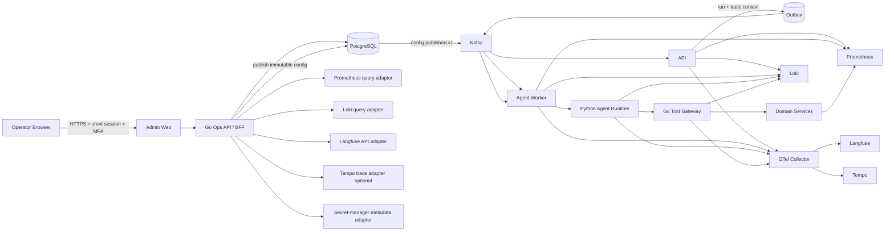

# 伴AI 后台管理、可观测性与 Agent Studio 设计

- 状态：本地可交付范围已完成（外部观测归档与第三方实验平台为可选集成）
- 日期：2026-09-09
- 范围：后台管理、Agent/大模型执行追踪、系统指标、日志检索、套餐与模型配置、Agent 编写/评测/发布
- 说明：本文同时保留目标架构和分阶段实施边界；尚未实现的能力会明确标注。

## 1. 设计结论

在现有模块化单体、PostgreSQL、Kafka、Agent Worker、Prometheus/Grafana 和运维账号体系上增加一个独立后台控制面，不重写现有运行时。

后台由三部分组成：

1. **Operations Console**：查看总览、Agent Run、模型调用、工具调用、队列、系统指标、日志、告警和审计。
2. **Configuration Center**：版本化管理套餐额度、模型服务/路由、Agent 预算和少量可热更新参数。
3. **Agent Studio**：以受控声明式 DSL 编写 Agent，管理 Prompt、节点、边、工具白名单、模型角色、预算、评测、灰度、发布和回滚。

关键架构决定：

- 后台前端独立部署在运维域名，不与用户端共享登录态。
- PostgreSQL 保存权威运行状态、配置版本、发布记录和审计记录。
- Prometheus 继续负责低基数指标；不把 `run_id`、`user_id` 等高基数字段作为指标标签。
- 本项目自身保存 LLM/Agent 权威运行证据、Prompt 版本、评测结果和质量指标；Langfuse 已作为可关闭、故障开放的 LLM/Agent 专项观测后端，接收 Trace、Generation、节点 Observation、版本关联与 Score，但不是运行或交付依赖。Loki + Alloy 已负责结构化系统日志采集与关联查询，并以 PostgreSQL 日志表作为显式回退；Tempo 仍作为达到完整 APM 规模后的可选增强，Prometheus 保留系统指标排障能力。
- 后台通过受控查询接口聚合 PostgreSQL、Prometheus、Loki 和 Tempo，不向浏览器暴露这些系统的管理凭据，也不开放任意 SQL、PromQL 或 LogQL。
- Agent 编写只允许使用注册过的节点类型和工具。任意 Python/JavaScript、自定义网络请求和 Shell 代码不允许在后台直接执行。
- 套餐、模型和 Agent 配置均使用不可变版本；生产发布要求 MFA、变更原因、评测证据和双人审批，可一键回滚到上一个已发布版本。
- 新发布只影响新 Run；已开始、等待审批或等待工具的 Run 始终恢复到创建时固定的 Agent/模型/Prompt 配置快照。
- “追踪大模型过程”展示节点、模型请求元数据、工具调用和结果摘要，不采集或展示模型隐藏思维链。推理 token 只显示数量。

### 1.1 当前实施进度

- 已实现 Operations Console 的 Run 列表/详情、节点轨迹、模型调用、成本、工具调用、事件与可靠性总览。
- 已将普通用户入口 `/` 与管理入口 `/admin` 分离；管理端仅使用管理密钥认证，密钥只保存在页面内存，旧 `/ops` 地址自动跳转到新入口。
- 已实现套餐、模型 Profile 和 Agent 定义的不可变版本、校验、提交、双人发布、回滚及审计接口。
- 新 Run 已持久化模型 Profile 与 Agent 定义的精确版本、部署 revision、fingerprint 和完整无密钥快照；恢复不重新读取 active 配置。
- Python Worker 已按 Run 快照隔离运行时缓存，应用模型路由、Agent 模型调用/总 token 预算和工具白名单；无已发布 Agent 定义时兼容现有内置图。
- 已实现声明式节点/边编译、隔离合成试跑、版本化评测记录、Agent 提交门禁，以及基于真实 Run 的稳定用户分流、在线质量门禁、自动停流和原子全量发布；Langfuse LLM/Agent 遥测导出和 Loki/Alloy 结构化日志查询均已接入，Tempo 聚合追踪仍作为按规模引入的可选增强。
- 已实现可视化 Agent 编排画布、节点级合成调试、Prompt 独立不可变版本、精确版本绑定、发布与回滚。
- 已实现持久化脱敏日志中心，以及基于日志窗口的告警规则、定时/即时评估、事故自动创建/恢复、人工确认/解决和关联日志下钻。
- 已实现按规则/级别配置的邮件通知订阅、事故发生与恢复投递、失败重放记录，以及包含审计时间线和脱敏日志的 Markdown/JSON 证据导出。
- 已实现按 Agent/模型配置版本聚合的成本与质量分析、小时/日趋势、基线异常检测，以及按全部或单模块设置的日/月预算；预算配置持久化、带乐观锁修订并记录操作审计。
- 已实现预算的周期自动评估：到达预警线时创建统一事故、超过上限时升级为严重事故、回到安全区或停用时自动恢复；全局邮件订阅接收发生、升级和恢复通知，证据报告保留精确成本与周期窗口。
- 已实现统一用量账本视图，聚合文档、Skill Run、Agent Run、模型成本和工作区，并提供带 MFA、原因和审计的追加式额度纠错；源事实不可修改。
- 已实现 API/Agent Worker 配置心跳与多实例收敛状态页，可区分已收敛、旧版本、加载错误和离线实例。
- 已增加持久化管理控制台通知渠道，并支持预算 30/90/365 天 Markdown/JSON 周期复盘导出。
- 已将请求 Trace 持久化到 Outbox，随 Kafka 信封与消息头传播，并在 Worker 消费、Agent 异步调度和死信详情中继续关联。

## 2. 现状盘点

### 2.1 可直接复用的能力

| 现有能力 | 位置/形式 | 后台用途 |
| --- | --- | --- |
| Agent Run 权威状态 | `agent.runs` | Run 列表、状态筛选、耗时和失败分析 |
| Agent 状态事件 | `agent.run_events` | Run 生命周期时间线 |
| Tool 调用 | `agent.tool_calls` | 工具风险、参数摘要、审批和结果状态 |
| Interrupt | `agent.interrupts` | 等待审批、等待工具、恢复历史 |
| Graph 节点轨迹 | `run.output.observability.node_trace` | 节点瀑布图和执行路径 |
| 模型调用元数据 | `run.output.model.calls` | 模型、角色、token、成本、延迟、错误和 fallback |
| 统一模型用量视图 | `app.model_usage_observations` | Agent、旧聊天和 Skill 的统一成本查询 |
| 运维认证 | `app.operator_accounts`、MFA、viewer/support/admin | 后台登录和权限基础 |
| 运维审计 | `audit_logs`、`trace_id`、CSV 导出 | 配置和人工操作审计基础 |
| DLQ/脏消息/补偿接口 | `/v1/ops/*` | 队列运维页面 |
| 可靠性快照 | `/v1/reliability`、`/metrics` | 首页健康状态和降级策略 |
| 指标与告警 | Prometheus、Grafana、告警规则 | 系统指标与告警中心 |
| Agent 评测 | `evals/agent`、JSON/JUnit 报告 | Agent Studio 发布门禁 |
| 发布证据/灰度控制 | 现有 Gate、Canary、rollout artifacts | 模型和 Agent 灰度复用 |

### 2.2 必须补齐的缺口

| 缺口 | 影响 | 设计处理 |
| --- | --- | --- |
| 无后台 Web 产品 | 现有 `/v1/ops` 只能被脚本调用 | 新建独立 Operations Console |
| 无运维 Run 列表/详情接口 | 只能用用户身份按单个 Run 查询 | 增加脱敏的 `/v1/ops/agent-runs` 查询族 |
| 模型调用埋在 Run JSON 输出中 | 聚合、分页、失败调用查询效率差 | 增加规范化 `agent.node_executions` 和 `agent.model_calls` |
| 失败前的模型事件可能未进入最终输出 | 无法完整解释异常 Run | 每次节点/模型调用增量写遥测事件，并保留 Trace |
| API `trace_id` 未贯穿异步链路 | API 日志与 Kafka/Agent 日志难关联 | 已在 Outbox、Kafka 信封/消息头、消费者上下文和 Agent 调度日志中传播受校验的 Trace ID；Run ID 继续作为业务关联 ID |
| 日志只有容器 stdout | 无统一查询、保留和访问控制 | JSON 日志进入 Loki；后台提供受控日志查询 |
| 当前指标偏五分钟快照 | 缺少分位数、节点和模型维度趋势 | 增加低基数 counter/histogram/gauge |
| 套餐目录运行时来自硬编码默认值 | 修改数据库套餐不会自动生效 | 版本化套餐目录并由运行时读取发布版本 |
| 模型配置来自环境变量 | 变更需重启，无法审批和回滚 | 环境变量仅作 bootstrap/灾备，常规选择进入版本化模型配置 |
| Agent Graph 为代码固定定义 | 业务人员无法安全编写和试验 Agent | 新增声明式 Agent DSL、编译校验、评测和发布流程 |
| 运维 Bearer Token + 每请求 TOTP 不适合浏览器 | 长期 Token 暴露风险较高 | 增加短时后台会话，HttpOnly/Secure/SameSite Cookie，敏感操作 step-up MFA |

## 3. 目标与非目标

### 3.1 目标

- 30 秒内定位一条 Run 当前停在哪个节点、为何等待或失败。
- 从 `trace_id`、`run_id`、`conversation_id`、用户匿名标识中的任一个入口完成关联排障。
- 查看模型调用的角色、请求/返回模型、上游服务、延迟、token、成本、fallback、重试和契约校验结果。
- 查看 API、Worker、PostgreSQL、Kafka、Redis、Qdrant、对象存储和模型服务的健康与趋势。
- 在权限和脱敏规则内查询日志，并从 Run 时间线跳转到精确时间窗口。
- 通过 API 和后台安全调整套餐额度、模型路由、Agent 定义和运行预算。
- 支持 Agent 草稿、校验、沙箱试跑、离线评测、Canary、灰度、发布和回滚。
- 所有写操作可追责、可验证、可回滚，不直接修改历史运行证据。

### 3.2 非目标

- 不把后台做成通用数据库管理器、任意日志查询器或服务器 Shell。
- 不允许操作员直接编辑生产 Run 的状态、模型用量或历史事件。
- 不记录完整私聊、上传文件正文、模型隐藏思维链、密钥或确认 Token。
- 不在首版支持后台上传任意代码形成自定义节点；新 Tool/代码节点仍通过代码评审和部署进入受信注册表。
- 不允许后台随意填写模型 Base URL。首版生产仍遵守现有 ADR，只允许预注册的 OpenRouter 服务配置。

## 4. 用户、角色与权限

沿用现有 `viewer < support < admin`，在能力层细化授权，不要求首版立刻增加角色枚举。

| 能力 | viewer | support | admin |
| --- | :---: | :---: | :---: |
| 查看脱敏总览、指标、Run、模型调用、日志 | ✓ | ✓ | ✓ |
| 查看队列、DLQ、审计 | ✓ | ✓ | ✓ |
| 取消/重试允许人工处理的 Run |  | ✓ | ✓ |
| 重放 DLQ、创建补偿记录 |  | ✓ | ✓ |
| 创建套餐/模型/Agent 草稿 |  |  | ✓ |
| 执行沙箱试跑和离线评测 |  | ✓ | ✓ |
| 提交生产发布申请 |  |  | ✓ |
| 审批生产发布 |  |  | ✓，且不能审批自己的变更 |
| 管理运维账号和审计导出 |  |  | ✓ |
| 开启临时敏感调试采集 |  |  | 双 admin + MFA，仅事故模式 |

生产高风险操作规则：

- 登录时验证 MFA；发布、回滚、套餐额度上调、模型服务切换和临时调试采集再次进行 step-up MFA。
- 提交人和审批人必须是不同的活跃 admin。
- 所有写接口必须包含 `reason`、`Idempotency-Key` 和乐观锁版本。
- 操作审计记录 before/after 的脱敏差异、actor、审批人、Trace ID、关联变更单和时间。

## 5. 信息架构与页面

建议独立后台应用和域名，例如 `ops.<domain>`，导航如下。

### 5.1 运行总览

顶部状态：

- 当前环境、版本、发布时间、发布版本。
- API、Worker、Agent Worker、PostgreSQL、Kafka、Redis、Qdrant、对象存储、模型服务健康。
- 当前降级级别 `L0-L3`、原因、候选级别和生效策略。
- 正在触发的告警、错误预算燃烧和发布冻结状态。

核心卡片：

- Run 成功率、失败率、超时率、取消率、等待审批数、等待工具数。
- Run p50/p95/p99、排队 p95、模型 p95、工具 p95。
- 最近 5 分钟/1 小时/24 小时模型调用量、token 和成本。
- fallback 率、429 率、模型契约失败率、质量门禁失败率。
- Kafka lag、最老任务年龄、DLQ 数和 Worker 饱和度。

首页所有卡片可下钻到已带时间和筛选条件的列表。

### 5.2 Agent Runs

列表字段：Run ID、创建时间、模块、Agent 版本、模型配置版本、状态、当前节点、总耗时、模型调用数、token、成本、工具数、重试次数、错误码。

筛选：

- 时间范围、环境、模块、状态、Agent/Graph 版本、模型配置版本。
- 请求模型、返回模型、上游供应商、模型调用状态、fallback。
- Tool 名称、风险等级、审批状态。
- 错误码、质量门禁结果、重试/超时/取消。
- `run_id`、`trace_id`、`conversation_id`、匿名用户标识精确搜索。

默认按 `created_at DESC, id DESC` 游标分页；不允许 offset 扫描大表。

### 5.3 Run 详情

Run 详情是后台最重要页面，分为六个区域：

1. **摘要**：状态、模块、当前节点、固定 deadline、版本快照、预算使用、错误和可执行操作。
2. **节点瀑布图**：每个节点的开始/结束、耗时、状态、attempt、模型/Tool 关联和中断区间。
3. **Graph 路径**：将实际执行节点叠加到已发布 Agent 图；未经过、成功、失败、等待、重试使用不同状态。
4. **模型调用**：角色、请求/返回模型、上游供应商、token、成本、延迟、timeout、fallback、错误状态、契约校验。
5. **Tool/Interrupt**：Tool 参数脱敏摘要、风险、prepare/approval/commit、任务状态、幂等键摘要和结果摘要。
6. **事件与日志**：持久化事件、Trace spans 和同一时间窗口的结构化日志合并展示。

详情页不展示模型隐藏思维链。Prompt 区只展示：

- Prompt 模板名称和版本。
- 变量名、各变量大小、来源类型和哈希。
- 默认脱敏后的输入/输出摘要。
- 仅在显式授权且数据策略允许时显示短时加密调试样本；到期自动销毁。

### 5.4 模型与成本

- 按时间、模块、Agent、角色、配置版本、请求模型、返回模型和上游服务聚合。
- Calls、成功率、fallback 率、429/5xx、p50/p95/p99、prompt/completion/cached/reasoning tokens、成本。
- 单 Run 成本、单成功 Run 成本、单位输出 token 成本。
- 实际值与套餐、Agent 预算、模型配置预算对比。
- 版本对比：发布前后质量、成本、延迟和错误率。

### 5.5 系统指标

- 应用：吞吐、5xx、延迟、连接和限流。
- Agent：状态、队列、节点耗时、重试、控制轮询、Python pool、dispatch、tool wake。
- 数据依赖：PostgreSQL 连接/慢查询/锁，Kafka consumer lag，Redis/Qdrant/对象存储错误与延迟。
- 主机/容器：CPU、内存、磁盘、网络、重启和 OOM。
- 保留 Grafana 深链，但后台内只使用预定义图表和 allowlist 查询模板。

### 5.6 日志中心

筛选字段：时间、环境、service、level、event、trace_id、run_id、node、model、tool、error_code。

交互：

- 从 Run 详情自动带入 `run_id` 和执行时间前后 30 秒。
- 展开 JSON 字段、复制脱敏事件、生成事故链接。
- 错误日志可跳转对应 Trace 和 Run。
- 默认不允许全文搜索聊天内容；禁止使用正则探测敏感值。

### 5.7 配置中心

- 套餐与额度。
- 模型服务和模型角色路由。
- Agent 全局预算与灰度。
- 配置变更单、审批、发布、回滚和生效状态。
- Secret 只显示引用名、可用状态和最近验证时间，不显示值。

### 5.8 Agent Studio

- Agent 列表和已发布/草稿版本。
- 画布编辑与 YAML/JSON 双向视图。
- Prompt 模板编辑、变量检查和版本差异。
- Tool Catalog 浏览和权限选择。
- 静态校验、沙箱试跑、离线评测、结果对比。
- Canary/灰度、发布和回滚。

### 5.9 既有运维页面

继续包含队列/DLQ、邮件投递、用户、运维账号、审计、补偿记录和发布就绪检查，并统一新的导航和权限矩阵。

## 6. 总体架构



首版保持 Go 模块化单体：Ops API、配置服务和 Agent 定义服务作为新的 `internal/*` 模块部署在现有 API 进程中。只有在查询负载或发布职责需要独立扩缩容时再拆服务。

### 6.1 Langfuse 采用决策

**建议采用，但不能把 Langfuse 当成整套后台。** Langfuse 当前适合承担 LLM/Agent Trace、generation/tool/agent observation、Prompt 版本、数据集、实验和评测分数；其数据模型基于 OpenTelemetry，也支持将同一遥测发送到多个目的地。

| 能力 | 是否交给 Langfuse | 说明 |
| --- | --- | --- |
| Agent/节点/模型/Tool Trace 浏览 | 是 | 可直接使用 observation tree/agent graph，减少自研排障 UI |
| 模型 token、成本、延迟分析 | 是，作为分析面 | 计费事实仍以本项目持久化调用记录为准 |
| Prompt 草稿、版本和实验 | 是 | 发布时导入并固定准确版本与 hash |
| Dataset、Experiment、人工/自动 Score | 是 | 与现有 `evals/agent` 互通，现有 Gate 仍是阻断发布的权威判定 |
| 系统 CPU/内存/Kafka/PostgreSQL 指标 | 否 | 继续使用 Prometheus/Grafana |
| 应用和容器日志 | 否 | 使用 Loki |
| 通用跨服务 Trace | 可选 | 小规模可先用 Langfuse；需要完整非 LLM APM 时再增加 Tempo |
| 套餐、额度和计费账本 | 否 | 由项目 PostgreSQL 权威保存 |
| 模型路由、Secret 和双审批发布 | 否 | 由配置控制面负责 |
| Agent DSL、Tool 权限和运行时编译 | 否 | 由 Agent Studio 和现有 Tool Gateway 负责 |
| 运维账号、业务审计、DLQ | 否 | 复用现有 `/v1/ops` 和审计体系 |

推荐映射：

- 一个 Agent Run 对应一个 Langfuse trace/root `agent` observation。
- 一个会话对应 `session_id=conversation_id`。
- Graph 节点对应 `span/chain/agent` observation。
- 真实模型 HTTP 请求对应 `generation` observation。
- Tool 调用对应 `tool` observation，质量和安全门禁对应 `guardrail/evaluator` observation。
- `run_id`、`agent_version`、`model_profile_version`、module、environment 作为 metadata/tag；用户标识使用项目内匿名 ID。
- Prompt observation 链接到精确 Prompt version，禁止运行时使用浮动 `production/latest` 标签。

Langfuse 不在业务主链路上：遥测异步发送，失败不能阻塞 Run；Prompt 在草稿和实验阶段由 Langfuse 管理，生产发布时由本项目控制面读取精确版本、校验 hash，并编译进不可变配置快照。这样 Langfuse 暂时不可用时，已发布 Agent 仍能启动和恢复。

部署选择：

- 开发/验证期可先使用单独项目和严格脱敏的数据接入，验证两周后再决定长期部署。
- 私聊数据敏感，正式环境优先自托管，并为 Langfuse 使用独立数据库/schema、bucket 和最小权限凭据。
- Langfuse v4 自托管包含 Web、Worker、PostgreSQL、ClickHouse、Redis/Valkey 和对象存储，不能把它视为“只加一个容器”；容量、备份、升级和观测盲区都要进入运维范围。
- 若当前资源不足，Phase 1 可只接入脱敏 Langfuse Trace，暂缓 Tempo；当非 LLM 跨服务排障需求增长时，由同一个 OTel Collector 双写 Tempo。

官方能力依据：

- [Langfuse Observability Data Model](https://langfuse.com/docs/observability/data-model)
- [Langfuse Observation Types](https://langfuse.com/docs/observability/features/observation-types)
- [Langfuse Prompt Management](https://langfuse.com/docs/prompt-management/overview)
- [Langfuse Evaluation Concepts](https://langfuse.com/docs/evaluation/core-concepts)
- [Langfuse Self-hosting Architecture](https://langfuse.com/self-hosting)

## 7. 统一关联与追踪模型

### 7.1 关联标识

| 标识 | 生命周期 | 用途 |
| --- | --- | --- |
| `trace_id` | 一次端到端异步操作 | API、Outbox、Kafka、Worker、模型、Tool 的 Trace |
| `span_id` | 一次节点/调用 | 分布式追踪父子关系 |
| `run_id` | 一次 Agent Run | 业务主查询键 |
| `thread_id` | LangGraph checkpoint 线程 | 中断/恢复关联，当前与 Run ID 一致 |
| `conversation_id` | 会话 | 用户问题上下文关联 |
| `node_execution_id` | 节点一次 attempt | 节点瀑布图 |
| `model_call_id` | 单次供应商请求 | 模型成本和错误审计 |
| `tool_call_id` | 单次 Tool 动作 | prepare/approval/commit 关联 |
| `agent_version_id` | Agent 不可变版本 | 解释执行图和 Prompt |
| `model_profile_version_id` | 模型不可变版本 | 解释模型路由和预算 |
| `prompt_version_id` | Prompt 不可变版本 | 解释模板变化 |
| `config_fingerprint` | 运行配置哈希 | 防止恢复时静默漂移 |

`traceparent` 与 `tracestate` 写入 Outbox 事件元数据并随 Kafka 传播；`run_id` 和版本 ID 使用现有业务字段传播。当前不接收任意客户端 baggage，避免用户内容、邮箱或 Token 跨服务扩散。

### 7.2 Run 时间线事件

保留当前 `accepted/running/waiting_approval/waiting_tool/completed/...` 事件，并增加细粒度事件：

- `node.started`、`node.completed`、`node.failed`、`node.retry_scheduled`。
- `model.call.started`、`model.call.completed`、`model.call.failed`。
- `tool.prepared`、`tool.approval_requested`、`tool.approved/rejected`、`tool.committed`、`tool.failed`。
- `run.config_pinned`、`run.budget_warning`、`run.budget_exhausted`。
- `quality_gate.passed/failed`、`artifact_gate.passed/failed`。

事件 payload 必须是版本化、脱敏、尺寸受限的 JSON。大对象只存哈希、类型、大小和安全摘要。

### 7.3 节点执行记录

新增 `agent.node_executions`：

| 字段 | 说明 |
| --- | --- |
| `id`, `run_id`, `sequence_no`, `attempt` | 主键和顺序 |
| `node_key`, `node_kind` | 节点和类型 |
| `status` | running/succeeded/failed/cancelled/timed_out |
| `started_at`, `completed_at`, `duration_ms` | 时间 |
| `parent_execution_id` | 子图/嵌套关系 |
| `prompt_version_id`, `model_call_count`, `tool_call_id` | 关联 |
| `input_summary`, `output_summary` | 脱敏结构摘要 |
| `error_code`, `error_message` | 稳定错误信息 |
| `attributes` | 限制键和值长度的扩展字段 |

### 7.4 模型调用记录

新增 `agent.model_calls`，一行代表一次真实上游 HTTP 调用，而不是一个逻辑节点：

- `id`, `run_id`, `node_execution_id`, `call_index`, `attempt`。
- `provider_profile_key`, `upstream_provider`, `requested_model`, `returned_model`。
- `role`, `status`, `is_fallback`, `generation_id_hash`。
- `prompt_tokens`, `completion_tokens`, `cached_tokens`, `reasoning_tokens`。
- `cost_micros`, `latency_ms`, `timeout_ms`, `time_to_first_token_ms`（支持流式后启用）。
- `reasoning_effort`, `contract_valid`, `contract_error_code`。
- `provider_status`, `error_code`, `retryable`, `retry_after_ms`。
- `prompt_version_id`, `request_hash`, `response_hash`。
- `started_at`, `completed_at`。

保留 `app.model_usage_observations` 作为兼容查询面，逐步改为基于规范化表的统一视图。用量必须以持久化调用记录为准，Prometheus 只做趋势和告警，不能作为计费账本。

## 8. 指标设计

### 8.1 指标原则

- 指标标签只使用低基数字段：environment、service、module、status、node、role、model_family、error_code、tool_name（受信有限集合）。
- `run_id`、`trace_id`、`user_id`、`conversation_id` 只进入日志/Trace/数据库，绝不进入 Prometheus 标签。
- 延迟使用 histogram，不再只暴露累计 duration counter。
- 成本和 token 同时有持久化事实表和指标趋势；两者定期对账。

### 8.2 建议新增指标

| 指标 | 类型 | 关键标签 |
| --- | --- | --- |
| `ai_companion_agent_runs_total` | counter | module,status,agent_version |
| `ai_companion_agent_run_duration_seconds` | histogram | module,status |
| `ai_companion_agent_queue_wait_seconds` | histogram | module |
| `ai_companion_agent_node_duration_seconds` | histogram | node,status |
| `ai_companion_agent_node_executions_total` | counter | node,status |
| `ai_companion_model_calls_total` | counter | role,model_family,status,fallback |
| `ai_companion_model_call_duration_seconds` | histogram | role,model_family,status |
| `ai_companion_model_tokens_total` | counter | role,model_family,type |
| `ai_companion_model_cost_micros_total` | counter | role,model_family |
| `ai_companion_model_contract_failures_total` | counter | role,error_code |
| `ai_companion_tool_calls_total` | counter | tool_name,status,risk_level |
| `ai_companion_tool_call_duration_seconds` | histogram | tool_name,status |
| `ai_companion_agent_budget_exhaustions_total` | counter | budget_type,module |
| `ai_companion_config_publish_total` | counter | config_type,environment,status |
| `ai_companion_config_apply_revision` | gauge | service,config_type |

`agent_version` 若版本数量会无限增长，则指标中只保留受控的 `release_channel`，具体版本进入数据库和 Trace。

### 8.3 告警补充

- Run 成功率、超时率或 p95 相对基线明显恶化。
- 单位成功 Run 成本突增。
- fallback 率、429、模型契约失败率、质量门禁失败率异常。
- 配置发布后服务应用版本不一致或超过 60 秒未收敛。
- PostgreSQL 连接池耗尽、Kafka consumer lag、Agent execution slot 饱和、容器 OOM/restart。
- Loki/Tempo/OTel Collector 不可用时发出观测盲区告警；观测故障不能阻塞业务主链路。

## 9. 日志与 Trace 设计

### 9.1 统一 JSON 日志字段

```json
{
  "timestamp": "2026-09-04T10:00:00.000Z",
  "level": "INFO",
  "service": "ai-companion-agent-worker",
  "environment": "production",
  "event": "model.call.completed",
  "message": "model call completed",
  "trace_id": "...",
  "span_id": "...",
  "run_id": "...",
  "node": "generate_response",
  "model": "model-family",
  "duration_ms": 812,
  "status": "succeeded",
  "error_code": ""
}
```

日志库提供字段构造器和脱敏器，禁止各模块随意记录请求对象。`error` 输出稳定分类和最多 1,000 字符的安全消息；堆栈只进入受限错误日志流。LLM/Agent observation 发送到 Langfuse，通用日志仍发送到 Loki，避免用 Langfuse 替代日志平台。

### 9.2 数据保留建议

| 数据 | 默认保留 | 说明 |
| --- | ---: | --- |
| Prometheus 原始指标 | 30 天 | 可下采样保留 13 个月 |
| Loki 普通日志 | 14 天 | 错误日志 30 天 |
| Tempo Trace | 14 天 | 错误 Trace 30 天 |
| Run/节点/模型元数据 | 180 天 | 与产品数据策略最终对齐 |
| 配置版本、发布记录、审计 | 1 年以上 | 按合规和业务要求确定 |
| 临时敏感调试样本 | 最长 24 小时 | 默认关闭、加密、双审批、自动销毁 |

## 10. 配置中心设计

### 10.1 参数分级

| 等级 | 示例 | 修改方式 |
| --- | --- | --- |
| S0 Secret | API key、数据库密码、认证密钥、确认密钥 | 仅 Secret Manager；后台只选择 `credential_ref` |
| C1 版本化业务配置 | 套餐额度、模型角色映射、Agent/Prompt、预算、灰度 | 后台变更单，可热发布和回滚 |
| C2 受控运行参数 | 模型 timeout/价格上限、Agent 调用预算、Canary 比例 | 后台变更单；严格范围校验 |
| D1 部署配置 | DSN、Kafka brokers、端口、Worker 并发上限、存储路径 | IaC/部署系统，不由普通后台 API 修改 |

### 10.2 配置发布状态机

```text
draft -> validated -> evaluation_running -> ready_for_review
      -> approved -> scheduled/publishing -> active
      -> rejected
active -> superseded
active -> rollback_requested -> rolled_back
```

生产发布步骤：

1. 创建草稿并保存不可变 draft revision。
2. 服务端静态校验、引用校验和安全策略校验。
3. 运行离线评测；模型/Agent 变更还需 Canary 证据。
4. 提交变更单，记录影响、风险、回滚目标和原因。
5. 另一名 admin + step-up MFA 审批。
6. 原子写入 active deployment，并发布 `config.published.v1`。
7. API/Worker 拉取完整快照、验证 fingerprint 后原子换代。
8. 监控应用 revision、错误率、延迟、成本和质量；Canary 任一指标越线立即停止候选流量，稳定版本保持不变。

配置服务不可用时，运行时继续使用本地最后一个已验证版本；不得混合使用半套新配置。新 Run 写入固定的 `agent_version_id`、`model_profile_version_id`、`plan_catalog_version_id` 和 `config_fingerprint`。

## 11. 套餐与用量设计

### 11.1 套餐模型扩展

现有套餐只包含 documents、skill runs 和 workspaces。建议版本化扩展为：

- `documents_active`
- `document_storage_bytes`
- `skill_runs_monthly`
- `agent_runs_monthly`
- `model_prompt_tokens_monthly`
- `model_completion_tokens_monthly`
- `model_cost_micros_monthly`
- `concurrent_agent_runs`
- `workspaces`
- `team_seats`
- `allowed_model_classes`
- `allowed_skills`

额度字段采用资源数组而不是持续增加数据库列，服务端对受支持资源做 schema 校验。`-1` 表示无限只允许内部/企业套餐显式配置，生产界面需醒目标记。

套餐版本发布后：

- 新计费周期默认使用发布时绑定的套餐版本。
- 已开始周期是否立即生效由 `effective_mode` 决定：`next_period`（默认）或 `immediate`。
- 降额若低于用户当前用量，不能删除数据；只限制新操作并展示超额状态。
- 不能直接改“已使用量”。纠错通过追加式 `usage_adjustments` 写入正负调整、原因、证据和到期时间。

### 11.2 用量事实

建立统一 `billing.usage_ledger`：

- `subject_type/subject_id`：user 或 workspace。
- `resource`、`quantity`、`unit`。
- `source_type/source_id`：model_call、skill_run、document、manual_adjustment。
- `period_start/period_end`、`occurred_at`。
- `idempotency_key`，保证重复事件不重复计量。
- `metadata` 只包含版本和脱敏来源信息。

模型 token 和成本以 `agent.model_calls`/Skill 模型调用成功写入后生成的 usage ledger 为准。

### 11.3 套餐管理接口

| 方法与路径 | 作用 | 权限 |
| --- | --- | --- |
| `GET /v1/ops/billing/plans` | 套餐与当前发布版本列表 | viewer |
| `GET /v1/ops/billing/plans/{code}` | 套餐详情和版本历史 | viewer |
| `POST /v1/ops/billing/plans/{code}/versions` | 创建草稿版本 | admin |
| `POST /v1/ops/billing/plan-versions/{id}/validate` | 校验额度、兼容性和影响 | admin |
| `POST /v1/ops/billing/plan-versions/{id}/submit` | 提交变更单 | admin |
| `POST /v1/ops/billing/plan-versions/{id}/publish` | 审批并发布 | 第二名 admin + MFA |
| `POST /v1/ops/billing/plans/{code}/rollback` | 回滚到已发布版本 | 第二名 admin + MFA |
| `GET /v1/ops/billing/usage` | 套餐/资源聚合用量 | viewer |
| `GET /v1/ops/users/{user_id}/billing` | 单用户套餐和用量 | support |
| `POST /v1/ops/users/{user_id}/usage-adjustments` | 追加用量纠错 | admin + MFA |
| `POST /v1/ops/users/{user_id}/entitlement-overrides` | 临时额度/能力覆盖 | admin + MFA |

创建套餐版本示例：

```json
{
  "base_version": 3,
  "display_name": "Pro",
  "status": "active",
  "effective_mode": "next_period",
  "limits": [
    {"resource": "documents_active", "limit": 200},
    {"resource": "skill_runs_monthly", "limit": 1000},
    {"resource": "agent_runs_monthly", "limit": 3000},
    {"resource": "model_cost_micros_monthly", "limit": 20000000}
  ],
  "allowed_model_classes": ["standard", "quality"],
  "reason": "调整 Pro 套餐 Agent 使用额度"
}
```

## 12. 模型服务与路由设计

### 12.1 配置对象

模型配置分三层：

1. **Provider Connection**：预注册服务、固定 Base URL、`credential_ref`、数据收集/ZDR 能力和健康状态。
2. **Model Catalog Entry**：模型 ID、family、能力、上下文、允许的参数、价格上限和是否允许生产使用。
3. **Model Profile Version**：按角色配置 primary/fallback、timeout、token cap、reasoning、provider routing 和预算。

首版生产 `provider=OpenRouter` 且 Base URL 固定为现有 canonical endpoint；“模型服务选择”是在预注册连接和已批准模型目录中选择，不允许输入任意 URL。未来增加供应商时由代码/IaC 先注册适配器，再由后台选择。

角色至少包含：planner、router、composer、assessor、responder、companion_responder、repairer、translation。

### 12.2 模型配置校验

- 模型必须在批准目录中，生产要求 pinned；禁止 `auto/latest` 等动态别名。
- companion responder 继续遵守只用明确 zero-price 模型池的现有策略，除非新 ADR 和评测批准变更。
- 每个角色最多 3 个 fallback，顺序固定并可审计。
- timeout、max tokens、reasoning effort、价格上限、ZDR 和 data collection 必须通过现有治理范围。
- 成本预算必须覆盖至少一次请求，否则拒绝发布。
- config version 和 canonical fingerprint 必须变化，防止静默漂移。
- 必须运行角色契约评测、质量评测、延迟/成本比较和 direct Canary。

### 12.3 模型管理接口

| 方法与路径 | 作用 | 权限 |
| --- | --- | --- |
| `GET /v1/ops/model/providers` | 预注册连接及脱敏健康 | viewer |
| `POST /v1/ops/model/providers/{key}/verify` | 验证连接和模型目录 | admin + MFA |
| `GET /v1/ops/model/catalog` | 可选模型和能力 | viewer |
| `GET /v1/ops/model-profiles` | Profile 列表和 active 版本 | viewer |
| `POST /v1/ops/model-profiles/{key}/versions` | 创建模型配置草稿 | admin |
| `POST /v1/ops/model-profile-versions/{id}/validate` | 静态校验和成本上界 | admin |
| `POST /v1/ops/model-profile-versions/{id}/evaluations` | 发起评测 | support/admin |
| `POST /v1/ops/model-profile-versions/{id}/submit` | 提交生产变更 | admin |
| `POST /v1/ops/model-profile-versions/{id}/publish` | 审批并发布 | 第二名 admin + MFA |
| `POST /v1/ops/model-profiles/{key}/rollback` | 回滚 | 第二名 admin + MFA |
| `GET /v1/ops/model-usage` | 聚合调用、token、成本和延迟 | viewer |

模型配置版本示例：

```json
{
  "base_version": 7,
  "provider_connection": "openrouter-production",
  "config_version": "2026-09-router-canary-v1",
  "roles": {
    "router": {
      "models": ["approved/model-a", "approved/model-b"],
      "max_tokens": 256,
      "reasoning_effort": "low",
      "timeout_ms": 30000,
      "attempt_timeout_ms": 15000
    }
  },
  "provider_policy": {
    "sort": "price",
    "allow_fallbacks": true,
    "require_parameters": true,
    "data_collection": "deny",
    "zdr_required": false,
    "max_prompt_price": 0.3,
    "max_completion_price": 2.5
  },
  "reason": "路由模型小流量评测"
}
```

API 响应永远不包含 API key。Provider verify 可产生一次明确标记的测试调用和成本，调用前返回估算并要求确认。

## 13. Agent Studio 设计

### 13.1 编写模型

Agent 定义是不可变版本化文档，由以下部分组成：

- 元数据：key、名称、描述、适用模块、owner、标签。
- 输入/输出 JSON Schema。
- 节点：类型、Prompt 引用、模型角色、Tool 引用、读写状态字段、timeout、重试。
- 边：固定边或基于受限条件表达式的分支。
- 工具策略：允许的 Tool、风险上限、是否必须人工审批。
- 预算：最大节点数、模型调用、token、成本、工具动作、恢复次数和总时限。
- Guardrails：质量门禁、敏感信息、内容安全、文件完整性和失败关闭策略。
- 评测套件和发布策略。

当前已实现的首版节点类型：

- `model`：使用绑定 Model Profile 中声明的模型角色生成文本。
- `router`：只允许选择编译时列出的 condition，不能动态跳转。
- `tool`：只能从节点 allowlist 和 Go 下发的受信 Tool Catalog 交集中选择；运行时自动展开为 prepare、人工审批、commit、异步等待和 observe 阶段。
- `end`：生成统一终态，不执行模型或工具。

后续版本再增加受信的 deterministic transform、quality gate 和已发布 subgraph 引用；不会开放任意代码节点。

不允许：任意代码、Shell、文件系统路径、任意 HTTP、动态 import、动态 Tool 名称、绕过 Tool Gateway 的写操作。

### 13.2 Agent DSL 示例

```yaml
display_name: 生活助理
description: 查询今日计划并依据可信结果回复
modules: [life]
model_profile: production-default
entry_node: route
nodes:
  - key: route
    type: router
    model_role: router
    prompt_template: 判断请求应查询计划还是直接回答
  - key: query
    type: tool
    tools: [life_query_today_plan]
  - key: respond
    type: model
    model_role: responder
    prompt_template: 只依据可信工具观察和用户上下文回答
  - key: done
    type: end
edges:
  - {from: route, to: query, condition: query_plan}
  - {from: route, to: respond, condition: direct}
  - {from: query, to: respond}
  - {from: respond, to: done}
budget:
  max_steps: 12
  max_model_calls: 6
  max_tool_calls: 2
  max_total_tokens: 16000
  timeout_ms: 120000
```

当前后台使用 JSON 编辑器；服务端规范化字段、生成 fingerprint，并拒绝含糊边、不可达节点、无终止路径和越界预算。画布/YAML 仍属于后续可视化编辑能力。

### 13.3 Prompt 管理

Prompt 使用独立不可变版本。Langfuse 负责草稿编辑、版本浏览和 Prompt Experiment，本项目控制面负责生产审批和不可变部署快照：

- `system_template`、`task_template`、允许变量及变量 schema。
- 输出 JSON Schema 或文本响应约束。
- 模型角色而非具体模型；具体模型由模型 Profile 解析。
- 敏感变量的日志策略和最大长度。
- 变更说明、作者、评测和发布记录。

Prompt 预览默认使用合成数据。真实生产样本需要数据权限、用途说明和短时访问授权。

### 13.4 编译与静态校验

发布前编译器必须检查：

- 唯一 start、至少一个 end、无不可达节点、循环有显式次数上限。
- 所有节点类型、Prompt、Tool、模型角色和子图引用存在且版本固定。
- 状态读写符合节点契约，关键字段不能被非授权节点覆盖。
- Tool 与模块 allowlist 一致；中高风险写操作必须经过 prepare + approval + commit。
- 所有重试有最大次数、退避和共享总 deadline。
- 最坏模型调用、token、成本和 Tool 动作不超过平台硬上限及套餐允许范围。
- checkpoint 恢复路径存在；已发布依赖不能被删除。
- 日志/Trace 属性不包含禁止字段。

### 13.5 测试、评测与发布

Agent Studio 流程：

```text
编辑 -> 静态校验 -> 合成沙箱试跑 -> 评测套件
    -> 与当前生产版本对比 -> Canary -> 灰度 -> 全量
```

评测至少覆盖：

- 路由/Tool 选择正确率。
- Tool 参数 schema 和越权拒绝。
- 高风险审批不可绕过。
- 输出质量、重复、内容安全和引用忠实度。
- 断点恢复、重复事件、timeout、取消、fallback 和预算耗尽。
- p95 延迟、模型调用次数、token、成本和回归阈值。

复用现有 `agent-eval-case-v1`、baseline、Canary 和发布证据格式；后台只做编排、展示和签署，不另造一套不可验证的评分体系。

当前合成试跑已复用生产声明式 LangGraph 编译器，并使用进程内 checkpoint、合成模型端口和合成 Tool Gateway 执行完整路径。试跑子进程仅接收 `PATH`、`PYTHONPATH` 和沙箱标记，不继承模型密钥、数据库 DSN、Kafka 地址或其他生产连接；支持模型/路由替身、Tool allowlist、参数 schema、审批暂停/批准/拒绝、异步等待恢复、预算和节点 Trace。报告固定声明 `side_effects=false`、`production_data_access=false`、外部模型/Tool 调用为 0。该能力用于验证控制流与恢复语义，不替代后续在线模型质量评测。

版本化评测直接接收 `agent-eval-case-v1` 用例信封，合成节点夹具放在 `given.context.synthetic`；每个 Agent 模块必须至少有一个场景，且每个场景必须断言状态、结果、模型调用上限和执行步数上限。评测运行、套件、逐项断言、版本/套件 fingerprint、汇总与可选基线差异持久化到 `ops.evaluation_runs`。只有精确匹配不可变 Agent 版本 fingerprint 的通过记录才能解锁提交；发布时再次校验，失败记录不能作为证据。该门禁不依赖 Langfuse，后续可把 Langfuse Dataset/Experiment 分数作为额外在线质量证据接入。

在线灰度使用 `ops.agent_rollouts` 保存候选版本、当前稳定基线、1%–50% 流量比例、策略、观测窗口、候选/基线指标和违规项。同一用户通过 rollout ID 与 user ID 的确定性哈希固定在同一版本；Run 创建时继续固化精确 Agent 快照。门禁直接聚合 `agent.runs` 中的终态、质量错误、耗时和模型成本：候选样本达到下限后，错误率、质量失败率、P95 延迟或平均成本的绝对值/相对基线回退任一越线，rollout 原子进入 `paused`，后续流量全部回到稳定版本；候选与基线样本均充分且全部通过时进入 `ready`。全量发布在一个数据库事务内同时校验稳定基线未漂移、切换 deployment、标记旧版本和完成 rollout。

### 13.6 Agent 管理接口

| 方法与路径 | 作用 | 权限 |
| --- | --- | --- |
| `GET /v1/ops/agents` | Agent 列表与 active 版本 | viewer |
| `POST /v1/ops/agents/{key}/compile` | 无持久化、无模型/Tool 调用的沙箱编译与执行计划预览 | viewer |
| `POST /v1/ops/agents/{key}/dry-run` | 对编辑中的定义执行隔离合成试跑 | support/admin |
| `POST /v1/ops/agents` | 创建 Agent 元数据 | admin |
| `GET /v1/ops/agents/{key}/versions/{version}` | 读取定义和依赖 | viewer |
| `POST /v1/ops/agents/{key}/versions` | 从空白或已发布版本创建草稿 | admin |
| `PUT /v1/ops/agent-versions/{id}` | 更新草稿，要求 `If-Match` | admin |
| `POST /v1/ops/agent-versions/{id}/validate` | 编译和静态校验 | support/admin |
| `POST /v1/ops/agent-versions/{id}/dry-runs` | 对不可变版本执行隔离合成试跑 | support/admin |
| `POST /v1/ops/agent-versions/{id}/evaluations` | 发起版本化评测 | support/admin |
| `GET /v1/ops/agent-versions/{id}/evaluations` | 查看该版本评测历史 | viewer |
| `GET /v1/ops/evaluation-runs/{id}` | 评测状态、结果和 artifacts | viewer |
| `POST /v1/ops/agent-versions/{id}/rollouts` | 以指定比例启动线上 Canary | 第二名 admin + MFA |
| `GET /v1/ops/agents/{key}/rollouts` | 查看灰度历史、指标和违规项 | viewer |
| `GET /v1/ops/agent-rollouts/{id}` | 查看单次灰度完整证据 | viewer |
| `POST /v1/ops/agent-rollouts/{id}/refresh` | 从持久化 Run 重新计算线上门禁 | support/admin |
| `POST /v1/ops/agent-rollouts/{id}/abort` | 停止候选流量并回到稳定基线 | admin + MFA |
| `POST /v1/ops/agent-versions/{id}/submit` | 提交发布变更单 | admin |
| `POST /v1/ops/agent-versions/{id}/publish` | 首版直接发布；更新版本需灰度门禁通过后原子全量 | 第二名 admin + MFA |
| `POST /v1/ops/agents/{key}/rollback` | 回滚到指定已发布版本 | 第二名 admin + MFA |
| `GET /v1/ops/tool-catalog` | Tool schema、风险和模块权限 | viewer |
| `GET /v1/ops/prompts` | Prompt 列表 | viewer |
| `POST /v1/ops/prompts/{key}/versions` | 创建 Prompt 草稿 | admin |

Prompt 接口可由 Ops API 代理 Langfuse Public API，但对后台前端保持本项目的权限、审批和审计契约；浏览器不能直接持有 Langfuse API Secret。

## 14. 观测查询接口

### 14.1 API 约定

- 所有时间使用 UTC RFC3339Nano；后台按浏览器时区展示。
- 列表使用 `limit <= 200` 和 opaque cursor；响应带 `next_cursor`。
- 时间范围默认 1 小时，普通查询最多 31 天；更大范围走异步导出。
- 支持 `fields`/`expand` 控制详情，避免列表返回大 JSON。
- 写请求使用 `Idempotency-Key`；更新草稿使用 `If-Match`/ETag。
- 每个响应返回 W3C `traceparent` 和规范化 `X-Trace-ID`；异步操作返回 `operation_id`。
- 错误使用稳定 `code`、可读 `message`、`details` 和 `retryable`。

### 14.2 Run 与模型接口

| 方法与路径 | 作用 |
| --- | --- |
| `GET /v1/ops/overview` | 总览卡片、健康、告警摘要 |
| `GET /v1/ops/agent-runs` | Run 筛选和分页 |
| `GET /v1/ops/agent-runs/{run_id}` | 脱敏 Run 摘要与版本快照 |
| `GET /v1/ops/agent-runs/{run_id}/timeline` | 合并生命周期、节点、模型、Tool、Interrupt 事件 |
| `GET /v1/ops/agent-runs/{run_id}/nodes` | 节点执行列表 |
| `GET /v1/ops/agent-runs/{run_id}/model-calls` | 模型调用列表 |
| `GET /v1/ops/agent-runs/{run_id}/tool-calls` | Tool/审批列表 |
| `GET /v1/ops/agent-runs/{run_id}/stream` | SSE 推送新增持久化事件 |
| `POST /v1/ops/agent-runs/{run_id}/cancel` | 支持人员取消仍可取消的 Run |
| `POST /v1/ops/agent-runs/{run_id}/retry` | 从终态 Run 创建新 Run，不修改原记录 |
| `GET /v1/ops/model-calls` | 跨 Run 的模型调用筛选 |
| `GET /v1/ops/model-usage` | 时间序列和维度聚合 |

Run 列表响应示例：

```json
{
  "items": [
    {
      "id": "run-uuid",
      "trace_id": "trace-id",
      "module": "work",
      "status": "running",
      "current_node": "compose_arguments",
      "agent_version": "work-assistant@12",
      "model_profile_version": "production-default@8",
      "duration_ms": 1840,
      "model_calls": 2,
      "total_tokens": 3240,
      "cost_micros": 240,
      "tool_calls": 0,
      "created_at": "2026-09-04T10:00:00Z"
    }
  ],
  "next_cursor": "opaque"
}
```

### 14.3 指标、日志和 Trace 接口

| 方法与路径 | 作用 |
| --- | --- |
| `GET /v1/ops/metrics/catalog` | 后台允许展示的图表和维度 |
| `POST /v1/ops/metrics/query` | 仅接受 `metric_key + time range + allowlisted filters` |
| `GET /v1/ops/logs` | 结构化字段过滤的日志分页 |
| `GET /v1/ops/traces/{trace_id}` | 脱敏 Trace 和 span 树 |
| `GET /v1/ops/alerts` | firing/pending/resolved 告警 |
| `GET /v1/ops/health/dependencies` | 依赖健康和最后成功时间 |

不提供 `query=任意 PromQL/LogQL/SQL`。如需专家自由查询，应通过受限 Grafana 账号和独立审计访问。

## 15. 数据模型

建议新增 `ops` schema，Agent 执行事实继续放在 `agent` schema，计费用量放在 `billing`/`app` schema。

### 15.1 配置与发布表

- `ops.agent_definitions`
- `ops.agent_versions`
- `ops.prompt_definitions`
- `ops.prompt_versions`
- `ops.provider_connections`
- `ops.model_catalog`
- `ops.model_profiles`
- `ops.model_profile_versions`
- `ops.plan_catalog_versions`
- `ops.plan_versions`
- `ops.configuration_changes`
- `ops.change_approvals`
- `ops.config_deployments`
- `ops.agent_rollouts`
- `ops.evaluation_runs`
- `ops.evaluation_artifacts`

共同约束：

- version 表不可原地修改；只有 draft 可通过 revision 产生新内容，发布后永久不可变。
- active deployment 对 `environment + config_type + key` 唯一。
- payload 使用 JSONB + schema_version，同时将高频筛选字段规范化为列。
- 每条版本保存 `canonical_sha256`；引用均固定到具体版本 ID。
- 不能物理删除被 Run、发布或审计引用的版本，只能 archived。

### 15.2 执行与用量表

- Run 输出中的规范化节点轨迹与模型调用快照，以及统一模型用量视图 `app.model_usage_observations`。
- 扩展 `agent.runs`：Agent/模型/Prompt 的不可变版本、deployment revision、fingerprint 和无密钥运行快照。
- 扩展 `eventing.outbox_events.trace_id`、`traceparent`、`tracestate`，由 Kafka 信封、消息头与 Worker context 恢复跨进程关联。
- `app.billing_usage_adjustments`：只追加的人工额度纠错；实际用量继续从各业务权威表实时聚合，避免双写漂移。
- `ops.runtime_config_reports`：各运行实例的当前版本、revision、fingerprint、加载状态和心跳。

主要索引：

- Run：`(created_at DESC, id DESC)`、`(status, created_at DESC)`、`(trace_id)`、`(conversation_id, created_at DESC)`、`(agent_version_id, created_at DESC)`。
- Node：`(run_id, sequence_no, attempt)`、`(node_key, started_at DESC)`。
- Model call：`(run_id, call_index)`、`(started_at DESC)`、`(requested_model, started_at DESC)`、`(status, error_code, started_at DESC)`。
- Usage adjustment：`(user_id, resource, created_at)`；周期字段固定纠错的适用订阅周期。

对大规模历史表按月分区；先通过数据量验证再启用，避免早期复杂化。

## 16. 安全、隐私与审计

### 16.1 后台认证

建议增加：

- `POST /v1/ops/auth/login`：operator token/password + TOTP 换取 15 分钟访问会话和受控刷新会话。
- 会话存于 `HttpOnly; Secure; SameSite=Strict` Cookie；CSRF 使用双提交 Token 或同源 Token。
- 高风险接口要求最近 5 分钟内的 step-up MFA assertion。
- 禁止在浏览器 localStorage 保存长期 Operator Token 或 TOTP。

当前阶段 Web 管理端在独立 `/admin` 入口直接使用 Bearer 管理密钥，不读取或复用普通用户登录状态，也不把密钥写入 localStorage；刷新或关闭页面后需要重新输入。生产环境仍可通过 `OPERATOR_MFA_REQUIRED` 强制运维账号 MFA，后续按上述短时 Cookie 会话方案进一步降低长期密钥暴露面。

现有 Bearer + TOTP 保留给 CLI/自动化，并限制来源网络、速率和审计。

### 16.2 数据脱敏

- 用户使用不可逆匿名显示 ID；邮箱默认部分遮蔽。
- Prompt/response、文档正文、Tool 参数按字段策略脱敏。
- `confirmation_token`、API key、Authorization、Cookie、DSN、SMTP 凭据在采集入口直接丢弃。
- 模型 generation ID 默认保存哈希；仅在供应商工单确需时通过受控映射获取。
- 导出任务异步生成、加密、短时下载并记录审计。

### 16.3 配置审计

每次发布记录：

- 发起人、审批人、MFA 状态、原因和工单。
- before/after canonical hash 和结构差异。
- 静态校验、评测、Canary、成本估算和回滚目标。
- 发布时间、应用服务、各实例 apply revision 和结果。
- 回滚也视为新 deployment，绝不删除原发布证据。

## 17. 性能与可靠性

- Ops 查询使用只读事务、严格超时和分页；复杂聚合可读副本或物化小时/天汇总。
- 日志和 Trace 查询失败不影响 Run 查询；页面明确标记“观测数据暂不可用”。
- 遥测上报异步、有界、可丢弃；权威 Run 状态、模型用量和配置发布必须持久化成功后才算完成。
- 配置发布采用 outbox；服务实例拉取后验证 schema、依赖和 hash，再原子替换内存快照。
- Runtime 对新 Run 读取配置失败时使用最后一个 active 且已验证快照；没有安全快照则 fail closed，不回退到未知默认模型。
- SSE 只推事件通知，断线后以 `after_sequence` 从 PostgreSQL 补拉。

## 18. 分期实施建议

### Phase 0：契约和数据基础

- 定义 Run/Node/Model Call/Config/Agent DSL schema。
- 统一 correlation IDs、日志字段和脱敏策略。
- 增加规范化执行事实表和只读 Ops Run API。
- 不改变现有 Graph 执行方式。

验收：任一 Run 可通过 Ops API 返回完整脱敏时间线；模型用量与现有视图对账一致。

### Phase 1：只读观测后台

- 独立 Admin Web、短时运维会话。
- 总览、Run 列表/详情、模型成本、系统指标、日志、Trace、告警。
- 已完成：API、Worker、Agent Worker 的脱敏结构化日志持久化、组合筛选、游标分页，以及 Trace/Run 关联管理界面。
- 已完成：Trace ID 经事务 Outbox、Kafka 信封/消息头、消费者 context 和异步 Agent 调度持续传播，死信记录可回查同一 Trace。
- 可选增强：数据量需要时再引入 Loki/OTel Collector 长期归档，Tempo 提供通用 APM span 树；不影响当前故障定位闭环。
- 复用现有 Grafana、Prometheus 和运维页面。

验收：通过一条故障 Run 在 30 秒内定位失败节点、模型/Tool 错误和同窗日志；页面无敏感字段泄漏。

### Phase 2：套餐与模型配置中心

- 已完成：版本化套餐、预注册 Provider、模型目录、模型 Profile、双审批、热加载和回滚。
- 已完成：新 Run 固化精确模型 Profile，恢复时继续使用原版本。
- 已完成：统一用量视图、只追加额度调整、Agent Run/模型成本硬额度检查，以及 API/Worker 多实例收敛状态页。

验收：套餐和模型配置可经 API 完成草稿、校验、审批、发布、回滚；已运行 Run 的配置快照不漂移。

### Phase 3：Agent Studio

- 已完成：声明式 JSON DSL、服务端拓扑/预算/角色/工具白名单校验、版本发布与回滚。
- 已完成：新 Run 按模块选择唯一 active Agent 版本并固化完整快照；Worker 应用预算、主动执行超时和工具白名单。
- 已完成：`model/router/tool/end` 节点及边编译为持久化 LangGraph；Tool 节点复用审批、幂等提交和异步任务恢复协议；节点 Trace 与模型用量进入既有观测输出。
- 已完成：无副作用沙箱编译接口与后台执行计划预览。
- 已完成：复用真实声明式 LangGraph 的合成数据试跑、模型/Tool 隔离替身、审批与异步恢复路径、预算/Trace 报告和后台试跑面板。
- 已完成：兼容 `agent-eval-case-v1` 的版本化评测套件、持久化报告、可选基线对比、Studio 结果面板，以及提交/发布 fingerprint 评测门禁。
- 已完成：1%–50% 稳定用户灰度分流、真实 Run 指标聚合、候选/基线对比、自动停流、Studio 灰度面板，以及通过后原子全量发布。
- 已完成：可视化编排画布、节点/边编辑、节点级合成调试，以及 Prompt 独立不可变版本、发布/回滚和 Agent 精确版本绑定。
- 已完成：版本化离线评测、真实 Run 灰度质量门禁、长期成本/成功率/质量失败率趋势与异常分析，以及 Langfuse Trace、Generation、节点 Observation、Score 和版本关联的隐私安全导出；Langfuse 不阻塞本地 Agent Studio。

验收：无需修改运行时代码即可创建一个只使用受信节点/Tool 的 Agent 版本，并安全完成评测、灰度、全量和回滚。

### Phase 4：运营优化

- 已完成：成本/质量版本对比、异常检测、按实际消耗速度预测预算周期总成本、预警/超额时间和所需节省金额。
- 已完成：基于真实调用样本、成本、错误率和 P95 延迟保护线生成只读模型切换建议；建议必须先经评测和灰度，不自动修改生产配置。
- 已完成：预测周期成本将超限时提前创建警告事故；每条预算可独立启停预测预警、配置 1–90 天历史窗口和 5–10000 个最小样本量，安全默认值为日报 7 天、月报 30 天和至少 20 个真实样本；风险解除、达到实际预警线或真实超限时复用同一事故完成更新、升级和通知。
- 已完成：预算编辑保存前只读试算，复用真实事故评估规则，对比当前/拟议配置的实际用量、预测成本、样本门槛、告警信号和严重级别；试算不会保存配置、创建事故或触发通知。
- 已完成：预算预测命中历史报表，持久保留预测开单时的成本、利用率、样本量和预计超限时间快照，将后续结果归类为真实超限命中、提前解除或仍在观察；命中率仅基于已有结论的记录，提前解除不直接视为误报。
- 已完成：基于预测命中率、已有结论数量和平均提前量生成只读策略调优建议；少于 5 条结论不调参，低命中率建议提高样本门槛，高命中但提前量不足时建议降低样本门槛，所有建议都必须先经过影响预览且不会自动保存。
- 已完成：管理员可将调优建议一键带入对应预算编辑器并自动执行只读影响预览；建议只填充拟议参数，不填充必填变更原因、不自动保存，最终写入仍需人工确认，且沿用预算 revision 冲突保护。
- 已完成：调优建议人工反馈闭环；采纳或拒绝决定绑定预算 revision、预测结论统计和拟议参数形成的 SHA-256 快照指纹，持久保存操作者、原因和完整建议快照，并记录审计日志；反馈不修改预算，同一快照可修正决定且每次操作均留痕。
- 已完成：已采纳建议的应用与效果追踪；只有管理员实际保存与建议匹配的参数时才记录应用 revision，新开的预测事故固化该 revision，报表严格对比建议快照基线与同一应用 revision 下的命中率、平均提前量和结论样本量；未达到应用时固化的结论门槛则继续观察，结果只读且不自动回滚。
- 已完成：预算级效果评估策略；可配置 7–180 天观察周期和 5–100 条最低结论样本，策略在建议应用时固化，观察窗外数据不混入评估；期满样本不足明确标记为数据不足，只有样本达标且指标明确变差时生成包含原历史窗口与样本门槛的只读回滚建议，仍需管理员带入影响预览并手动保存。
- 已完成：效果异常人工处置闭环；管理员可将回滚建议标记为“计划回滚”或“继续观察”，记录确认依据并在后续关闭建议，确认、修改和关闭均绑定应用 revision、观察窗口、前后命中率、结论样本及回滚参数写入不可变审计日志；关闭后不可再次修改，所有处置动作均不自动更新预算。
- 已完成：计划回滚与人工预算变更自动关联；仅当预算仍处于建议应用 revision、预测能力保持启用且保存值严格恢复为原历史窗口和样本门槛时，才在同一事务内记录执行人、执行时间和新预算 revision，并写入独立审计事件；执行不会自动关闭处置，版本已变化的旧计划会明确提示重新核对。
- 已完成：回滚后二次效果验证与复盘；复用建议应用时固化的观察周期和样本门槛，严格统计回滚 revision 下新开的预测事故，将回滚后命中率与提前量同时对比异常版本和原始基线，输出收集中、样本不足、已恢复、正在恢复、表现分化或尚未恢复结论；关闭处置时将当前复盘指标写入审计快照，所有结论保持只读。
- 已完成：持久化告警规则、日志阈值评估、事故工作区、自动创建/恢复、人工确认/解决、审计和关联日志下钻。
- 已完成：按规则与最低级别路由的邮件/管理控制台订阅、发生/恢复通知、投递追踪、邮件失败重放和脱敏事故证据导出。
- 已完成：预算 30/90/365 天周期复盘报告导出，包含当前状态、预测结论、人工决策、效果观察、回滚计划和回滚后验证。
- 根据数据量引入汇总表、分区和只读副本。

## 19. 关键验收场景

1. 输入 `run_id` 能看到 accepted → running → model call → tool approval → resume → completed 全链路。
2. 模型 429 触发 fallback 时能看到每次真实请求、顺序、耗时、成本、错误和最终选择。
3. Run 在 Python 进程异常退出时仍保留已开始节点、失败 Trace 和安全错误日志。
4. 取消/timeout 后的迟到结果不能覆盖终态，后台能显示 revision fencing 证据。
5. viewer 无法看到敏感字段或调用写接口；support 不能发布配置；admin 不能审批自己的生产变更。
6. 套餐降额低于当前用量时不删除数据，只阻止新增资源并显示超额。
7. 手工用量纠错只生成追加记录，原始模型调用和历史汇总可追溯。
8. 模型 Profile 发布失败时所有实例继续使用旧版本，不出现角色配置混用。
9. 等待审批的 Run 在模型/Agent 新版本发布后仍使用原始配置完成恢复。
10. Agent DSL 中的无限循环、跨模块 Tool、未审批写操作、动态模型别名和超预算配置均被拒绝。
11. Agent 新版本未通过既有评测基线不能进入生产 Canary。
12. Canary 指标越线后候选流量立即归零；门禁通过前不能切换 active deployment。
13. 回滚产生新的审计和 deployment 记录，Run 详情能解释当时实际使用的版本。

## 20. 完成边界与可选集成

本地开发完成标准是：后台入口与用户入口隔离；管理密钥不持久化到浏览器；Operations Console、配置中心、可视化 Agent Studio、节点调试、Prompt 版本、评测/灰度/回滚、用量纠错、配置收敛、日志/事故/通知、成本质量与预算复盘均有持久化 API 和管理界面；OpenAPI、迁移和自动化测试同步通过。

以下能力是部署或规模化选项，不属于未完成代码：

- Langfuse：LLM/Agent Trace、Generation、节点观测、成本和评分已接入；跨项目实验与集中 Prompt 协作可继续在远端启用，系统权威版本、评测和发布门禁仍保留在 PostgreSQL。
- Loki/Tempo/OTel Collector：日志量、保留期或跨服务 span 分析达到阈值时接入；当前持久化脱敏日志、Trace ID 和 Run 时间线不依赖它们。
- SMTP、真实模型 Provider、企业 OAuth、外部告警渠道：需要相应凭据和生产环境批准，适配边界已保留，不使用伪造凭据作为完成证据。

## 21. 需要产品确认的决策

以下决策不阻塞当前本地交付，但上线前仍需产品和合规确认：

- 套餐是按用户还是工作区计费，团队成员是否共享 token/成本额度。
- 模型成本额度采用硬限制、软提醒，还是超额计费。
- 哪些 support 场景有合法权限查看脱敏后的 Prompt/response 摘要。
- 生产 Agent/模型发布是否始终双审批，或只对高风险变更启用。
- Agent Studio 首批使用者是内部研发、运营，还是未来面向团队客户。
- 指标、日志、Trace、Run 元数据和审计的最终合规保留期限。

在这些决策确定前，安全默认值为：工作区共享额度关闭、成本硬上限、内容默认不可见、生产双审批、Agent Studio 仅内部 admin 使用。
