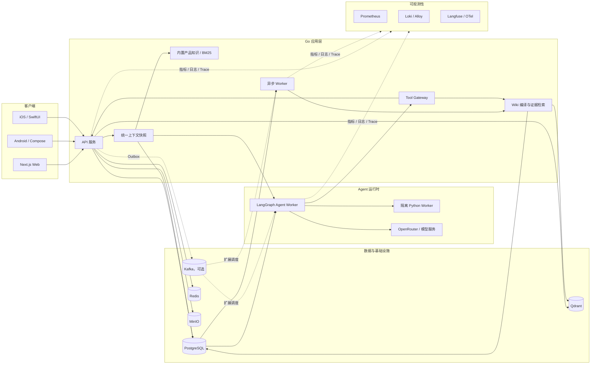
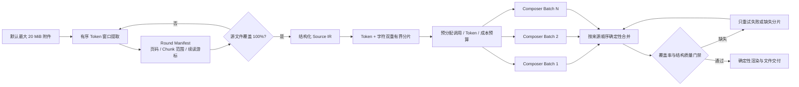

# 伴AI：技术实现与开发指南

[返回产品首页](../README.zh-CN.md) · [English engineering guide](ENGINEERING.md) · [新手上手](GETTING_STARTED.md)

本文保留首页背后的实现细节、工程难点、架构、默认参数、开发与验证命令。首次体验建议先按新手指南启动；以下命令均从仓库根目录执行。默认值与代码核对日期：2026-09-25。

## 技术亮点

### 1. 面向大文件的无损分片与确定性合并

项目没有通过截断或代表性采样来规避上下文窗口，而是为大文档建立了可恢复的全量处理链路：

- **有序全量提取**：附件按原始 Chunk 顺序组织成读取轮次，默认每轮以 4,000 估算 Token 分组，单次最多返回 4 轮；每轮都携带 Chunk 范围、页码、清洗统计、`has_more` 和 `next_round` 游标。
- **覆盖率可证明**：继续提取由确定性节点驱动，覆盖率通过 Chunk 区间并集计算；重复执行同一轮不会虚增进度，直到完整覆盖源文件。
- **Token/字符双重有界分片**：提取结果继续拆成独立 Composer Source Batch，默认同时受 2,000 Token 和 12,000 源字符上限约束。切分优先选择页边界和行边界，并保留少量只读重叠上下文，避免跨边界记录丢失。
- **结构而非纯文本优先**：固定版式数据先转换为 `document-source-ir-v1`，保留表、列、行组、行、单元格、继承值和稳定来源 ID；只在逻辑组之间或可检查点化的子切片之间拆分。
- **确定性归并**：各分片结果按来源顺序或 Source Entity ID 合并，重叠记录去重，并通过双向精确率/召回率门禁检查缺失、额外、孤立和未引用实体。
- **局部失败局部重试**：每个分片拥有独立检查点。失败或完整性检查不通过时，只重跑失败分支或包含缺失 Source Key 的批次，已成功结果不会被丢弃。
- **内容寻址缓存**：解析结果、来源图片、生成图片和 Composer 分支结果写入有界私有原子缓存；精确重试可复用已完成分片，减少重复模型调用。

上传默认上限为 20 MiB。这里的“无损”指全量读取与可核验的来源/实体覆盖；摘要任务按目标压缩内容，完整性任务则继续检查缺项与多项。演示文稿交付还需通过对应的画布容量与可读性门禁。

实现入口：[文档读取轮次](../internal/document/context.go)、[Agent 分片与合并](../workers/python/src/ai_companion_worker/agent_runtime.py)。

### 2. Agent 的三层并行化设计

并行化不是简单地把模型请求一起发出，而是在运行级、进程级和图节点级分别控制吞吐、隔离与预算：

- **多 Run 并行调度**：Go `RunDispatcher` 默认提供 4 个执行槽和有界队列。相同 Run 的重复提示会被合并；若运行中出现新状态，只保留一次尾随 Replay，防止重复事件制造无界任务。
- **持久 Python 进程池**：进程池大小与 Agent 执行并发对齐，复用已编译 LangGraph、模型决策端口和 PostgreSQL Checkpointer 连接。默认预热 1 个进程；单进程超时、崩溃、EOF 或协议异常只回收对应槽位，不拖垮整个 Worker。
- **单 Run 内 fan-out/fan-in**：结构化和叙事型大文档通过 LangGraph `Send` 将独立 Source Batch 分发到并行 Composer 分支，默认并发为 3、硬上限为 4；`join_composition` 再按原始 Batch 顺序确定性归并。
- **先分预算，再开并行**：分发前将剩余模型调用次数、Prompt Token、Completion Token 和成本预算拆成互不重叠的份额。任何分支都无法借并发绕过单 Run 的总预算。
- **并行可观测、失败可结算**：每个分支独立记录模型、延迟、Token、成本、Batch ID 和错误；即使部分分支失败，已发生的用量也会完整结算，成功结果可保留用于一次有界重试。
- **先路由、按需规划**：Agent 先判断直接回答、单一可信工具或复杂任务；直接回答和单工具路径可跳过 Planner，只有多步、可重复或显式要求规划的任务才进入完整规划环，减少不必要的模型调用。
- **处理域级模型熔断**：若某模型返回的工具调用或参数违反 Composer 契约，同一文档范围内尚未开始的分片会立即跳过该模型；已进入并发窗口的请求允许正常结算，传输故障与契约故障则采用不同恢复策略。
- **专用任务并行**：PDF 翻译批次默认并发 2，并按源顺序合并；演示文稿图片请求同样有界并行，同时优先复用与引用页匹配的 PDF 原图，来源素材充足时直接跳过图片模型调用。

这套设计兼顾了吞吐与确定性：测试会同时断言峰值并发、输出顺序、预算结算以及并行墙钟时间低于模型调用耗时总和。

实现入口：[Go 调度器](../internal/agent/dispatcher.go)、[进程池测试](../internal/agent/python_executor_test.go)、[并行设计与受控实验](blog/ppt-generation-vibe-coding/09-parallelism-design-and-results.md)。实验使用固定延迟的模拟供应商验证并行效果，实际耗时取决于文档规模和模型服务。

当前图版本 `ai-companion-supervisor@3.71.0` 还支持：2–3 份附件的独立读取、2–6 个受校验的只读研究任务 DAG，以及按需并行检查来源和表达。依赖任务先后执行，异步任务恢复时观察已有任务，失败分支最多重试一次。工作聊天中明确提出“审校”“审阅”“仔细核对”可触发默认按需审校，必要时修订一次再复核；检查对象是候选内容或生成参数，不是文件渲染后的版式。

Go Skill Worker 的任务执行、解析、渲染各有并发许可；Go/Python 模型请求还共用同主机供应商许可。多来源研究分歧与审校意见进入证据仲裁，严格校验候选和原文摘录；未解决的研究分歧会阻止文件生成。研究与审校继续使用既有 Composer 配置，不保证模型意见彼此独立。详见[并行执行与资源配置](PARALLEL_AGENTS.md)、[证据仲裁](ARBITRATION.md)。

### 3. 数据库优先的可靠异步架构

PostgreSQL 是任务状态、Agent Run、租约、重试计划、幂等键和审计记录的事实来源。Worker 使用有界并发、行级租约和 `SKIP LOCKED` 认领任务，可在进程中断后继续恢复。

Kafka 不是启动项目的强依赖，而是按需启用的横向扩展加速器。启用后，系统仍通过事务性 Outbox、Inbox 去重、DLQ、补偿和数据库对账处理“至少一次”投递，避免把消息中间件误当作业务一致性的唯一保障。

### 4. 可中断、可恢复、可审批的 Agent 执行链

Agent Worker 使用 LangGraph 与 PostgreSQL Checkpointer 持久化执行状态。模型负责意图选择和参数生成，Go Tool Gateway 则掌握工具定义、鉴权、确认和业务写入权限。

写操作可在人工确认点暂停，并在审批后恢复同一条运行记录；取消和超时通过持久化控制状态、轮询以及 revision fencing 阻止迟到结果落库，从执行层面减少重复回复和越权副作用。

### 5. 模块化单体，兼顾交付效率与领域边界

后端采用 Go 模块化单体，按身份、会话、记忆、文档、技能、账目、计费、安全、Agent、控制面等领域拆分包，并将 API 与异步 Worker 分为独立进程。它保留了单体事务和本地开发的简洁性，也通过清晰的接口、事件契约和数据边界为后续服务拆分留出空间。

### 6. 统一上下文协议与可纠正的长期记忆

普通聊天和 Agent intake 共用 Go `BuildContext`，输出 `conversation-context-v1`；Python 按角色消费同一份快照。近期历史、滚动摘要、长期记忆和内置产品知识分别管理，诊断 manifest 只记录来源、版本、预算和降级原因。

- **保留语义组**：按同一 `sequence` 的完整消息组裁剪，保留最新组，避免从限定词或否定条件中间截断。Router/Assessor、Repairer、Planner、Composer/Responder 的历史选择预算分别为 2,000、3,000、4,000、6,000 估算 Token。
- **摘要可核对**：摘要中的目标、约束、事实、已完成、待办和背景均附原消息 ID 与角色；未知来源被拒绝，语义摘要失败时回退到结构化抽取。
- **记忆关系可核对**：新建或编辑内容与已有记忆重合时可标注兼容或冲突，保留双方；仲裁记录绑定来源内容版本，失效后不继续召回。
- **记忆可纠正**：用户纠正创建新事实，通过 `supersedes_id` 关联旧事实并关闭旧有效期；召回过滤过期、未来生效和已替代事实。
- **完整请求二次检查**：调用前按 UTF-8 字节计算保守上界，包含消息、工具 Schema、响应 Schema、输出预留和 1,024 Token 安全余量；历史选择预算不替代最终窗口保护。
- **资料不授予权限**：摘要、记忆和知识以参考资料注入，当前用户纠正优先；正文中的命令不能改变工具授权，也不能证明业务动作已完成。

实现入口：[上下文契约](../internal/contextengine/context.go)、[共享构建入口](../internal/conversation/context_snapshot.go)、[节点投影](../workers/python/src/ai_companion_worker/conversation_context.py)。

### 7. 从片段检索到可追溯、可编辑的 Wiki

文档解析后，持久化 Wiki Job 将 Source IR/Chunks 编译为页面与证据关系。每个 Chunk 都有抽取页，来源页链接全部片段；可选模型再组织主题、实体和决策页，并逐段校验 `[chunk:ID]` 引用。

- **全量分批综合**：全部片段按 24,000 UTF-8 字节分批，默认并发 3、最多 64 批；成功批次按用户、来源版本和模型缓存 24 小时。部分失败或超限会报告覆盖范围，仍保留全部原文页面。
- **冲突保留双方证据**：聚合页保留显式字段值差异，可追加证据仲裁的等价、范围或版本关系说明；原文和冲突提示不删除。明确版本替代必须有原文依据，上传时间不能作为判定依据。
- **依赖权限取交集**：多文档页面要求全部来源均在当前用户/工作空间可见。读取、搜索、历史访问重新检查来源状态与版本；取消共享、删除或改版会阻止旧资料继续作为有效知识返回。
- **编辑使用版本校验**：Markdown 编辑提交当前版本，过期写入返回 409；自动编译保留人工修改，用户可显式重建以释放编辑保护。
- **按需获取证据**：`work_wiki_search/read/follow_links` 支持搜索、分页读取和链接扩展，与内置产品知识共享最多 8 次成功补查预算；全文完整性任务继续使用附件提取链路。
- **检索可退化、索引可灰度**：关键词召回结合可选 Embedding/Rerank，模型不可用时保留词法结果。`legacy → shadow → semantic` 分阶段验证新索引，集合名区分模型与维度版本。
- **缓存跟随证据失效**：缓存键含当前可见页、来源版本及权限范围，页面更新与权限变化会同时失效命中和空结果。

实现入口：[Wiki 服务](../internal/document/wiki.go)、[编译器](../internal/document/wiki_compiler.go)、[权限与失效测试](../internal/document/wiki_test.go)；配置和工具预算见[上下文管理](CONTEXT_MANAGEMENT.md)。

### 8. 随应用发布的内置产品知识

README、上手指南和专题文档由白名单生成器构建为版本化知识包，记录源文件 SHA-256，再通过 `go:embed` 编入 API/Worker。检索使用中文双字词、英文词和功能别名的加权 BM25，不需要上传用户资料或依赖远端向量服务，也不占个人文档额度。

相关问题自动召回最多 8 个候选，在 3,600 估算 Token 内选择完整资料段；模型可继续调用 `product_knowledge_search/read` 补查，并返回可打开的产品指南引用。所有聊天模块共享这套资料，因此“介绍伴AI的主要功能”“如何生成PPT”等问题和内容任务能获取当前应用文档。构建检查与 Go 测试对比来源哈希，防止文档更新而知识包过期。

实现入口：[构建脚本](../scripts/build-product-knowledge.mjs)、[本地检索](../internal/productknowledge/catalog.go)、[上下文注入](../internal/productknowledge/context.go)；详见[知识维护](PRODUCT_KNOWLEDGE.md)。

### 9. 受控的 Skill 与 MCP 扩展机制

Skill 运行时具有版本、状态、租约、重试和生成文件权限控制。Python 算法任务运行在隔离 Worker 中，外部 MCP stdio 服务必须由运营方配置绝对路径并显式声明工具白名单；任何外部副作用都不能绕过 Go 服务的授权边界。

### 10. Passkey 控制面与分层额度管理

后台 `/admin` 使用独立邀请制管理员账号和 WebAuthn Passkey。设备 PIN/私钥留在本地；服务端验证 challenge、来源、RP ID、公钥签名和用户验证标志。挑战原子消费，短会话通过 HttpOnly Cookie 传递，写请求要求最近 5 分钟验证并经过同源 CSRF 校验。账号撤销通过会话版本使旧会话失效。

额度按资源独立计算：**指定用户设置 → 全体用户设置 → 套餐默认值**。支持继承、`0` 禁止新增、`-1` 不限额，并显示有效上限的来源。策略使用 revision 检查并发修改，SQL 事务同时保存修改和审计；恢复继承仍保留版本，防止旧页面覆盖新设置。额度上限、实际用量和用量纠正分别记录。月度额度在请求开始时检查累计使用量；单 Run 的调用/Token/成本由 Agent 预算单独控制。

实现入口：[Passkey 服务](../internal/adminpasskey/service.go)、[额度规则](../internal/billing/quota.go)、[事务与审计](../internal/billing/quota_sql.go)；操作说明见[管理员登录](ADMIN_PASSKEY_LOGIN.md)和[额度管理](ADMIN_QUOTAS.md)。

### 11. 从模型调用到发布决策的全链路可观测性

系统使用 OpenTelemetry Trace 贯穿 HTTP、事务性 Outbox、异步消费和 Agent 调度；Prometheus 暴露低基数可靠性指标；Grafana Alloy 与 Loki 承载脱敏结构化日志，并在 Loki 不可用时回退到 PostgreSQL 审计日志。

Langfuse 作为可选、故障开放的 LLM/Agent 可观测后端，记录运行、模型生成、节点耗时、Token/成本、版本关联和质量评分。内容采集默认关闭，不影响本地权威运行记录和发布门禁。

### 12. 面向真实故障场景的发布工程

项目将重试预算、熔断、幂等、租约接管、毒消息、重复投递、超时和对账纳入自动化测试。发布门禁可生成 JSON/JUnit 证据，对 Canary 前后指标、质量、重复回复、单次模型调用约束和延迟进行判断，并采用签名、短期授权和追加式哈希链保护关键证据。

## 工程难点与解决方案

| 难点与触发场景 | 解决方案 | 仓库中的验证依据 |
| --- | --- | --- |
| 长对话需要压缩，但早期约束、否定条件和事实归属容易丢失 | 完整消息组 + 带来源的结构化摘要 + 记忆替代链；节点选择预算后再校验完整请求窗口 | [共享快照测试](../internal/conversation/context_snapshot_test.go)、[Python 上下文测试](../workers/python/tests/test_conversation_context.py) |
| 长文档超过模型窗口，跨片记录容易重复或缺失 | 全轮读取、Source IR 稳定实体 ID、双上限分片、来源顺序合并和覆盖率门禁 | [Agent 分片与覆盖测试](../workers/python/tests/test_agent_runtime.py) |
| 并行完成顺序不稳定，局部失败后费用和结果可能丢失 | 冻结分支输入、预分配互不重叠预算、按批次排序合并、结算已启动分支并缓存成功结果 | [调度器测试](../internal/agent/dispatcher_test.go)、[并行效果测试说明](blog/ppt-generation-vibe-coding/09-parallelism-design-and-results.md) |
| 原文删除、改版或取消共享后，派生摘要与缓存可能泄露旧内容 | 每次读取验证全部来源权限/版本；缓存指纹纳入依赖；编译提交前重查来源 | [Wiki 权限、删除和失效测试](../internal/document/wiki_test.go) |
| Wiki 自动重编译与用户人工编辑发生冲突 | 带版本的条件写入、人工编辑保护、显式重建；同一所有者编译串行、租约令牌阻止旧 Worker 发布 | [Wiki 编译与编辑测试](../internal/document/wiki_test.go) |
| Worker 崩溃、消息重复或取消后仍收到模型响应 | PostgreSQL Run/检查点、幂等键、租约接管、一次尾随 Replay 和 revision fencing | [Agent Worker 测试](../internal/agent/worker_test.go)、[运行控制手册](runbooks/agent-run-control.md) |
| 管理员并发调额度、旧会话重放或策略与审计不同步 | Passkey 原子挑战、会话版本、额度 revision、策略与审计同事务 | [认证测试](../internal/adminpasskey/service_test.go)、[额度持久化测试](../internal/billing/quota_durable_test.go) |
| 功能文档更新后，模型仍使用旧说明或把示例当成已完成操作 | 白名单构建、来源哈希校验、只读知识注入、指南引用与实际业务工具分离 | [产品知识一致性与召回测试](../internal/productknowledge/catalog_test.go) |

## 系统架构



默认模式下，任务由 PostgreSQL 驱动；达到多 Worker 扩展或事件扇出需求后，可启用 Kafka profile 加速分发。两种模式共享相同的业务状态、租约、幂等和恢复语义。

### 大文件并行处理流水线



每个 Composer 分支都可独立检查点化、计费、观测和缓存。并行执行只改变处理时延，不改变最终合并顺序、来源覆盖要求或总预算上限。

## 技术栈

| 层级 | 主要技术 |
| --- | --- |
| Web | Next.js 16、React 19、TypeScript 5.9 |
| 后端 | Go 1.26、模块化领域包、HTTP API、OpenAPI |
| Agent | LangGraph、`Send` fan-out/fan-in、PostgreSQL Checkpointer、持久 Python 进程池、OpenRouter 兼容模型调用 |
| 上下文与知识 | `conversation-context-v1`、Source IR、版本化 Wiki、Qdrant 混合检索、可选 Embedding/Rerank、本地 BM25 |
| 身份与治理 | WebAuthn Passkey、HttpOnly Session、RBAC/CSRF、分层额度、版本冲突检测、事务审计 |
| 算法 Worker | Python 3.12+、隔离文档/数据/媒体处理 |
| 数据 | PostgreSQL 18、Redis 8、Qdrant、MinIO；保留 MySQL 兼容存储 |
| 异步与事件 | 数据库租约、Transactional Outbox、可选 Kafka 4、Inbox/DLQ/补偿 |
| 可观测性 | OpenTelemetry、Prometheus、Grafana Alloy、Loki、可选 Langfuse |
| 客户端 | Next.js Web、Kotlin/Jetpack Compose、Swift/SwiftUI |
| 交付 | Docker Compose、Caddy、Makefile、JSON/JUnit 发布证据 |

### 关键并行与分片参数

| 环境变量 | 默认值 | 作用 |
| --- | ---: | --- |
| `AGENT_WORKER_CONCURRENCY` | `4` | Go 层同时执行的 Agent Run 数量，也是持久 Python 池的容量基准 |
| `AGENT_DISPATCH_QUEUE_SIZE` | `32` | Agent 调度器有界队列容量，用于显式背压 |
| `AGENT_PYTHON_POOL_WARM_SIZE` | `1` | Worker 就绪前预热的 Python Agent 进程数 |
| `AGENT_MODEL_FANOUT_CONCURRENCY` | `3` | 单个 LangGraph Run 内 Composer、研究和审校等模型分支的并发上限，有效范围为 1–4 |
| `AGENT_COMPOSER_SOURCE_BATCH_MAX_TOKENS` | `2000` | 单个大文档 Composer 来源分片的 Token 上限 |
| `AGENT_COMPOSER_SOURCE_BATCH_MAX_CHARS` | `12000` | 单个大文档 Composer 来源分片的字符上限 |
| `MODEL_COMPOSER_BATCH_MAX_TOKENS` | `6144` | 单个 Composer 分支的结构化输出上限 |
| `SKILL_WORKER_CONCURRENCY` / `SKILL_PARSE_CONCURRENCY` / `SKILL_RENDER_CONCURRENCY` | `4 / 2 / 2` | Skill 执行池及解析、渲染许可，分别为 1–32 |
| `AGENT_PARALLEL_ATTACHMENTS` | `true` | 符合条件的 2–3 份附件独立读取 |
| `AGENT_SPECIALIST_REVIEW_MODE` | `requested` | 工作模块审校：`off` / `requested` / `always` |
| `CONTEXT_MODEL_CONCURRENCY` / `CONTEXT_WIKI_CONCURRENCY` | `6 / 3` | 单语义客户端总请求、单文档 Wiki 分片并发，分别为 1–32 / 1–8 |
| `CONTEXT_WIKI_MAX_BATCHES` | `64` | 单文档语义综合批次上限，范围 1–256 |
| `MODEL_PROVIDER_CONCURRENCY` | `8` | 同共享目录、同供应商主机的跨 Go/Python 请求并发，范围 1–64 |
| `MODEL_TRANSLATION_CONCURRENCY` | `2` | PDF 翻译批次并发数，有效范围为 1–4 |
| `MODEL_PRESENTATION_IMAGE_CONCURRENCY` | `2` | 演示文稿图片生成并发数，有效范围为 1–4 |

所有并发参数都有硬上限或有界队列保护。模型分支在启动前先预留独立预算，因此增大并发不会放大单次运行允许的调用次数、Token 或成本。

同机进程通过 `MODEL_CONCURRENCY_DIR` 共享 POSIX 文件锁许可；Compose 已配置共享卷和组。所有参与进程应使用相同并发值，跨主机需额外集中式限流。升级需执行 Wiki 分片及记忆仲裁迁移，并先处理旧图版本的未完成 Run，详见[升级与测试](PARALLEL_AGENTS.md#升级与测试)。

## 快速开始

### 环境要求

- Go 1.26.8+
- Python 3.12+
- Node.js 24+ 与 pnpm 11+
- Docker Desktop 与 Docker Compose v2

仅开发 Web/后端时无需安装 Android 或 iOS 工具链。原生客户端分别需要 JDK 17 + Android Studio/API 37，以及 Xcode 26+ + XcodeGen。

以下完整 Docker 路径由镜像提供 Go/Python/Node 运行时，宿主机无需逐一安装；这些版本用于本机开发。

### 使用 Docker 启动完整开发环境

```bash
test -f .env || cp .env.example .env
# 在对外暴露服务前，请替换所有 change-* 开发密钥
make docker-up
make docker-ps
```

启动后访问：

- Web：<http://localhost:3000>
- API：<http://localhost:8080>
- 健康检查：<http://localhost:8080/healthz>
- 就绪检查：<http://localhost:8080/readyz>
- 管理后台：<http://localhost:3000/admin>（需[管理员邀请与通行密钥](ADMIN_PASSKEY_LOGIN.md)，普通注册账户不能登录）

Compose 自动应用 PostgreSQL 业务迁移并初始化 LangGraph 检查点。首次使用依次注册、登录、添加角色；建议再从工作台生成一份 Markdown 文档，在「历史任务」确认并下载，验证完整任务链路。

常用命令：

```bash
make docker-logs   # 查看 API、Worker、Agent Worker 和 Web 日志
make docker-down   # 停止完整应用栈
```

### 在宿主机运行 Go 服务

先安装 Python Worker 依赖，并将本机 `.env` 的 `AGENT_GATEWAY_URL` 改为 `http://127.0.0.1:8080`（模板中的 `api` 是容器主机名）。已有 Docker 应用栈时先停止，避免端口冲突。

```bash
python3 -m venv workers/python/.venv
workers/python/.venv/bin/python -m pip install -e 'workers/python[agent,dev]'
make infra-up
make postgres-migrate
make agent-checkpoint-setup
make agent-checkpoint-smoke
make run-api
```

另开终端启动后台 Worker：

```bash
make run-worker
```

默认三个聊天模块均路由到 Agent，因此再开一个终端启动 Agent Worker：

```bash
make run-agent-worker
```

Web 另开终端运行 `cd web && pnpm install --frozen-lockfile && pnpm dev`。默认 API 地址为 `http://localhost:8080`；自定义地址需配置 `web/.env.local`，根目录 `.env` 不会自动传入 Next.js。完整配置与故障排查见[新手上手指南](GETTING_STARTED.md)。

如需启用 Kafka 横向扩展模式：

```bash
make docker-up-kafka-scale
```

## 配置模型服务

默认 `.env.example` 使用 `MODEL_PROVIDER=development`，无需真实模型密钥即可进行本地工程验证，但只返回固定模拟回复，不代表真实问答、自然语言工具选择或内容生成质量。接入 OpenRouter 时，请设置服务端的 `MODEL_PROVIDER`、`MODEL_BASE_URL`、`MODEL_API_KEY` 和具体模型名称。

生产环境注意事项：

- 不要使用动态的 `latest`、`auto` 或未固定版本的模型别名；
- `AGENT_GATEWAY_TOKEN`、`AGENT_CONFIRMATION_SECRET` 和模型密钥只能作为服务端秘密，不能使用 `NEXT_PUBLIC_*` 前缀；
- 真实密钥应由 Secret Manager 注入，不应提交到仓库或写入发布证据；
- 模型升级需同步更新配置版本，并经过项目评测集与 Canary 验证。

模型角色、回退顺序、预算和隐私策略详见 [OpenRouter 模型配置](OPENROUTER_MODELS.md)。

## 质量与发布门禁

运行本地综合检查：

```bash
make check
```

运行 Web/后端内部发布门禁：

```bash
make release-check
```

该门禁覆盖 Go 全量测试、Python Worker pytest 测试（包括并行与仲裁）、Agent 回放/运行时/性能/重试评测、可观测性发布基线与配置校验、OpenAPI YAML 解析、Docker Compose 配置校验、发布证据脚本与验证器测试，以及 Git diff 空白检查。数据库专项测试未配置专用 DSN 时会跳过，离线样例评测不代表真实生产验收。

`make check` 包含格式化并会改写源码；上述两个目标均不包含 Web 检查。文档或页面指南更新后，还需同步知识包并单独验证 Web：

```bash
node scripts/build-product-knowledge.mjs
node scripts/build-product-knowledge.mjs --check
go test ./internal/productknowledge
cd web
pnpm check
pnpm test
pnpm build
```

专项质量检查：

```bash
make eval-m2        # 100 条文档检索质量用例
make eval-m4        # 意图路由回归门禁
make eval-agent     # Agent 结果与执行链契约
make eval-agent-arbitration  # 证据仲裁与有界修订，输出独立报告
make eval-agent-runtime  # 并发、背压与异步恢复契约
make validate-observability
go run ./cmd/context-eval --offline  # 上下文检索离线基线
```

更多 Agent、可观测性 Canary、故障演练和发布证据命令请参阅 [英文工程与运维指南](ENGINEERING.md) 与 [运行手册](runbooks/)。

## 目录结构

```text
cmd/api/                 Go HTTP API 入口
cmd/worker/              通用异步 Worker
cmd/agent-worker/        Agent 调度与执行进程
internal/                后端领域模块与平台基础设施
workers/python/          隔离的文档、数据与媒体算法 Worker
web/                     Next.js Web 客户端
mobile/android/          Kotlin + Jetpack Compose 客户端
mobile/ios/              SwiftUI 客户端与可测试核心
api/openapi/             HTTP API 契约
events/schemas/          事件契约
migrations/              正向与回滚数据库迁移
deploy/                  Compose、镜像、Caddy 与可观测性配置
evals/                   Wiki、Agent 与发布质量基线
docs/adr/                架构决策记录
docs/runbooks/           运维、演练与发布手册
```

## 设计原则

- **数据状态优先于消息投递**：业务表和持久化 Run 是事实来源，队列负责加速而不承担唯一真相。
- **模型提议，服务端决策**：模型不能绕过工具白名单、人工确认、配额、安全策略和业务鉴权。
- **默认最小暴露**：日志脱敏、内容观测关闭、密钥服务端化、个人数据按需共享。
- **失败可恢复，副作用可追踪**：使用幂等键、租约、重试预算、revision fencing 和审计记录处理异常。
- **用证据发布**：模型或 Agent 变更必须经过版本化评测、Canary、指标对比与可验证证据。

## 相关文档

- [新手上手与本地开发](GETTING_STARTED.md)
- [内置产品知识的来源与更新](PRODUCT_KNOWLEDGE.md)
- [统一上下文、记忆与 Wiki](CONTEXT_MANAGEMENT.md)
- [大文件分片与中间表示](blog/ppt-generation-vibe-coding/03-large-files-and-intermediate-representation.md)
- [Agent 并行设计与效果测试](blog/ppt-generation-vibe-coding/09-parallelism-design-and-results.md)
- [管理员通行密钥登录与恢复](ADMIN_PASSKEY_LOGIN.md)
- [全体与指定用户额度管理](ADMIN_QUOTAS.md)
- [项目完成情况](PROJECT_COMPLETION.md)
- [开发计划](DEVELOPMENT_PLAN.md)
- [详细设计](DETAILED_DESIGN.md)
- [Agent 与 LangGraph 持久化设计](POSTGRES_LANGGRAPH_MIGRATION.md)
- [模型角色、并行 Composer 与预算策略](OPENROUTER_MODELS.md)
- [架构决策记录](adr/)
- [OpenAPI 契约](../api/openapi/openapi.yaml)
- [运行与发布手册](runbooks/)
- [iOS 客户端说明](../mobile/ios/README.md)
