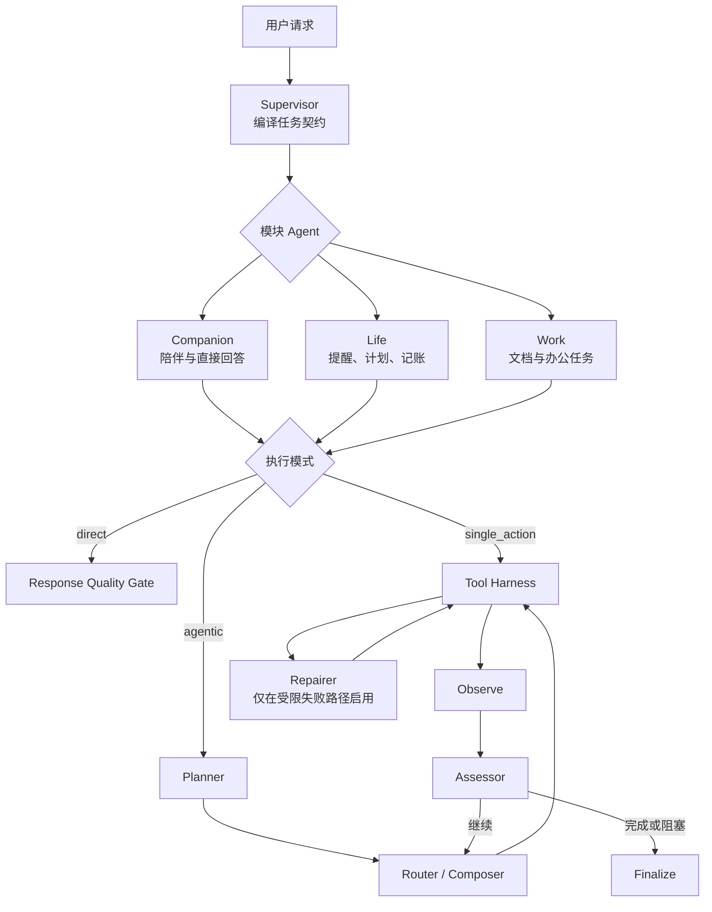
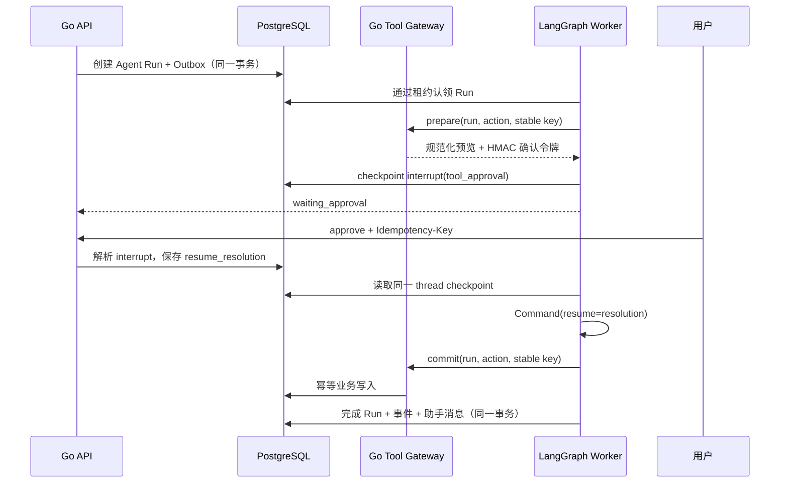
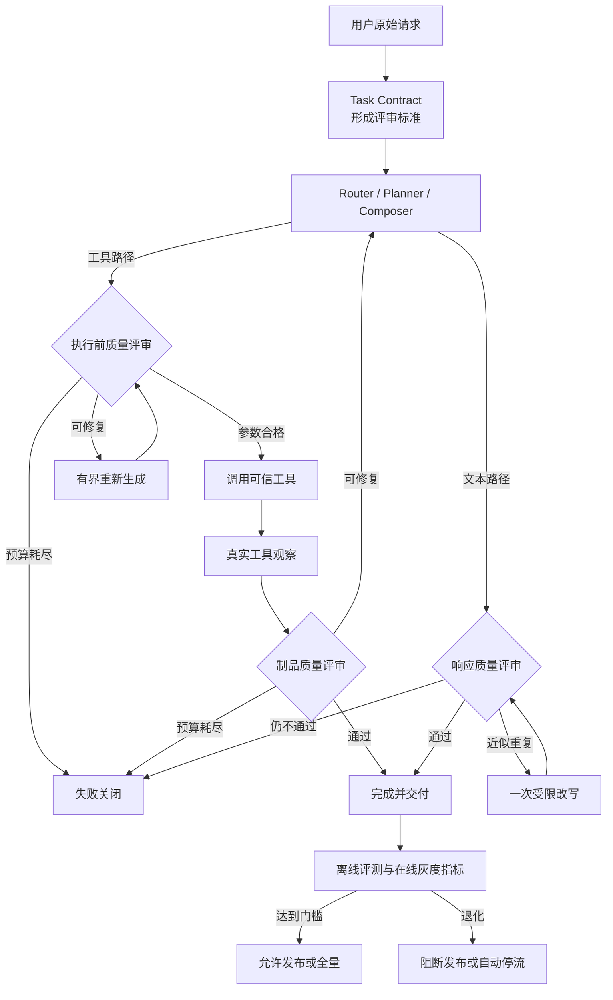

# 从一句话到可靠交付：伴AI 的意图识别、多 Agent、任务规划、质量评审、LangGraph 恢复与幂等

做一个 AI 助手的 Demo 很容易：把用户输入交给大模型，让模型选择工具，再把工具结果返回给用户。

但把它做成一个可以记账、设提醒、分析文档、生成文件的产品，问题会迅速从“模型答得好不好”变成另一组更难的问题：同一句话到底该聊天还是调用工具？一个复杂任务要不要先规划？用户确认前进程重启了怎么办？Kafka 重复投递会不会让工具执行两次？模型已经调用成功、Worker 却在写检查点前崩溃，又该怎么算？

伴AI 的答案不是给模型更多自由，而是把自由放进一个可恢复、可治理的执行框架里。模型负责语义判断，LangGraph 负责显式流程，PostgreSQL 保存权威状态，Go 服务守住身份与业务写入，幂等键、租约和 revision fence 则共同处理“至少一次执行”带来的重复风险。

本文以当前仓库中的 `ai-companion-supervisor@3.69.0` 为实现快照，拆解这套链路背后的工程思路。

## 一、意图识别不是一个分类标签，而是一串受约束的决策

传统意图识别通常把问题简化成文本分类：输入一句话，输出 `chat`、`ledger` 或 `reminder`。这对展示入口和轻量提示有用，却不足以决定真实执行。

例如用户说：“明早九点提醒我交周报。”系统不仅要识别出 `reminder`，还需要知道：

- 是否已经获得时区；
- “明早”对应哪个绝对时间；
- 创建提醒属于什么风险等级；
- 当前角色是否拥有这个工具；
- 是否需要用户确认；
- 重复点击确认时如何避免创建两条提醒。

因此，伴AI 把意图识别拆成两个互补层次。

第一层是 Go 侧的确定性轻量路由。它识别翻译、邮件、PPT、提醒、记账、文档问答等高置信模式，同时抽取金额、币种、目标语言、页数、邮箱和时间表达式。结果不是只有一个标签，而是包含：

```json
{
  "intent": "reminder",
  "confidence": 0.97,
  "required_slots": [],
  "risk_level": "medium",
  "slots": {
    "title": "明早九点提醒我交周报",
    "time_expression": "明早九点提醒我交周报"
  },
  "layer": "rules",
  "version": "intent-rules-2026-08-22.v2"
}
```

这层适合做低成本预判、页面引导和回归评测。遇到弱信号时，它返回 `fallback_required`，而不是假装自己已经理解。

第二层发生在 Agent 图内。模块 Agent 会拿到用户原话、上下文、已有观察、任务契约，以及由 Go Tool Gateway 提供的精确工具目录，再通过受约束的模型工具调用做决策。模型必须返回一个合法意图，并且只能在“直接回答、请求继续生成，或选择一个可信工具”之间做出明确选择。工具名必须存在于当前目录，参数必须通过对应 JSON Schema，模块前缀也必须匹配 `companion / life / work` 的权限边界。

也就是说，模型可以说“我认为该调用提醒工具”，但不能创造一个不存在的工具，不能把 work 模块的能力塞进 life 模块，也不能通过参数伪造用户身份。最终身份、会话、角色和模块都由 Go 服务从持久化的 Agent Run 中推导。

这套设计的核心不是“规则还是模型”二选一，而是把两者放到各自擅长的位置：

- 规则负责高确定性的规范化、校验和快速失败；
- 模型负责结合上下文做语义选择；
- 策略层负责权限、风险、预算和降级；
- 用户确认负责不可由模型代替的授权。

## 二、多 Agent 不是开一群机器人，而是拆分认知职责

伴AI 的“多 Agent”首先是一组逻辑角色，而不是一组可以无限互聊的自治进程。它们共享同一条受治理的 LangGraph 状态，但各自拥有不同输入、模型角色、输出契约和预算。



这些角色的分工很具体：

- **Supervisor** 不调用模型。它验证初始输入，建立图版本、模型清单、工具目录指纹、预算和节点契约，并从用户原话编译不可随意放松的任务契约。
- **Companion / Life / Work 模块 Agent** 负责本领域内的回答或工具选择。跨模块工具会在 Python 和 Go 两侧分别拒绝。
- **Planner** 只生成目标、1～8 个步骤、成功标准和可选任务意图，不执行工具，也不能提高预算。
- **Composer** 在工具已经选定之后生成复杂参数。处理大文档时，它按 Source Batch 工作，而不是同时承担路由、规划和写入。
- **Assessor** 根据真实工具观察判断完成、继续还是阻塞，不能把“模型觉得完成了”当成业务事实。
- **Repairer** 只在确定性修复无效后获得一次受 Schema 和微预算限制的机会；副作用状态不明时会停止自动重试，转入核对。
- **Quality Gate 与 Harness** 大多是确定性节点，负责参数规范化、来源覆盖、文件类型、重复内容和制品质量。

这样的拆分有两个直接收益。

一是上下文更小。Router 不需要看到修复策略，Repairer 不需要拥有完整工具目录，Composer 也不需要决定用户身份。二是失败更容易定位。一次运行可以明确记录是 `planner` 超预算、`router` 返回非法工具、`composer` 违反分支契约，还是 `artifact_quality_gate` 拒绝了不完整文件。

项目还支持由 Agent Studio 下发声明式图快照。定义只允许 `model / router / tool / end` 四类节点，限制节点数、边数、工具白名单、模型角色和总预算；发布后的定义与模型配置会作为无密钥快照绑定到 Run。这样，“可配置”不会退化成“运行中随意改变”。

## 三、先路由、按需规划：Planner 不该成为每个请求的税

很多 Agent 框架默认先规划，再执行。这个流程看起来完整，但对“你好”“查一下今日计划”“生成一份已给定参数的文件”来说，Planner 只是增加一次模型调用、一次失败机会和一段延迟。

伴AI 采用 route-first。模块 Agent 先判断请求属于哪种执行模式：

| 模式 | 典型场景 | 是否进入 Planner |
| --- | --- | --- |
| `direct` | 闲聊、无需项目数据的回答 | 否 |
| `single_action` | 一个可信工具即可完成 | 否 |
| `agentic` | 多步、可重复、含中间制品或工具显式声明 `requires_plan` | 是 |

代码中的判断也是确定性的：没有工具就是 `direct`；工具声明了 `requires_plan` 或 `repeatable`，或者当前动作只是附件提取这类中间步骤，就进入 `agentic`；否则是 `single_action`。

Planner 的产物也不是一段散文，而是一个小型执行契约：

```text
objective        要完成什么
steps            1～8 个可观察步骤
success_criteria 怎样才算完成
task_intent      对歧义任务的结构化补充
```

这里有一个重要边界：Planner 可以细化模糊意图，但不能删除 Supervisor 已经从原始请求锁定的硬要求。例如用户明确要求“基于全部附件生成中文 PPT”，后续模型不能把它偷偷降级成“给一段中文摘要”。生成文件也只是一条观察，必须通过制品质量门，才能满足任务契约。

规划环同样不是开放式循环。当前默认预算包括最多 10 次工具行动、64 次模型调用、固定 Token/成本上限、最多 120 次外部工具恢复，以及有限的修复次数。每个模型节点还有自己的调用上限。图的 recursion limit 只是最后一道保险，真正约束自治程度的是行动预算、节点契约、总截止时间和可验证的终止条件。

## 四、LangGraph 恢复的关键：恢复同一个 Run，而不是重新问一遍模型

任务恢复最常见的错误实现，是 Worker 重启后重新提交用户原话。这样虽然“又跑起来了”，却可能重新路由、重新规划、重复消耗模型预算，甚至再次执行已经成功的写操作。

伴AI 使用 PostgreSQL Checkpointer 保存 LangGraph 状态，并强制：

```text
LangGraph thread_id == agent_run_id
```

不能使用 `conversation_id` 作为 `thread_id`，因为一段会话可能包含多次独立运行；共用检查点会让审批、重试和取消相互污染。

每个检查点还绑定图名称、图版本、模型配置指纹和工具目录指纹。恢复时如果发现图版本变化、模型清单不一致、工具目录被篡改，运行会安全停止，而不是拿新代码继续解释旧状态。正在等待审批的 Run 也不会重新拉取新工具目录，而是复用创建时检查点中的可信目录。

一次需要确认的写操作，大致经历下面的时间线：



这里有三种值得区分的恢复。

### 1. 人工审批恢复

写工具先执行 `prepare`，返回规范化参数、风险摘要和 HMAC 确认令牌。图在 `interrupt()` 处持久暂停。用户同意后，Go 控制面保存带 `interrupt_id` 的 `resume_resolution`，Python 再用 `Command(resume=...)` 恢复。旧的、错 Run 的或类型不匹配的 resolution 会被拒绝；用户拒绝时，图直接进入 `reject_tool`，不会调用 commit。

### 2. 异步工具恢复

耗时 Skill 返回任务 ID 后，图在 `tool_wait` 中断点暂停。Go Worker 先查 Skill 的持久状态：仍是 `queued / running / waiting_confirmation` 时，只延后 `available_at`，不启动 Python，不连接 Checkpointer，也不重复读取工具目录。探测间隔从 500ms 指数增长到 5s。

当 Skill 成功、失败或取消时，终态与 Outbox 事件在同一事务写入；事件可以立即唤醒对应 Run。即使事件丢失，数据库 reconciler 仍会在下一次扫描中恢复它。Kafka 在这里是低延迟提示，不是唯一唤醒来源。

### 3. 节点失败恢复

如果审批 resolution 已经被 LangGraph 消费，随后 `commit_tool` 因网络故障抛错，下一次恢复不能再次提交同一个 interrupt。运行时会检查当前快照：没有待处理 interrupt，但仍有 next node，就以 `invoke(None)` 从失败节点继续。这样 Supervisor、Router、Planner 和已完成的 Composer 分支不会从头重跑。

## 五、真正的可靠性来自三份状态各司其职

LangGraph checkpoint 很重要，但它不应该承担所有职责。伴AI 明确区分三类状态：

| 状态 | 权威存储 | 负责回答的问题 |
| --- | --- | --- |
| 图执行状态 | `langgraph` schema | 运行到了哪个节点，哪些中间结果已产生 |
| Agent 控制状态 | `agent.runs / interrupts / run_events` | 谁拥有执行权，是否等待审批，何时重试，是否取消或超时 |
| 业务事实 | `app` schema | 提醒、账目、消息、文件等是否真实存在 |

这也是为什么“有 checkpoint”不等于“任务不会重复”。Checkpointer 能告诉图从哪里继续，却不能单独解决 Worker 争抢、API 重放或外部副作用。

Go Worker 通过 `FOR UPDATE SKIP LOCKED` 和有界并发领取可运行任务。领取后写入 `lease_owner`、`lease_expires_at` 并递增 `revision`。之后的完成、失败、延期和暂停都必须同时满足：Run 仍是 `running`、租约仍属于当前 Worker、revision 没有变化、租约与总截止时间没有过期。

如果旧 Worker 卡住，新 Worker 可在租约过期后接管；旧 Worker 即使晚到，也会因为 revision 不匹配而无法提交结果。这就是 revision fencing 的作用：它不试图保证旧进程立刻停止，而是剥夺旧进程的提交权。

## 六、幂等不是一个 Key，而是一条端到端链路

在分布式系统里，绝对的 exactly-once 执行通常是不现实的。伴AI 采用更诚实的语义：

```text
at-least-once execution + idempotent side effects
```

为此，幂等被放在多个边界上。

### Run 创建幂等

客户端创建 Run 时提供 `Idempotency-Key`。数据库对 `(user_id, idempotency_key)` 建唯一索引；Run 和 `agent.run.requested.v1` Outbox 事件在同一事务提交。网络重试只会拿到原 Run，不会多出第二个 Run 或第二条请求事件。

### 审批幂等

审批 resolution 使用用户提供的幂等键，并对 `(run_id, resolution_key)` 建唯一约束。相同决定的重复点击返回已有状态；同一个键试图表达不同决定则冲突。

### 工具行动幂等

图不生成随机工具键，而是用稳定位置构造：

```text
{run_id}:action:{action_index}:prepare
{run_id}:action:{action_index}:commit
```

同一节点恢复时仍使用同一个键。Go Tool Gateway 再次校验 Run、模块、工具目录、参数 Schema 和确认令牌，领域表则通过用户级幂等约束阻止第二条账目、提醒或 Skill Run。

### 调度幂等

Kafka 可能重复投递，数据库扫描也可能与事件唤醒同时发生。真正的执行权由数据库认领决定：只有一个 Worker 能拿到合法租约和最新 revision，其余重复提示会被合并或在认领时失败。

### 最终回复幂等

Run 完成、完成事件和助手消息在同一事务落库。状态条件与 revision fence 阻止重复完成提交，消息表的会话序号约束再提供一层保护。因此，恢复重放不会自然演变成两条助手回复。

但这套设计仍然明确承认一个边界：如果外部模型或第三方服务已经接受请求并计费，Worker 却在本地 checkpoint 之前崩溃，恢复后可能再次调用外部服务。没有供应商级幂等协议，就不能承诺 exactly-once 计费。系统能提供的是可审计的至少一次账本、软预算上限和本地副作用去重；真正的损失上限仍需要供应商账户硬限额兜底。

同理，当工具超时且无法判断副作用是否已经发生时，系统不会盲目重试，而是进入 `reconcile_side_effect`，提示用户或运营侧核对。这比“为了成功率再试一次”更符合生产系统的风险边界。

## 七、数据库优先，Kafka 只做加速器

项目早期把 Kafka 作为异步链路的重要组成部分，后来调整为数据库优先：PostgreSQL 已经保存任务、租约、重试时间、幂等键和业务状态，就不应该为了执行一个单区域模块化单体，强制先经过另一个故障域。

默认部署由 Worker 每秒扫描可运行记录。需要水平扩展时，再启用 Kafka consumer group 作为低延迟分发层，数据库扫描退化为较低频率的 stranded-work 恢复。无论是否启用 Kafka，LangGraph checkpoint、业务表、租约、Inbox 去重和 revision fence 的语义都不改变。

这个选择带来一个很有用的架构原则：消息系统可以优化“多快知道有活要干”，但不能决定“这项工作是否存在、由谁执行、是否已经完成”。

## 八、用故障场景验证，而不是只测正常流程

这类系统最有价值的测试，不是“模型是否返回 reminder”，而是对恢复不变量的验证。当前测试覆盖了这些场景：

- 同一个 `agent_run_id` 始终映射到同一个 LangGraph `thread_id`；
- 单一可信工具绕过 Planner，复杂工具才进入规划；
- 写工具中断后使用同一个 Run 恢复，commit 恰好成功一次；
- 重放等待中的 Run 返回同一个 `interrupt_id`；
- 过期 `interrupt_id` 和变化后的身份被拒绝；
- approval 已消费但 commit 节点失败时，从 commit 继续而不是重复审批；
- 工具仍在运行时不启动 Python，终态后才恢复图；
- Worker 重复认领不会再次执行；
- 临时执行错误按有界退避恢复，最终只完成一次；
- 图版本或模型/工具指纹变化时，旧 checkpoint 安全停止；
- 用户拒绝写操作时，commit 调用次数为零；
- 并行 Composer 分支按源顺序确定性合并，只重试失败分支。

这组测试共同证明的不是“永远不失败”，而是失败之后仍遵守同一套身份、预算、顺序和副作用约束。

## 九、质量评审不是旁路：它直接决定工具能否执行、结果能否交付

在伴AI 中，质量评审不是任务结束后附加一个分数，也不是让另一个模型笼统地说“看起来不错”。它是一组版本化、可持久化的判定节点，直接参与 LangGraph 路由：参数不合格就不能调用工具，文件不合格就不能标记完成，修复预算耗尽就失败关闭。

项目把质量评审分成两个闭环：单次 Agent Run 内的实时质量门，以及 Agent 新版本发布前后的离线评测与在线灰度门禁。



### 1. Task Contract：先把“什么叫合格”写进状态

Supervisor 会在路由和规划之前，从用户原话编译 `task-contract-v3`。它不是生成计划，而是一份不会被后续模型轻易改写的评审基准，记录：

- 用户需要哪种文件，如 PPTX、DOCX 或表格；
- 是否要求“全部、每一项、完整”等全量覆盖；
- 是否绑定可信附件；
- 必须包含哪些字段，例如名称、代码、时间和地点；
- 输出语言、表格能力和视觉能力；
- `artifact_exists / artifact_opens / artifact_readable / source_coverage_complete` 等硬要求；
- 完成策略 `all_hard_requirements_pass`。

Planner 可以补充演示文稿的能力组合，却不能放松来源、语言、完整性和文件类型。这使质量评审有了稳定基准：不是问“结果总体好不好”，而是逐项证明原始请求中的硬要求是否满足。

### 2. 执行前评审：先审参数，再允许工具产生副作用

模型选中工具后，参数不会直接进入 Tool Gateway。系统会先进行可信 JSON Schema 校验和领域质量评审。

邮件草稿使用 `email-draft-policy-2.1.0`。确定性校验器会检查显式语言要求、联系人关系、自我介绍策略、主题、称呼、正文、行动请求、礼貌语、落款和发件人身份；还会拒绝中英文污染、伪造的发件人身份，以及正文不同区块之间的语义重复。

邮件第一次不通过时，违规代码会反馈给 Composer，让它完整重写一次。第二次仍不通过，Run 进入 `email_quality_failed`，草稿不会继续交付。

PPT 参数评审使用 `presentation-arguments-v1`。除了 Schema，它还会检查：

- 能力计划要求表格时，是否真的提供了结构化表格；
- 用户点名的字段是否都有对应列；
- 每行单元格数量是否与列数一致；
- 同一个来源实体是否被重复输出；
- 单元格是否为空、是否只有标点或重复分隔符；
- 中文输出中是否混入未翻译的名称、星期或大段英文；
- 面向目标受众的内容中是否混入制作说明；
- 完整性任务是否保留逐行 `source_locator`；
- 是否使用真实 Source IR，以及来源映射、记录集合和时间字段是否完整。

PPT 参数最多进行两轮受限重写。仍不通过时，系统在生成文件之前就进入 `artifact_quality_failed`。这比先生成一个有缺陷的 PPT，再依赖用户肉眼发现问题更节省成本，也更容易定位失败字段。

### 3. 响应评审：确定性修复优先，模型只处理语义风险

普通文本响应会经过 `response-quality-1.0.0`。质量门先用确定性算法去掉完全重复的段落和句子；这种修改不会引入新事实，因此可以直接执行，也天然适合 checkpoint 重放。

对于相似度达到阈值的近似重复段落，系统只报告违规位置和相似度，不直接删除。原因是两段相似文本可能各自包含一个额外事实，机械去重反而会造成信息损失。此时 LangGraph 进入 `revise_response`，给 Responder 一次带违规清单的受限改写机会，然后重新进入同一个质量门。

如果改写后仍不通过，结果被标记为 `response_quality_failed`。更重要的是，响应质量门不会把上游的鉴权失败、模型不可用或制品失败“评审成成功”；已有终态会被原样保留，避免一个后处理节点掩盖真正故障。

### 4. 制品评审：文件存在不等于任务完成

工具返回生成文件后，`artifact-quality-v1` 会根据 Task Contract 和真实工具观察重新验收。通用检查包括：

- 是否真的存在文件；
- 文件名是否安全且没有路径注入；
- 后缀类型是否与工具能力和用户要求一致；
- 是否覆盖了来源文件；
- 全量任务的 `source_coverage.coverage_ratio` 是否等于 1，是否发生截断。

PPTX 还必须携带工具侧 `quality_report`。Harness 不只相信报告里的 `passed`，还会交叉检查实际 outline 中是否存在结构化表格、是否至少有一条真实记录、报告的行数是否与页面中的行数一致，以及完整性任务是否保留来源定位。

这条规则解决了一个常见的 Agent 假完成：模型可以生成一句“PPT 已完成”，工具也可以返回一个能打开的文件，但只要用户要求的表格、字段或完整来源覆盖没有通过验证，任务就仍未完成。制品门失败后，图会在剩余行动预算内回到 `continue_action` 重新整理；预算耗尽则停止交付不合格文件。

### 5. Assessor 评审进度，但不能替代确定性质量门

复杂任务执行工具后，Assessor 会基于计划、Task Contract 和真实 observations 返回 `completed / continue / blocked`。它适合回答“还需不需要下一步”，却没有权力绕过文件门禁。

即使 Assessor 判断 completed，只要 Task Contract 要求制品而 `artifact_validation.passed` 不是 `true`，图仍会继续行动或在最终节点失败关闭。换句话说，模型评审负责过程判断，确定性门禁负责完成证明。

### 6. 质量评审也必须可恢复、可幂等

每份质量报告都会写进 Agent State，包括策略版本、违规代码、确定性修复、改写轮次和最终是否通过。LangGraph checkpoint 因此不仅保存“运行到哪”，也保存“为什么不能继续”。

恢复时，已经通过的节点和 Composer 分支不必重做；同一轮改写计数也不会归零。确定性去重可以安全重放，模型改写则受调用预算限制，工具仍使用稳定行动幂等键。质量评审由此成为恢复协议的一部分，而不是重启后可以遗忘的临时判断。

### 7. 从单次结果到版本发布：离线评测与在线灰度质量门

运行时质量门只能判断一个结果。要判断一个新的 Agent 定义、Prompt 或模型配置能否发布，项目还实现了版本级质量评审。

离线评测使用版本化 `agent-eval-case-v1` 套件和隔离的模型/工具替身，在真实编译图上执行用例。每个用例不仅核对回答文本，还可以约束：

- 最终状态和 outcome；
- `direct / single_action / agentic` 执行模式；
- 必须经过或禁止经过的节点；
- 精确工具调用顺序；
- `quality_pass`；
- 最大模型调用、最大步骤和最大修复次数。

报告统计硬通过率、模型调用 P50/P95、步骤 P95 和新增失败，并与同版本基线比较。结果同时输出 JSON 与 JUnit，便于 CI 阻断回归。Agent Studio 的候选版本只有绑定了相同 fingerprint 的通过评测，才能进入灰度。

在线阶段采用稳定用户分流，将 1%～50% 流量发送给候选版本，并与当前基线版本比较真实 Run。默认策略至少收集 20 个候选样本，检查候选错误率、质量失败率、P95 延迟和平均成本，也检查相对基线的错误、延迟和成本回退。候选超过任一阈值时，灰度会自动暂停；样本充足且全部通过后，才进入可全量状态。

于是，质量评审形成了三个连续层次：Task Contract 定义单次任务的正确性，运行时质量门阻止不合格结果执行或交付，版本级评测与灰度门禁阻止整体能力退化进入全量生产。

## 结语：把智能放在边界内，Agent 才能进入生产

伴AI 的 Agent 架构可以浓缩成一句话：让模型决定语义，让代码决定权力。

意图识别不是一个孤立分类器，而是模型判断、确定性校验、风险策略和用户授权的组合。多 Agent 不是角色越多越智能，而是把 Planner、Router、Composer、Assessor 和 Repairer 的职责分开，让每个角色只拥有完成任务所需的最小上下文和权限。LangGraph 负责保存可恢复的执行进度，PostgreSQL 负责控制状态与业务事实，Go Tool Gateway 则守住真正的写入边界。

质量评审、任务恢复和幂等都不是某个框架自动赠送的能力。它们来自一整套彼此咬合的设计：稳定的 Task Contract、版本化质量门、持久检查点、模型修复预算、稳定 Run 身份、interrupt/resume、数据库租约、revision fencing、事务性 Outbox、领域幂等键、完成事务和故障场景测试。

模型能力还会继续提高，但只要系统会写数据、会等待外部任务、会跨进程恢复，这些工程约束就不会过时。真正可靠的 Agent，不是从不犯错的 Agent，而是犯错、重试、重启和重复投递之后，仍然不会忘记自己是谁、做到哪一步，以及哪些事情绝不能再做第二次。

## 延伸阅读

- [项目中文 README](../../README.zh-CN.md)
- [PostgreSQL + LangGraph 迁移与恢复设计](../POSTGRES_LANGGRAPH_MIGRATION.md)
- [数据库优先异步调度 ADR](../adr/0005-database-first-async-dispatch.md)
- [LangGraph Agent 运行时实现](../../workers/python/src/ai_companion_worker/agent_runtime.py)
- [任务契约与制品质量评审](../../workers/python/src/ai_companion_worker/task_quality.py)
- [响应质量评审](../../workers/python/src/ai_companion_worker/response_quality.py)
- [邮件质量评审](../../workers/python/src/ai_companion_worker/email_quality.py)
- [Agent 离线评测执行器](../../workers/python/src/ai_companion_worker/evaluation/runner.py)
- [Agent 在线灰度质量门](../../internal/controlplane/agent_rollout.go)
- [Agent Worker 的租约、重试与控制实现](../../internal/agent/worker.go)
- [PostgreSQL Agent Run Store](../../internal/persistence/postgresstore/agent.go)
- [意图路由实现](../../internal/router/router.go)
