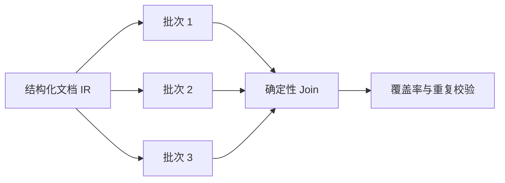

# 大文件不是摘要题：用有界轮次、结构化 IR 和 fan-out/fan-in 保住细节

模型面对大文件有一种非常自然的倾向：总结。对“提炼一份报告”来说，这是优点；对“列出所有课程名称、代码和时间”来说，这是数据丢失。

我们最早也做了分块，但效果仍不理想。原因是“切成几段分别总结，再把摘要合并”只是在并行制造多个摘要。块与块之间的逻辑行关系丢失，后面的内容还可能在最终合并时覆盖前面的内容。

## 先定义完成，不要先定义切块

大文件流程的第一步不是决定每块多少 Token，而是确定任务的覆盖语义。

如果用户要的是叙事型 PPT，完成意味着所有主要主题均有来源证据，允许压缩细节；如果用户要的是字段型 PPT，完成意味着每个逻辑实体都被枚举，不能因为相似就合并掉；如果用户指定某几页或某个主题，完成意味着聚焦范围完整，而不是全文平均采样。

这三种任务需要不同的中间表示。用一个 `text_chunks[]` 处理所有情况，最后一定会在某处泄漏语义。

## 从文本块升级为结构化文档 IR

我们给解析结果增加了稳定结构，而不是只返回字符串。一个简化的 `document-source-ir-v1` 大致包含：

- 文档和附件身份；
- 页码范围与页内块序；
- 标题层级与章节路径；
- 表格、行、单元格和跨行关系；
- 原始文本与标准化文本；
- 图片所在页、边界框和哈希；
- 每个节点的来源定位。

IR 的价值并不在于“更像数据库”，而在于它让拆分和合并都有依据。一个表格行不会因为 Token 边界从中间切断；一个标题不会和下面的内容失去父子关系；两个附件里的同名表格也能通过命名空间区分。

## 递归拆到合适，而不是只拆一次

大文件处理采用有界轮次。每一轮先按结构边界装箱，再同时检查输入预算和预估输出预算。如果一个批次仍然过大，就继续沿更细的结构边界拆分，直到满足约束；不是把超大批次硬塞给模型，也不是先摘要后继续。

```python
def make_batches(nodes, input_limit, output_limit):
    queue = pack_by_structure(nodes)
    ready = []
    while queue:
        batch = queue.pop(0)
        if fits_input(batch, input_limit) and fits_expected_output(batch, output_limit):
            ready.append(batch)
        else:
            queue[0:0] = split_on_next_structure_boundary(batch)
    return ready
```

这里的 `expected_output` 很关键。只控制输入长度仍会失败：一块包含 300 行的紧凑表格，输入 Token 可能不大，但要求模型输出 300 条结构化记录时会撞上完成 Token 上限。后续版本因此同时限制源字符、估算 Token、实体数量和输出字段规模。

## 为什么按逻辑实体分片

字段型任务最终转成 `presentation-logical-entity-ir-v1`。每个实体拥有稳定键、字段映射、所有来源行和需要聚合的值。Composer 接收的是一组完整实体，而不是任意页片段。

这解决了两个问题：

第一，同一门课程的名称在第一行、第二个上课时间在下一行时，两行仍属于同一实体。第二，模型输出被截断后，可以精确知道缺少哪些实体键，只重跑缺失批次，而不是让模型“补全剩余内容”并祈祷它理解剩余的定义。

## fan-out/fan-in 不是越并行越好

批次独立后，可以通过 LangGraph `Send` 做 fan-out，再按源顺序 fan-in。我们没有直接把并发开到最大，而是设置小而明确的上限，并给每个分支分配互不重叠的调用、Token 和成本预算。



并发上限较小有三个原因：模型供应商的限流不是唯一瓶颈；每个在途请求都会占用成本预留；一旦结构化契约持续失败，继续发出几十个相似请求只会放大损失。当前实现还加入了处理范围级的 Composer 熔断：结构化工具调用或参数违约会让后续批次跳过该模型，超时和传输错误则走另一套恢复策略。

## 合并必须是纯函数

最初的合并仍交给模型，结果会出现“后一个批次写得更完整，于是模型用它重写整份结果”，前序记录被悄悄丢掉。后来合并改为确定性纯函数：

- 按实体键去重；
- 聚合字段保序追加；
- 标量字段遵循明确冲突策略；
- 叙事章节按源顺序拼接，再重新计算最终页数；
- 公式和代码片段禁止被普通语言清洗器改写；
- 每条记录保留来源页集合。

模型只生成分片候选，不能决定哪些已完成记录应该消失。

## 叙事分片也有自己的陷阱

叙事型 PPT 不需要枚举每个表格实体，但也不能把每个分片当成一份完整演示文稿。一次并行化改造中，我们把用户要求的最终 `slide_count` 原样传给每个分支，结果每个分片都努力生成整份页数，fan-in 后页面数成倍膨胀。反过来，如果把分支页数压得太死，模型又会为了满足数字而删掉源内容。

后来的处理是把“分片产出量”和“最终页数”解耦：分支只生成与自身证据匹配的章节，不承担全局页数；相邻且合并后仍低于输入、输出上限的叙事分片先做确定性 coalescing，减少模型调用；fan-in 后再根据完整章节集合计算最终页数并做有界折叠。公式和代码片段在分片 Prompt 中被标记为不可改写对象，避免平行分支分别“优化”出不同公式。

这个细节说明，并行化不是把原函数外面套一个线程池。凡是原先依赖全局上下文的参数，都要重新判断它属于分支、Join，还是最终渲染阶段。

## 缓存为什么也是质量功能

完成一次大文件任务后，用户点击重试往往只是因为最后几页版式不好。如果每次都重新运行所有 Composer 分支，不仅慢且贵，还会因为随机性改变已经正确的内容。我们增加了按源内容、任务契约、模型与 Schema 版本构造的结果缓存。精确重试会复用完成分支，只重新执行变化或失败部分。

这不只是性能优化。它缩小了每次修复的变量范围，让视觉改动不会顺便改变表格内容，也让失败复现更稳定。

这一阶段最重要的认识是：防止模型摘要，不能靠一句“不要摘要”。必须把“完整”编码为实体集合、覆盖键和合并规则。下一篇将继续讨论谁来决定使用这些结构化机制，以及为什么门禁不能机械地套在每一个 PPT 请求上。
