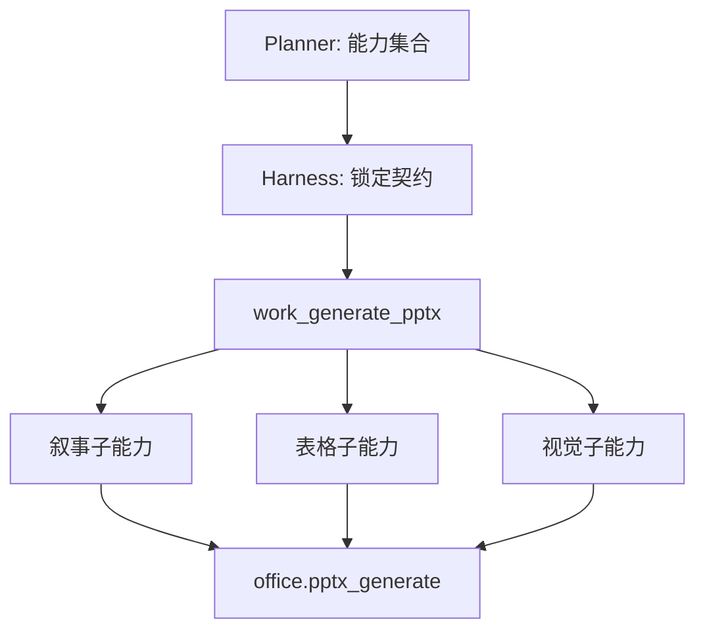

# 让 Harness 管质量，而不是让所有 PPT 都套同一套门禁

当结构化表格功能第一次修好后，我犯了一个典型的过度修复错误：既然表格整理容易错，那就把严格字段门禁放到所有 PPT 任务前面。

它很快造成新的问题。用户只是要一份叙事型分享稿，系统却机械地寻找课程代码、时间字段和表格列；用户要求插图，字段门又可能因为没有表格而拒绝。为了通过测试而增加的规则，开始绑架普通 PPT。

这迫使我重新划分 Planner、Harness 和工具之间的责任。

## Planner 在需要时判断“需要什么能力”

Planner 不再直接从一长串工具里选择某个高度专用动作，而是在需要规划时输出能力集合：

```json
{
  "presentation_capabilities": ["narrative", "table", "visual"],
  "output_language": "zh-CN",
  "exhaustive": true
}
```

`narrative` 始终存在；只有检测到“字段整理、清单、逐项枚举、对照表”等意图时才加入 `table`；只有用户明确要求图片，或内容确实需要视觉解释时才加入 `visual`。

这一步需要语义判断，适合模型。像“10 分钟演讲”包含时间词，但显然不是要整理“上课时间”字段。正则表达式可以做提示，不能成为最终能力选择器。

后续为了降低简单请求的延迟，Graph 又改成先路由、再按需规划。受信任的单动作可以直接进入 Harness；重复、多步骤或明确要求规划的任务才调用 Planner。Supervisor 会先建立确定性的叙事、表格和视觉默认值，Planner 只细化含糊之处。这样既不让所有 PPT 都承担一次高成本规划，也不会因为跳过 Planner 而丢掉用户明说的“表格”“图片”或“所有”。

## Harness 把意图变成不可放松的契约

Planner 的输出仍然不值得直接信任。它可能漏掉用户明确说过的“所有”“中文”“需要图片”，也可能在超时 fallback 后只留下默认能力。因此 Supervisor 先从原始用户请求建立硬约束，Harness 再把规划结果与这些约束合并。

我把 Harness 理解成一个编译器前端：

- 用户原话和受信任上下文是源程序；
- Planner 给出语义分析候选；
- Harness 完成类型检查、约束锁定和 Schema 投影；
- 工具执行器只接收已经编译过的最小输入。

模型可以增加合理的布局建议，但不能把 `exhaustive=true` 改成摘要，也不能因为表格太长就把 `output_language=zh-CN` 丢掉。

## 一个主工具，多个私有子能力

最终对 Planner 和 Router 只暴露一个公共入口：`work_generate_pptx`。它背后组合三个能力：

- 叙事能力：章节、要点、来源和页数规划；
- `work_generate_table_pptx`：字段映射、逻辑实体与表格分页；
- `work_generate_visual_pptx`：可信原图复用、图片生成与来源匹配。

表格和视觉子工具仍有独立 Schema、测试和质量门，但不出现在普通工具选择列表中。这样既保持最小暴露面，也避免把所有代码重新耦合回一个超级工具。



这个设计还有一个现实收益：旧检查点可能曾经直接调用子工具。我们保留了有界兼容路径，让历史运行可以恢复；新运行则统一经过主入口。架构演进不应该用“清空所有运行状态”来换取整洁。

## 门禁跟着能力走

拆分之后，门禁的激活条件也变得清楚：

- 所有 PPT 都检查文件安全、页数、语言、来源与基础可读性。
- 只有 `table` 能力检查列映射、实体覆盖、字段证据和聚合完整性。
- 只有 `visual` 能力检查图片数量、主题匹配、来源页和生成预算。
- 叙事型 PPT 检查章节结构、重复内容和正文容量，但不要求表格字段。

这解决了“针对某次课程表写死规则”的问题。门禁不再认识 `Section` 这个单词，也不认识某个学校的课程代码格式；它只知道某列被映射为 `course_code` 时，值必须有源证据，且不能来自被映射为分组编号的字段。

## 不同角色使用不同推理强度

另一个早期误区是把所有模型调用都开成高强度思考。对 Planner 来说，高推理强度有助于识别隐含的表格与视觉意图；对结构化 Composer 来说，过多推理会增加延迟和输出消耗，甚至挤压真正记录可用的完成 Token。

因此我们按职责设置推理档位：Planner 偏高，Router 偏低，Assessor 和结构化 Composer 使用较轻但稳定的推理。Composer 的任务不是重新发明计划，而是在固定 Schema 内转换一个有界批次。复杂度应由 IR 和 Harness 消化，而不是让每个分片都重新思考整条链路。

## 为什么不用“一个更强的模型”解决

更强模型可以减少部分误判，却不能提供恢复语义、权限隔离和确定性覆盖。即使模型 99% 时间能记住中文输出，剩下 1% 也需要语言门决定是否交付；即使模型能在一次调用里生成完整表格，系统仍需要证明源记录没有丢失。

Harness-first 的价值不是限制模型，而是让模型只在它真正有优势的地方发挥。它把“要不要表格”“哪些字段对应”留给语义推理，把“必须全量”“不能跨附件串数据”“失败后复用哪些分片”留给代码。

下一篇进入表格子能力内部，看看“同一门课的多个时间为什么没有进入同一个单元格”，以及我们如何从物理行恢复逻辑实体，而不是继续堆课程表专用规则。
