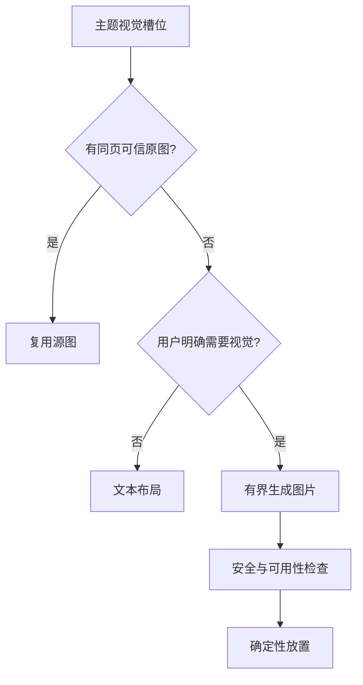

# 多模态 PPT：什么时候复用原图，什么时候生成新图

纯文字 PPT 的问题解决到一定程度后，用户很自然地提出：能否保留 PDF 里的图片，或者在需要时生成插图？

“给每页加一张图”很容易做出看起来丰富的结果，也很容易制造事实错误。一次生成中，分类器示意图被放到了文本向量章节，因为它们都包含“模型”这个词；另一次，源 PDF 明明有准确图表，系统却重新生成了一张风格漂亮但数据不可信的插图。

多模态能力因此不能只是一个图片 API，而要成为带来源约束的子流程。

## 第一原则：可信原图优先

视觉策略 `presentation-visuals-v2` 先解析源 PDF 中的图片对象和页面渲染区域，为每张候选图记录：

- 附件身份和页码；
- 页内位置和尺寸；
- 内容哈希；
- 分辨率与可读性；
- 附近文本和章节路径；
- 是否疑似装饰、图标或重复背景。

源图不是提取出来就能用。页眉 Logo、底图和小图标数量可能远多于真正有意义的图表，所以还需要面积、重复率、长宽比和邻近语义过滤。

## 图片必须与主题共享来源证据

每个 PPT 主题已经携带来源页集合。候选源图也有来源页。只有两者存在交集，图片才有资格进入该页；质量门会再次验证这一关系。

```text
topic.source_pages ∩ image.source_pages != ∅
```

这个规则看起来保守，却解决了大多数“图文不相关”问题。语义相似度可以在同一来源页的多张图片之间排序，但不能越过来源约束，把别处看起来更漂亮的图拿过来。

对于跨页主题，系统允许使用主题覆盖页中的任一可信图片；对于没有来源证据的总结页，则优先不放原图，或使用经过明确标注的生成图。

## 什么时候才生成图片

图片生成是补位能力，不是默认装饰器。流程先计算需要视觉的主题槽位，再用可信原图覆盖。如果覆盖已足够，就跳过生成；只有用户明确要求视觉内容且仍有空槽时，才调用图片模型。

生成提示词来自经过验证的主题摘要，不包含原文中的内部指令；每张图是独立、有预算的调用，并受并发和总数量上限约束。这样一张失败不会拖垮整份 PPT，也不会因为“尽量丰富”生成几十张昂贵图片。



## 为什么表格和视觉要能共存

一开始把 PPT 分成“表格模式”和“视觉模式”两个互斥分支，结果用户要求“把课程整理成表格，并在封面或总结页加图”时只能二选一。能力组合架构解决了这个问题：表格子工具生成结构化页面，视觉子工具只填充允许的视觉槽位，主渲染器合并两者。

表格页通常保持信息密度优先，不强行插图；总结页或章节页可以使用来源图或生成图。这样视觉是内容结构的一部分，而不是在成品上随机贴图。

## “保留原位置”与“适合 PPT”之间的取舍

PDF 翻译任务中，用户要求图片保留原位置，文字原位替换，这时布局目标是忠实复刻。PPT 生成则不同：原图位置提供语义和裁剪线索，但不应机械复制 PDF 坐标。PPT 有不同的纵横比和阅读距离，需要在保持图片内容完整的前提下重新布局。

因此两个能力共享提取器，但使用不同渲染策略：

- PDF 翻译保留页面坐标和非文字对象，只替换可读文字区域。
- PPT 生成保留来源页和图片本体，根据主题版式重新放置。
- 若文字太小无法可靠替换，PDF 流程宁可保留原样，不能留下空白。
- 若图片分辨率不足，PPT 流程可以降级为文本页，但不能拉伸成模糊主视觉。

## 多模态失败也要可解释

最终 `visual_report` 会记录源文档数量、提取候选数、复用图片数、生成图片数、实际放置数、文本降级数和生成错误。用户看到一页没有图片时，系统应该能区分：没有相关源图、预算不允许、生成失败，还是布局容量主动选择了文本。

这类可解释状态对 Vibe Coding 尤其重要。否则开发者只看到“图没出来”，很容易直接放宽所有过滤器，下一次又得到图文错配。指标把“没有图”拆成可验证的原因，修复才不会破坏已有安全边界。

下一篇进入最容易被低估的领域：版式。即使内容和图片都正确，PPT 仍可能因为字体、换行、空页或项目符号在不同渲染器中变得不可用。
