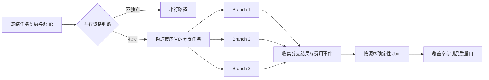

# 并行不是开几个线程：PPT 生成 fan-out/fan-in 的设计与效果测试

大文件 PPT 流程稳定之后，最明显的问题变成了慢。一份长 PDF 可能被拆成多个叙事分片或逻辑实体批次，每个批次都需要 Composer；如果还要翻译页面、生成两张插图，所有模型调用串行执行时，用户会在每一个独立延迟上依次等待。

第一反应很自然：把调用放进线程池。但在一个带预算、重试、来源和结构化契约的 Agent 里，并行从来不只是执行方式，它会同时改变状态合并、费用核算、失败语义和可观测性。

这一篇专门记录我们如何确定并行边界、怎样避免并发把正确性冲掉，以及实际测试证明了什么。

## 先判断工作是否真的独立

PPT 链路中可以并行的不是“所有耗时步骤”，而是输入和输出边界已经冻结的同级任务。

适合并行的部分包括：

- 已完成字段映射后的逻辑实体批次；
- 已确定来源范围的叙事文档分片；
- 互不重叠的 PDF 翻译布局批次；
- 已生成主题描述的独立图片生成请求。

不适合并行的部分包括：

- Planner、Harness 与能力 Schema 投影，因为后一步依赖前一步的契约；
- 文档结构识别与逻辑实体构造，因为错误的结构会被所有分支放大；
- fan-in 后的去重、来源覆盖和最终页数计算；
- 单一 PPTX 文件的最终渲染和制品质量门。

我现在使用一个很朴素的判断标准：如果两个任务交换完成顺序后，确定性 Join 仍能生成完全相同的结果，它们才具备并行资格。

## 并行化前先冻结五样东西

每个分支开始前，系统会冻结：

1. 任务契约，包括语言、完整性、受众和能力集合。
2. 分支输入，包括批次 ID、源页、实体键和结构化 IR。
3. Composer Schema 与模型配置版本。
4. 分支可使用的调用、Token、成本和截止时间份额。
5. Join 顺序和冲突规则。

分支只能返回候选参数和本分支观测，不能修改共享的 `rows`、`brief` 或剩余预算。如果一个线程直接向全局数组追加记录，完成顺序就会成为输出顺序；如果多个分支从同一个“剩余成本”变量扣款，预算检查就会产生竞态。

因此并行节点更接近 MapReduce，而不是共享状态线程：



## 为什么默认并发是 3，而不是越大越好

Composer fan-out 的默认并发为 3，并硬限制在 4 以内。PDF 翻译默认并发为 2，可配置范围同样有限；图片生成有独立的并发和总张数上限。

这个选择并不是因为线程池只能跑到 4，而是系统还有几个更严格的约束：

- 每个在途请求都要预留完成 Token 和最坏成本；
- 上游模型存在速率限制和延迟波动；
- 并发越高，结构化契约错误发生时已经发出的无效请求越多；
- Python Worker 还要处理检查点、缓存和其他任务；
- 一个任务不应占满整个实例的外部调用配额。

理论上的串行时间近似为所有分支延迟之和：

```text
T_serial ≈ Σ latency(branch_i)
```

有 `C` 条并行通道时，理想时间接近最慢通道承担的分支延迟之和，再加上准备和 Join 开销：

```text
T_parallel ≈ max(load(lane_1)...load(lane_C)) + overhead
```

实际加速上限受批次数、最长分支、串行阶段和供应商限流共同约束。把并发从 3 提到 30，不会让 Planner、解析和渲染消失，只会让风险更集中。

## 两种 Composer 分片使用同一个并行骨架

结构化 PPT 按逻辑实体批次 fan-out。每个分支只处理一组完整实体，返回带实体 ID 的行；Join 根据批次序号和实体键恢复源顺序，并验证是否覆盖全部实体。

叙事型 PPT 按来源分片 fan-out。它的分支返回章节而不是表格行。相邻小分片会先在 2,000 Token 和 12,000 源字符等约束内做 coalescing，避免为了并行制造过多小请求。分支不负责满足最终 `slide_count`，Join 完成后才根据全部章节重新计算页数。

两者共享以下机制：

- `fanout_composition` 记录并行资格、模式和并发数；
- 每个批次有稳定 ID 和源页集合；
- 分支观测使用线程隔离缓冲区；
- `join_composition` 按源顺序合并；
- 已完成结果可以通过版本化缓存复用；
- 最终质量门不因并行模式而放宽。

共享骨架减少了恢复逻辑的分叉，但分支契约仍然不同。表格分支必须给出实体行；叙事分支必须给出有效标题和至少足够构成内容的事实。为了复用并行框架而强行统一两种输出，会把语义差异重新推给模型。

## 失败时为什么要等待已发出的分支结算

假设三个分支并行执行，其中第二个返回 503。最危险的处理方式是立即抛异常并丢弃另外两个线程的结果。它会造成两类账不平：成功分支可能已经产生费用却没有记录，失败后的重试还会再次调用它们。

我们的策略是：停止调度尚未开始的任务，让已经 admitted 的分支完成或失败，收集每个分支的模型事件、Token 和成本，再将运行标记为可恢复失败。成功结果进入缓存；重试只补缺失分支。

如果失败来自结构化契约违约，而不是网络超时，处理范围级熔断会让后续批次跳过同一个模型。原因很简单：同一 Schema 下连续犯同一种格式错误时，更高并发只会更快地产生更多坏结果。

## 缓存让并行重试不再重复付费

结果缓存的键包含源内容、任务契约、工具 Schema、模型配置和会话范围。写入采用私有目录和原子替换，避免一个分支读到另一个分支尚未完成的文件。

第一次执行 5 个叙事批次时，Composer 会被调用 5 次。精确重试时，测试确认 Join 收到 5 个 cache hit，Composer 总调用数没有继续增长。这个结果比“重试更快”更重要：它说明视觉或最终渲染失败后，不会重新生成已经正确的正文分支，也不会引入新的随机差异。

## 效果测试怎么设计

并行测试不能只断言“最后成功”，否则代码完全串行也会通过。我们使用了四层断言。

第一层是并发事实。测试模型在进入调用时增加 `active`，退出时减少，并记录 `peak_active`；图片生成测试还使用 barrier，确保两个调用确实同时在途。

第二层是受控延迟效果。Fake provider 为每个分支注入固定 sleep，在相同输入上分别运行并发 1 和目标并发，比较 wall time。使用相对阈值而不是绝对毫秒，可以降低 CI 机器速度差异带来的抖动。

第三层是语义等价。并行结果必须保持实体顺序、源页、章节覆盖、最终页数和质量报告；只变快但打乱课程行，测试仍然失败。

第四层是失败与费用结算。任一分支失败时，测试检查所有已发出分支的观测事件均被保留，不能因为主流程提前退出而漏记成本。

## 当前受控实验结果

下面是仓库现有确定性测试能支持的结论。它们使用固定延迟的 Fake provider，验证并行实现的相对效果与正确性，不是公网模型的生产基准。

| 场景 | 规模与并发 | 测试断言支持的效果 | 同时验证的正确性 |
| --- | --- | --- | --- |
| 叙事型 PPT Composer | 5 个批次，并发 3 | 并行 wall time 小于串行的 80%，即受控场景至少缩短 20% | 覆盖第 1 至第 5 页、章节顺序、页数重算、无错误表格能力注入 |
| 结构化 PPT Composer | 3 个实体批次，并发 3 | 并行 wall time 小于串行的 85%；wall latency 小于 provider latency 总和 | `PED1101`、`PED1102`、`PED1103` 仍按源顺序合并，覆盖率完整 |
| PDF 布局翻译 | 16 页、4 批次，并发 2 | 并行 wall time 小于串行的 75%，即受控场景至少缩短 25% | 16 页均返回翻译，聚合费用和轮次数正确 |
| PPT 图片生成 | 2 张图，并发 2 | 实测 `peak_active == 2`，两个独立调用均完成 | 生成次数、放置数量和使用报告一致 |
| 精确重试缓存 | 5 个叙事批次 | 第二次运行 5 个分支全部命中缓存，Composer 调用总数不增加 | 缓存键包含源、契约和模型版本，Join 仍重新验证 |
| 并行失败 | 2 个结构化分支，其中 1 个失败 | 主流程失败但每个已发出分支的 usage 都被结算 | 成功结果可恢复，失败状态和错误码保留 |

在 2026-09-12 的本地回归中，我单独重跑了上述 6 个关键用例：

```text
6 passed, 5 warnings in 1.86s
```

这里没有写“性能提升 3 倍”，因为测试并不能支持这个结论。它能证明的是：代码确实产生了受限并发；在受控延迟下 wall time 显著低于串行；输出顺序、覆盖和费用结算没有为了速度而牺牲。生产效果还需要从真实 Agent 日志中观察 P50/P95、供应商延迟、缓存命中率和限流情况。

## 上线后观察哪些指标

并行节点会输出以下低基数运行字段：

- `parallel` 与 `parallel_mode`；
- `concurrency`、`batch_count` 和 `processed_batches`；
- `wall_latency_ms` 与聚合 `provider_latency_ms`；
- `cache_hit_count`；
- 分支成功、失败、熔断和重试数量；
- 每个 Agent Run 的调用、Token 与费用总量。

如果 provider latency 很高而 wall latency 没有下降，说明分支可能并未真正重叠，或串行准备阶段占比过大；如果 wall latency 下降但费用和失败率上升，则并发过高或分片过碎；如果缓存命中率低，要先检查缓存键是否包含了不稳定字段，而不是盲目延长 TTL。

## 并行化最终改变了什么

表面上看，这次改造只是把多个模型调用同时发出。真正的工程变化却是：我们被迫明确哪些状态属于分支、哪些规则属于 Join、哪些预算必须预留、哪些失败需要结算，以及什么叫“并行后结果仍然等价”。

这也是我在 Vibe Coding 中学到的一条重要经验。性能问题很容易诱导 Agent 给出一段漂亮的并发代码，但在接受改动之前，我会要求它回答五个问题：任务真的独立吗？输出如何稳定排序？失败后钱算在哪里？重试会不会重复执行？测试如何证明它确实更快且结果没变？

只有这五个问题都有可运行的答案，并行才是能力，而不是新的随机性来源。
