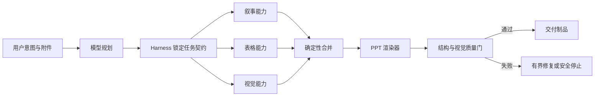

# 用 Vibe Coding 把 PPT 生成做成可靠产品

这是一组面向 AI 应用开发者的工程实践文章。它记录的不是“让模型写一份 PPT”这种一次性演示，而是我们如何在连续的真实失败中，把附件读取、长文档理解、结构化整理、多模态素材、版式渲染和自动验收逐步收进一条可治理的生产流水线。

所谓 Vibe Coding，在这组文章里并不是闭着眼睛让模型改代码。我的实际工作方式更像一个高频闭环：先看用户眼中的坏结果，再看日志和中间状态，形成一个可证伪的原因假设，让编码 Agent 完成最小改动，然后用原始失败样本重新部署、点击重试、渲染成品并继续挑错。直觉负责寻找方向，契约、测试和可观测性负责阻止直觉把系统带偏。

## 系列目录

1. [从“能生成”到“能交付”：一条 PPT 流水线是怎样被失败逼出来的](01-from-demo-to-pipeline.md)
2. [附件不是聊天上下文：修复“明明上传了文件，却还让我上传”](02-attachments-and-retries.md)
3. [大文件不是摘要题：用有界轮次、结构化 IR 和 fan-out/fan-in 保住细节](03-large-files-and-intermediate-representation.md)
4. [让 Harness 管质量，而不是让所有 PPT 都套同一套门禁](04-harness-and-capability-composition.md)
5. [表格型 PPT 的真正难点：从物理行恢复逻辑实体](05-structured-tables-and-semantic-merge.md)
6. [多模态 PPT：什么时候复用原图，什么时候生成新图](06-multimodal-source-grounding.md)
7. [排版不是 Prompt 问题：文字溢出、空页、字体和项目符号的渲染工程](07-layout-is-a-rendering-problem.md)
8. [把“再试一次”变成工程闭环：自动验收、恢复与 Vibe Coding 方法论](08-automated-acceptance-and-vibe-coding.md)
9. [并行不是开几个线程：PPT 生成 fan-out/fan-in 的设计与效果测试](09-parallelism-design-and-results.md)

## 一条贯穿全系列的原则

模型擅长理解意图和生成候选内容，确定性代码擅长守边界、保身份、做合并和验证。PPT 生成的可靠性，不来自某一个更强的模型，而来自两者之间清楚的分工：

文章中的设计名称来自项目实现，例如 `document-source-ir-v1`、`presentation-logical-entity-ir-v1`、`presentation-visuals-v2`。它们不是必须照抄的标准，而是为了说明：一旦中间状态有名字、有版本、有契约，Vibe Coding 才能从“哪里不对改哪里”升级成可以长期演进的软件开发。
